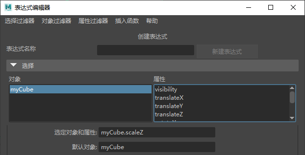

# DCC工具开发笔记

## Maya

maya，老东西，行业标准，真难用（不是）

[腾讯巨神级TA](https://zhuanlan.zhihu.com/p/76957745)、[碧血红天的blog](http://www.zt-page.com/?p=109)、[Pycharm环境搭建](https://www.cnblogs.com/3lina/p/11672415.html)

### 创建一个python工具

Python插件和Unity Editor那种工具不太一样，这个其实本质就是一个嵌入式的脚本，通过命令调用maya指令，就算有UI也是现绘制的，也不需要什么项目结构，就一个py文件

#### 创建一个python文件

```python
import maya.cmds as cmds


def createWindow():
    if cmds.window('mywindow', exists=True):
        cmds.deleteUI('mywindow')
    windowvar = cmds.window('mywindow')
    cmds.columnLayout()
    checkButton = cmds.button(l='Test', command='testFunc()')
    cmds.showWindow('mywindow')

def testFunc():
    print "Hello"

createWindow()
```

#### 添加到工具栏

当你的代码完成后，可以将其固定到工具架上


#### 怎么写

这应该是很多人写maya插件最大的疑惑，我的建议是先学美术，开着脚本编辑器，按照美术流程走一遍，你会发现你每一次操作，脚本编辑器都会输出一个指令，这个应该能让你深受启发


如果你的脚本编辑器没有显示，那么在脚本编辑器中设置**显示二者**


### 常用API

```python
import maya.cmds as cmds
```

- 删除：`cmds.delete(p)`
- 选中：`p = cmds.ls('Name')`

- 创建
  - Cube：`pCube = cmds.polyCube(w=10, h=10, d=10, name='myCube')`

- 移动（到指定位置）
  - 平移：`cmds.move(0, 10, 0, pCube)`
  - 缩放：`cmds.scale(2, 2, 2, pCube)`
  - 旋转：`cmds.rotate(45, 45, 0, pCube)`

- 选择（得到的是对象数组）
  - 当前选择：`list = cmds.ls(selection=True)`

- 读参数
  - 位置：`cmds.getAttr('%s.translate ' % (p))`
  - 位置（某一维）：`y = cmds.getAttr('%s.translateY ' % (p))`
- 写参数
  - 位置（某一维）：`cmds.setAttr('%s.translateX' % (p), 10)`

想知道maya物体的参数，可以通过表达式编辑器查看（窗口-动画编辑器-表达式编辑器）



- 得到顶点数据

```python
def printVertexPos():
    selectObjectList = cmds.ls(selection=True)
    VertexArray = cmds.ls('{}.vtx[:]'.format(selectObjectList[0]), fl = True)
    for v in VertexArray:
        print cmds.xform(v, query = True, translation = True, worldSpace = True)
```

### 我的工具

#### 平滑法线

[平滑法线](https://github.com/Reuben-Sun/Note-of-Graphics/blob/main/Code/MayaPython/SmoothNormal.py)

#### 模型展2UV

```python
#创建一个名称为sph的多边形
def createFunc():
   cmds.polySphere(n='sph')

#删除除了map1以外所有的uvmap
def deleteUVs():
    au = cmds.polyUVSet(query=True, allUVSets=True)
    for j in range(len(au)-1):
        cmds.polyUVSet(delete=True, uvSet=au[j+1])

#自动展选中物体的2UV，并命名为map2
def pickUV2():
    list = cmds.ls(dag=1, selection=True)
    au = cmds.polyUVSet(query=True, allUVSets=True)
    if(len(au) == 1):
        cmds.polyAutoProjection(list[1] + '.f[*]', cm = 1, uvs= 'map2')
    else:
        print "map2 has been exited"
```

#### 动画clip

```python
#输出选中的动画片段的开始帧和结束帧
def printClip():
	list = cmds.ls(selection=True)
    for p in list:
        start = cmds.getAttr('%s.clipStart ' % (p))
        end = cmds.getAttr('%s.clipStart ' % (p)) + cmds.getAttr('%s.clipDuration ' % (p))
        print start
        print end
```

