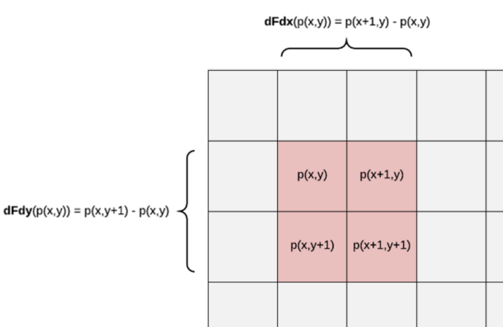
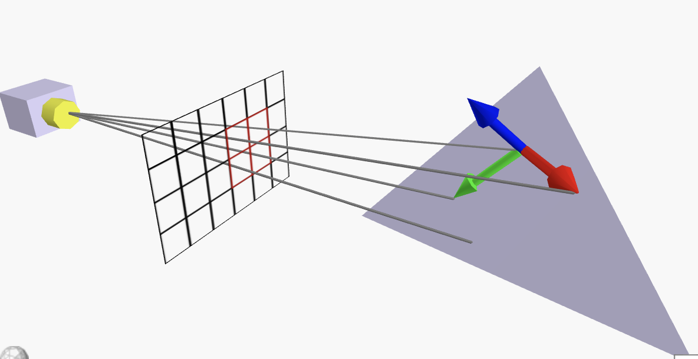

# Shader

### ddx与ddy

在OpenGL中叫dFdx和dFdy，在HLSL中叫ddx和ddy

[HLSL deriv_rtx](https://learn.microsoft.com/en-us/windows/win32/direct3dhlsl/deriv-rtx--sm4---asm-)

ddx和ddy是一个求偏导的过程，依赖于硬件光栅化，只能用于fragment着色器，意思为计算blocks内相邻片元间value的变化（value可以是任意参数，比如uv、color、position、normal），注意不要在分支中使用偏导
$$
\mathrm{ddx}=\frac{\mathrm{p}(x+1,y)-\mathrm{p}(x,y)}{1}
$$
三角形光栅化时，fragment着色器一次处理2x2个像素，其中左上角的像素$(x,y)$始终为偶数坐标



如果一个几何体不够大，使用抗锯齿算法后渲染分辨率仍然比2x2要小，那么这个几何体在光栅化前就会被剔除，以此不必担心像素不够的情况

#### mipmap（UV）

使用mipmap会增加贴图存储，但是能提高性能和效果，在对mipmap贴图进行采样时，我们可以手动指定采样层级

我们需要一种方法能求mipmap层级（如果层级不对，会导致纹素比异常，产生摩尔纹等）

ddx和ddy一个应用是求贴图mipmap层级

```glsl
float mip_map_level(in vec2 texture_coordinate)
{
    vec2  dx_vtc        = dFdx(texture_coordinate);
    vec2  dy_vtc        = dFdy(texture_coordinate);
    float delta_max_sqr = max(dot(dx_vtc, dx_vtc), dot(dy_vtc, dy_vtc));
    return 0.5 * log2(delta_max_sqr);
}
```

> 在OpenGL4.x提供了mipmap函数`textureQueryLod()`

#### 面法线（坐标）

我们在fragment着色器中对世界坐标做ddx和ddy，就能得到三角面上两个向量（这俩向量还是垂直的），而平面上两个非平行向量就能确定一个平面，他们的叉积就是面法线（注意手系和法线正负）

```glsl
vec3 faceNormal = normalize( cross(dFdx(pos), dFdy(pos)) );
```



该技术常用于平面着色（Flat Shading），让物体有一种低面感，法线没有插值，是ground着色、phong着色以前的东西（老古董前的老古董）

#### 高度图（法线）

与面法线原理类似，给定一张单通道的灰度图当作高度图，通过ddx、ddy就能得到高度的变化，进而得到法线的变化

```glsl
fixed h = tex2D(_HightMap, i.uv).r;
float offsetU = -ddx(h); 
float offsetV = ddy(h);
float3 n = normalize(i.normal.xyz + float3(offsetU, offsetV, 0) * _Intensity);
```

