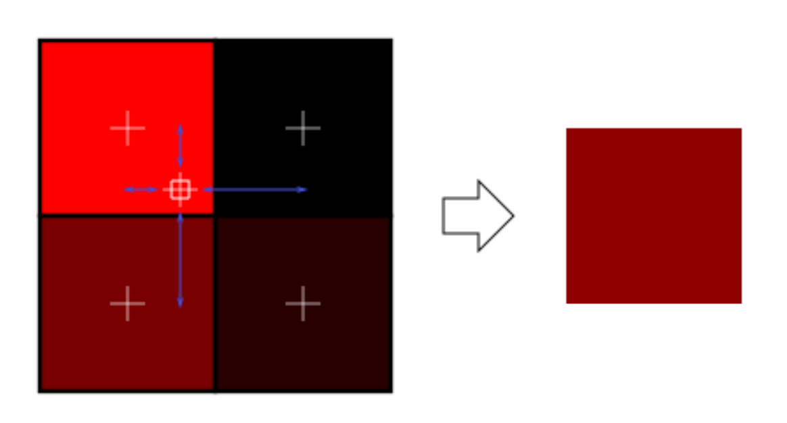
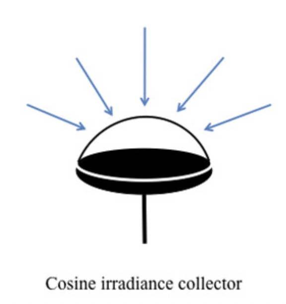
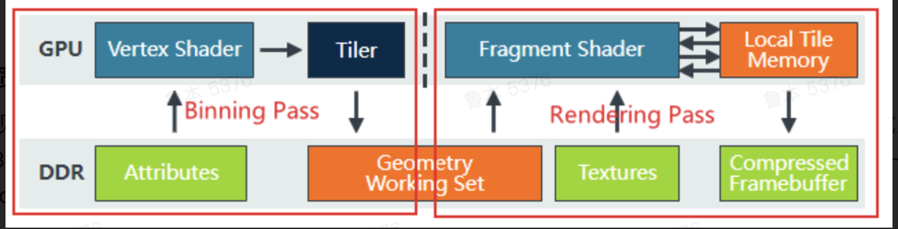

# TA面试题

这里面不少答案都是我自己凭感觉答的，不保真

#### 什么是渲染管线

**渲染管线**是通过安排CPU发出Draw Call的内容以及顺序，指导GPU进行一系列操作，并协同将开发者期待的图像渲染在屏幕上

- 剔除
- 渲染
- 后处理

#### 什么是Draw Call

Draw Call是CPU为GPU准备渲染数据，并指令GPU进行一次渲染的操作，是重量级的

#### 什么是Batching

将多个简单、使用同一材质的物体合并渲染的方式叫Batching

*batch是批的意思*

#### 渲染管线的渲染流程

- 延迟着色阶段（光栅化）Deferred Shading (rasterization)


- 直接阴影阶段（光线追踪或光栅化）Direct shadows (ray trace or rasterization)


- 光照阶段（计算着色器+光线追踪）Lighting (compute + ray trace)


- 反射阶段（光线追踪或计算着色器）Reflections(ray trace or compute)


- 全局光照阶段（计算着色器+光线追踪）Global Illumination (compute and ray trace)


- 环境光遮蔽阶段（光线追踪或计算着色器） Ambient occlusion (ray trace or compute)


- 透明与半透明渲染阶段（光线追踪+计算着色器）Transparency & Translucency (ray trace and compute)


- 后处理阶段（计算着色器）Post processing (compute)


#### 渲染流水线的基本流程

渲染就是从一个三维场景出发，获得一个二维图像的过程。分为四个过程，应用阶段、几何阶段、光栅化阶段、像素处理阶段，其中几何阶段光栅化阶段主要在GPU中进行。

几何阶段分为五个步骤：顶点着色器、曲面细分着色器、几何着色器、裁剪、屏幕映射

光栅化阶段分为四个步骤：三角形设置、三角形遍历、片元着色器、逐片元操作


##### 什么是顶点着色器

- 输入值是CPU通过Draw Call发出的顶点数组（没有索引）

- 输出值是齐次裁剪空间坐标（如果不使用细分着色器和几何着色器）

##### 什么是细分着色器

- 在显卡中**视口变换器(Viewport Transform)**中实现
- 将复杂的曲面转化为简单的点、线、三角形，可以增加网格细度，并在细分后的顶点上生成插值属性

- 如果使用了曲面细分着色器，顶点着色器就不会处理空间变化（如果没有顶点动画的需求，顶点着色器只负责传递数据），而是交给曲面着色器和几何着色器
- 在不改变网格外形的情况下，对网格进行平滑操作

##### 什么是几何着色器

- 在视口变换器中实现，输出值是齐次裁剪空间
- 能改变顶点数量
- 能按索引访问顶点

##### 什么是网格着色器

- 新一代三合一着色器，用于整合顶点、细分、几何着色器
- 可以实现无矩式渲染

##### 屏幕映射

- 输入齐次裁剪空间
- （通过透视除法）转化到**归一化设备坐标(NDC)**，最后输出屏幕空间坐标

#### 什么是渲染路径

**渲染路径**是一系列对光照和着色(尤其是光照)的控制选项的集合

主流引擎支持前向渲染，延迟渲染，和自定义渲染

- 前向渲染
  - 批次数=相机数x对象数x（除了主有向平行光外的逐片元光照数+1）
  - 随着片元光照数量增多，性能大幅下降
- 延迟渲染
  - 类似一种后处理
  - 批次数=相机数x（网格数+逐片元光照数）
  - 将几何通路和光照渲染通路分开，几何通道结果输送到G-Buffer中，然后对每个像素只进行一次光照计算
- 自定义渲染
  - 屏幕后处理、天空盒、透明物体

#### 延迟渲染

##### 为什么延迟渲染不支持透明度混合

因为半透明网格在G-Buffer中会被其他片元覆盖

##### 为什么延迟渲染不支持真的对抗锯齿

因为G-Buffer需要的带宽远远大于帧缓冲，在多重抗锯齿下难以满足负载

#### 前向渲染

前向渲染的渲染通路（Pass）有两种，分布是**基本通路（forwardbase）**和**附加通路（forwardadd）**

**forwardbase**

- 对所有的默认的**有向平行光源**及其产生的阴影进行逐片元计算，同时对其它基于顶点的和基于球谐光照的光源，以及物体的自发光、统一环境光和光照贴图进行计算
- 只对一个有效灯光执行一次，所以只会执行一次

**forwardadd**

- 对剩下的**使用逐片元光照的光源**进行光照计算
- 必须和forwardbase一同使用，不然会被忽略掉
- 对forwardbase外所有有效灯光都执行一次，所以会执行多次

#### 向量

##### 向量点乘叉乘的几何意义

点乘是投影，叉乘是法向量（方向符合右手定则，沿大拇指方向）

##### 向量点乘叉乘的数学意义

$\mathbf{a} =\left( x_{1},y_{1},z_{1}\right)  $

$\mathbf{b} =\left( x_{2},y_{2},z_{2}\right)  $

$\mathbf{a} \cdot \mathbf{b} =|\mathbf{a} ||\mathbf{b} |\cos \theta =x_{1}x_{2}+y_{1}y_{2}+z_{1}z_{2}$


##### 求向量$\mathbf{a}$关于向量$\mathbf{b}$的对称向量$\mathbf{c}$

$\mathbf{a} \cdot \mathbf{b}=\mathbf{c} \cdot \mathbf{b}$

$|\mathbf{a} |=|\mathbf{c} |$

##### 求点M关于直线l的对称点N

M和N的中点在直线上

$\overrightarrow{MN} $与直线垂直

#### 欧拉角是什么？有何优缺点

欧拉角是一个直观利用三维向量表达旋转的方法

优点：占用的空间小，不会遇到非法输入

缺点：没有统一标准、不能跨平台；三个分量可能不正交，可能有无法表示的角度；不能插值运算

#### 图形渲染用到哪些空间

- 顶点着色器：模型空间--M--世界空间--V--观察空间--P--齐次裁剪空间----屏幕空间

#### 什么是模版测试

将屏幕的部分像素通过一个通道盖住，在渲染时剔除通道上不满足条件的值

#### 如何渲染半透明物体

- 透明度测试
- 透明度混合

#### 如何优化着色器代码

- 复杂计算放在顶点着色器中
- 简化等式，比如说：p = sqrt(2*(X+1))可以改写成1.414*sqrt(X+1)等
- 尽量使用内建函数
- 重复度低的操作可以交给CPU
- 使用顺序结构代替分支
- 丢弃片元时直接将alpha设为0
- 纹理图尽量使用2的n次方大小
- 将许多小纹理拼成一个大纹理
- 近点采样能满足要求就不要使用线性采样

#### 如何判断多边形是凸多边形

- 角度法：内角是否小于180°
- 凸包法：如果凸包和原始多边形点数一样多，那么就是凸多边形
- 顶点凹凸性：本质上还是角度法，就是相邻顶点组成向量叉乘

#### 相交测试

*见图形学笔记*

#### 法线贴图

纹理就是贴图

法线纹理用RGB三个通道分布存储法向量在XYZ轴上分量大小

由于法线贴图大部分文素的方向都是朝向法线方向，于是法线贴图大多是蓝色的

#### 如何渲染阴影

- 体积阴影法
- 深度阴影法

#### 什么是HDR

高动态范围，一种颜色缓冲技术，使用更高的精度来表示亮度，能更真实的反应光照

HDR通过色调映射转到LDR

#### 什么是伽马矫正

早期摄像机通过伽马加码，将实际亮度存储为更亮的值，显示时通过该骂解码获得正确的功率

#### 什么是色调映射

就是利用显示器有限的亮度范围来近似实现HDR，就是将亮度映射到[0,1]的范围内，并压缩到8位的渲染目标上

#### 什么是PBR

基于物理的渲染

#### 正交投影和透视投影的区别

- 都是源于对针孔摄像机对数学建模
- 视锥形状不一样

#### 什么是齐次坐标

为了实现仿射变换，将三维顶点引入四维空间，这个空间叫做齐次坐标空间

#### 旋转平移矩阵

*见图形学笔记*

#### 高光模型

漫反射模型

- Lambert模型：反射光强度和 表面法线和光源的夹角的 余弦值成正比
- 半Lambert模型：光照有一个保底值，于是没有黑面
- Minnaert模型：用于模拟丝绒
- Oren-Nayar模型：风之旅人的沙子

高光反射模型

- Phong模型：纯几何的经验模型，就是在Lambert漫反射上加了一点高光，强度与 视角方向和反射光方向的夹角的 余弦值成正比
- Blinn-Phong模型：Phong的改进，不计算反射光，而是计算视角方向和光源方向的角平分矢量h，用h替代反射方向计算高光
- Schlick模型：对BP模型的优化，简化一些运算，能获得更类似于油漆的效果

基于物理的模型

- Cook-Torrance模型

#### 什么是光栅化

是渲染流水线的一个重要阶段

三角形设置和三角形遍历可以合成光栅化，计算三角网格，并进行线性插值

#### 阴影，软阴影

#### 什么是抗锯齿

锯齿是走样的一种，指在渲染三角形、线的时候，像素要么存在，要么不存在，于是出现锯齿现象

- SSAA，超级采样抗锯齿，翻倍渲染向下采样
- MSAA，多重采样抗锯齿，每个像素内有多个采样点，渲染时以点数加权获得（性能好，不支持延迟渲染）
- FXAA/TXAA，放弃精度，让边缘模糊

#### 延时渲染

场景中有大量实时光源时，前向渲染效率会下降，使用两个Pass，一个不计算光照，只计算片元是否可见

不支持抗锯齿，不能处理透明物体

#### 故障检测

#### 后处理

- 亮度饱和度对比度
- 边缘检测
- 高斯模糊
- 动态模糊
- Bloom效果

#### 贴图技术

贴图就是纹理

#### BRDF

双向反射分布函数

#### 作品集里实现原理

ezy-slice原理：网格中存储了顶点数据、三角形数据、法线数据，使用MeshFilter获得sharemesh（mesh是新网格，sharemesh是原始网格）

物体的节点和三角形被分为三个部分（上下和切割面），相交处的三角形做分割操作，然后让原始网格不可见

#### 如何区分位置和方向

齐次坐标，w==0就是位置，w==1就是方向

#### SSAO

SS（Screen Space），都是后处理

SSGI屏幕空间全局光照

SSAO屏幕空间环境光遮蔽，对屏幕空间上每一个片元，在其法线范围的半球体中进行采样，采样点在深度纹理采样，从而判断该点是否被遮蔽

一般来说使用SSAO后还要在进行一次模糊，还需要进行时域平滑来避免闪动

#### SSR

SSR屏幕空间反射，在相机中发射出n条光线，然后根据物体的法向量和摄像机的射线方向计算出这条光线的反射方向。再对他进行raymarch（光线步进）计算。

#### 动态模糊

种类

- 相机动态模糊
- 对象动态模糊

原理

- 保存多帧数据进行混合
- 速度映射图，图中存储了每一个像素的速度，沿着这个速度采集像素，进行加权混合，得到模糊效果

#### 线框

##### 方法1:深度偏移（这玩意不是线框，是描边）

使用两个Pass渲染，一个正常渲染，一个在深度偏移的情况下渲染一遍线

- 两个Pass有性能损失
- 深度偏移是为了防止线条被遮挡，这会导致多边形和线框在相同位置的片元的深度值不一样

##### 方法2:几何着色器（这才是线框）

几何着色器可以使用索引数组访问顶点的拓扑结构

线框渲染可以使用几何着色器访问三角形，并计算每个顶点到对边的垂线长度，于是通过插值获得三角形中每个点到三角形三个边的最短距离

我们知道在光栅化阶段要插值上色，那么我们可以在插值的时候进行判断，当垂线距离符合条件时（离三角形边特别近）就染上线框的颜色

#### 片元着色器和像素着色器的区别

*在大部分情况下没有区别*

在极个别情况下（大概是OpenGL那边）我门认为如果片元着色器中的输入数据是恰好覆盖屏幕的四边形时，这个片元着色器被称为像素着色器

#### SDF

距离函数

shadertoy的本质就是通过编写（2D）距离函数来绘制物体

#### 为什么shader中少用分支和循环

因为在gpu中，分支的实现原理是两个分支都执行，然后丢弃不需要的分支，这个增长是指数级的（2^n^）

#### 什么是Cubemap

立方体纹理，是实现环境映射的一种方法

#### 什么是光照探针

是一组封装后的Cubemap，在烘培或预计算时，对空间中的一些采样点（光照探针）采集Cubemap，在运行环境渲染运动物体时，CPU会从离物体最近的光照探针中获取Cubemap，按照距离进行插值。

这个过程实现了CPU和GPU的解耦，CPU只需要维护一组固定的光照探针组，GPU只需要处理与这个物体相关的临近Cubemap

通过光照探针获取环境景象需要对场景进行六次渲染（毕竟有六个面）

#### 什么是球偕函数

将真实环境中连续的光照方程进行离散化，通过球形坐标系分解简化反射方程，通过球偕变换获得球偕系数，在运行时根据球偕系数重建方程

采样-分解-变换-重构

#### 参数和分量

参数是黑盒，分量是白盒（你可以理解的是，别人在unity面板上拖动的属性多半是参数，一种东西的组成是分量，比如颜色可能就有由高光、漫反射等分量）

#### 为什么次表面散射用漫反射做高斯模糊

因为lambert的光照强度与入射光线和法线夹角有关，而折射和反射的比例也与这个夹角有关（菲涅尔）

折射光是次表面散射的入射光，折射的光越强，散射的光也会越强

#### 什么是光线步进

**光线步进（raymarching）**：从摄像机位置向屏幕每一个像素点发射一条光线，光线按照一定步长前进，并检测当前光线是否位于物体表面，据此调整光线前进幅度，直到抵达物体表面，再按照一般光线追踪的方法计算颜色值。

#### 什么是MC算法

**步进立方体算法（Marching Cube）**是一种在密度场中采样来生成多边形的算法，在生成多边形之后再依照多边形渲染的过程进行正常的渲染。 相比射线扫描算法，步进立方体算法可以生成并保存多边形，所以在密度场的修改频率不高的情况下，使用步进立方体算法可以节省很多不必要的性能消耗。

核心：确定等值面

#### 什么是屏幕空间阴影纹理

对于多光源的情况，每个光源都可以产生一个深度阴影纹理。在着色器中对这些深度阴影纹理逐个进行处理，可以得到若干个屏幕空间的阴影纹理，将这些屏幕空间下的阴影纹理混合就可得到一个总的屏幕空间阴影纹理，它表示了在屏幕空间中某个片元接受到的来自所有光源产生的阴影强度的总和

#### 什么是URP

unity内的**渲染管线（Render pipelines）**包括

- 内置渲染管线（Build-in）
- 可编程渲染管线（Scriptable Render Pipeline，SRP）
  - 高清渲染管线（High Definition Render Pipeline，HDRP）
  - 通用渲染管线（Universal Render Pipeline，URP）

#### 什么是滤波模式

纹素坐标是整数值，但UV坐标不是，所以要有一种方法由UV坐标获得纹素值

##### 最近相邻滤波(Nearest neighbor filtering，或者Point sampling)

- UV坐标 x 纹理大小，然后四舍五入取最近的纹素

- 有明显的像素块

##### 双线性滤波(Bilinear filtering，或者liner filtering)

- 根据一个坐标到其附近最近的四个像素点的距离进行加权平均，得到一个混合的颜色



##### 三线性滤波(Trilinear filtering)

- 在相邻的两个Mipmap层次上分别进行双线性滤波，再对得到的两个值进行线性插值
- 当距离非常大或非常小的时候，三线性滤波会退化为双线性滤波

##### 各项异性滤波(Anisotropic filtering)

当一个目标表面和透视摄像机之间的角度较大时，纹理的填充面积实际上并不是正方形，这引入了模糊和闪烁等瑕疵

- 需要在一个非正方形区域内采样和混合
- 有的使用长方形，有的使用梯形


#### 什么是纹理映射

*就是将三维的空间坐标点转化为二维的纹理坐标点*

**步骤**：

1. 投影映射
2. 变换函数
3. 纹理采样
4. 纹理转换

#### 什么是纹理压缩

这是一种有损压缩，对于一张原始纹理，会创建两张小纹理A和B，同时还有一个矩阵M，M的行列和原始纹理的长宽一致，里面的值类似于调色板中的索引，实现纹理A和纹理B的混合

#### GPU的寻址方式

##### 集成显卡

对集成显卡来说，GPU使用CPU专门划分出来的一份内存空间**UMA（Unified Memory Architecture，一致性储存架构）**作为显存，GPU和CPU使用不同的虚拟地址对UMA中同一个物理地址进行寻址，两者共享总线。

在渲染时，CPU将顶点数据存储到主存中，然后GPU通过**GART(Graphic Address Remapping Table，显存地址重定位表)**访问UMA

##### 独立显卡

独立显卡中CPU和显卡的沟通是使用异步的**DMA(Direct Memory Access，内存直接访问)**实现的。

1. CPU将DMA命令从内存中读取，并写入DMA控制器
2. DMA控制器直接操控内存总线，在不依赖CPU的情况下将数据传输给显卡驱动
3. 显卡驱动给DMA控制器发送信息（握手）
4. DMA占用内存总线，向内存请求地址，向显卡发送信号
5. 显卡接受信号后将数据传输到内存，并清除DMA请求信号
6. 沟通结束，触发一次CPU中断

#### CPU和GPU分支预测方式有何差别

##### CPU

CPU在流水线中进行分支预测

- 静态分支预测
- 动态分支预测
- 协同分支预测

##### GPU

将两个结果都运行一次，然后丢弃不需要的分支，这样会严重影响性能（指数级），这个现象被称为**线路分歧**

#### 纹理数据在GPU中是如何排列的

纹理存储器中的数据以一维/二维/三维数组的形式存储在显存中，可以通过缓存加速访问

在kernel中访问纹理存储器的操作称为**纹理拾取(texture fetching)**

将显存中的数据与纹理参照系关联的操作，称为将数据与**纹理绑定(texture binding)**

#### shader中的变量类型（OpenGL）

##### uniform

在顶点着色器和片元着色器中的声明方式完全一样，可以视为被双方共享的全局变量

##### attribute

只能在顶点着色器中使用的变量，一般用于存储顶点的位置、法线、uv、颜色信息

##### varying

顶点着色器和片元着色器之间做数据传输用的变量，必须保证在两者中声明保持一致

#### 如何保证顶点着色器传入片元着色器的数据一致性

varying变量声明一致？

#### 矩阵乘法

两条直线的交点就是C的位置


x左乘A


x右乘A


#### 直线扫描转化法

##### 数值微分法DDA

思想：步进和通过舍入选择像素

$P_{0}(0,0)$到$P_{1}(5,2)$

k=0.4

| $i$  | $x_{i}=x_{i-1}+1$ | $y_{i}=y_{i-1}+k$ | $round(y_{i})$ | 坐标  |
| ---- | ----------------- | ----------------- | -------------- | ----- |
| 0    | 0                 | 0                 | 0              | (0,0) |
| 1    | 1                 | 0+0.4=0.4         | 0              | (1.0) |
| 2    | 2                 | 0.4+0.4=0.8       | 1              | (2,1) |
| 3    | 3                 | 0.8+0.4=1.2       | 1              | (3,1) |
| 4    | 4                 | 1.2+0.4=1.6       | 2              | (4,2) |
| 5    | 5                 | 1.6+0.4=2.0       | 2              | (5,2) |

##### 中点画线法

相比于DDA算法，省去了浮点数运算

直线方程$F(x,y)=Ax+By+C=0$，若$F(x,y)>0$则位于直线上方，若$<0$则位于直线下方，若$=0$则在点上

使用步进思想，根据**中点误差项**判断是向右移动还是向右上移动（如果0<k<1)


直线已经经过点$P$，下一步经过了点$P_{u}$和$P_{d}$，他们的中点是M，我们将M带入直线方程，通过判断大小来决定是不是

为了进一步降低消耗，使用步进，每一次就将点$P(x_{i}+1,y_{i}+0.5)$带入直线方程$Ax+By+C=0$

- d<0就取右边的点，$d_{i+1}=d_{i}+A+B$

- d>0就取右上的点，$d_{i+1}=d_{i}+A$

只不过我们只关心符号，所以可以用2d代替d

- d<0就取右边的点，$d_{i+1}=d_{i}+2A+2B$

- d>0就取右上的点，$d_{i+1}=d_{i}+2A$

##### Bresenham画线法

本质上和中点画线一样

- $d_{i}<0$就取右边的点，$d_{i+1}=d_{i}+2\Delta y$

- $d_{i}\geqslant 0$就取右上的点，$d_{i+1}=d_{i}+2\Delta y-2\Delta x$

- $d_{1}=2\Delta y-\Delta x$

$P_{0}(0,0)$到$P_{1}(5,2)$

k=0.4

$\Delta y=2$

$\Delta x=5$

| $i$  | $d_{i}$                                | $x_{i}$ | $y_{i}$ | 坐标  |
| ---- | -------------------------------------- | ------- | ------- | ----- |
| 0    | 0                                      | 0       | 0       | (0,0) |
| 1    | $d_{1}=2\Delta y-\Delta x=-1<0$        | 1       | 0       | (1.0) |
| 2    | $d_{2}=d_{1}+2\Delta y=3>0$            | 2       | 1       | (2,1) |
| 3    | $d_{3}=d_{2}+2\Delta y-2\Delta x=-3<0$ | 3       | 1       | (3,1) |
| 4    | $d_{4}=d_{3}+2\Delta y=1>0$            | 4       | 2       | (4,2) |
| 5    | $d_{5}=d_{4}+2\Delta y-2\Delta x=-5<0$ | 5       | 2       | (5,2) |

#### 构建贝塞尔曲线

##### 一阶

两个点$P_{0},P_{1}$

直接坐标线形插值

$B_{1}(t)=(1-t)P_{0}+tP_{1}$

##### 二阶

三个点$P_{0},P_{1},P_{2}$

先求$P_{0}P_{1}$和$P_{1}P_{2}$的一阶贝塞尔，然后再对两个一阶进行线性插值

##### n阶

$$
B_{i,n}\left( t\right)  =\frac{n!}{i!\left( n-i\right)  !} t^{i}\left( 1-t\right)^{n-i}
$$

- $i$是第几项，从0开始
- $n$是控制点总数

#### 线段的裁剪

##### Cohen-Sutherland

尽量避免求交运算

编码，把空间分为九个部分，其中中间部分是屏幕，其outcode编码为


判断时，两个端点的outcode值为$o_{1}和o_{2}$

-  若$o_{1}=o_{2}=0（其实是0000）$：说明两个点都在屏幕中间
- 若$o_{1}\neq 0,o_{2}=0（12顺序可以颠倒）$：说明一个在屏幕内，一个在屏幕外，而非零端点的编码说明了线段与裁剪窗口哪一个边（或者两个边）相交，需要计算交点
- 若$o_{1}\&o_{2}\neq 0$：说明两个点在裁剪窗口的同一侧，可以直接丢弃
- 若$o_{1}\&o_{2}= 0$：需要计算交点

##### Liang-Barsky


窗口$Wx_{l}=0,Wx_{r}=4,Wy_{b}=0,Wy_{t}=3$

直线：
$$
\begin{cases}x=-2+u\left( 7+2\right)  &\\ y=6+u(-2-6)&\end{cases}
$$

$$
\begin{cases}u_{1}=2/9&\\ u_{2}=2/3&\\ u_{3}=3/4&\\ u_{4}=3/8&\end{cases}
$$

$u_{max}=\max(0,2/9,3/8)=3/8$

$u_{min}=\min(1,2/3,3/4=2/3)$

所以保留$u_{2}u_{4}$，其中$u_{2}=(4,2/3)\ u_{4}=(11/8,3)$

### Early-z

在vertex后，fragment前做一次深度测试，如果失败，则不进行fragment（如果成功，还是要在fragment中做ZTest），这样可以大幅提高性能

开启AlphaTest需要关闭Early-Z，因为AlphaTest通过会写入深度值，而新写入的深度值无法通过Early-Z，于是本该输出的颜色被剔除了（现在硬件做了优化，可以更智能的自动开关Early-Z）


###  什么是球面度

**球面度sr**是立体角的国际单位（平面角的单位是**角度/弧度**），可以理解为三维的弧度

- 弧度
  - 在一个圆上切一个扇形，弧长等于$r$所对应的角为1弧度
  - 一个完整的圆的弧度为$2\pi$

- 球面度
  - 在一个球上切一个“锥形”，锥形的底面积等于$r^2$所对应的角为1球面度
  - 一个完整的球的球面度为$4\pi$


### 为什么BRDF 函数的单位是 1/sr

BRDF，双向反射分布函数，是材质表面某一点出射**辐射率（Radiance）**和入射**辐照度（Irradiance）**的比值
$$
BRDF=\frac{dL\left( \omega_{o} \right)  }{dE\left( \omega_{i} \right)  }
$$

- 辐射率$L$：每单位面积每单位**投影固体角（projected solid angle）**上的能量
- 辐照度$E$：每单位面积上的能量

#### 为什么BRDF不直接用出射辐射率/入射辐射率呢？

##### 原因一：因为入射辐射率很难测量

测量**出射辐射率$L_{0}$**很简单，只要我在出射方向上放一个下面的仪器，对准该点就可以了


测量**入射辐射率**很麻烦，需要要求光源很小，没有其他光的干扰，所以实际测量的时候不可行，于是不使用，最后BRDF就是出射辐照度/入射辐射率，这两个

而测量**辐照度$E_{i}$**只需要一个面积较小的平面，接收半球方向的**光通量$\Phi $**，$E=\Phi /S $



##### 原因二：数学

如果是辐射率/辐射率，当出射立体角$\omega_{o}$趋近为0时，两者比值为0（上面是无穷小），没有意义
$$
\lim_{\omega_{o} \rightarrow 0} \frac{dL_{o}}{L_{i}} =0
$$
但辐射率/辐照度不等于零，因为上面下面都有无穷小，所以是不定式/等价无穷小，有意义
$$
\lim_{\omega_{o} \rightarrow 0} \frac{dL_{o}}{dE_{i}} \neq 0
$$

### 什么是万向节死锁

Gimbal Lock （万向节死锁，或叫 环向锁节）

在传统的欧拉坐标系，相机可以沿着xyz三个方向旋转，这三个轴有旋转的先后顺序，可以理解为父母层级关系，父轴旋转时子轴也会跟着旋转

- Y轴
  - X轴
    - Z轴

相邻两个轴始终保持垂直，但有的时候，第一个轴会和第三个轴重合，于是你就会失去一个自由度，你无法朝向某一个方向旋转了，如果要旋转，就需要同时旋转两个轴，这个旋转很不流畅，会出现抽搐，被称为**万向节死锁**

可以通过引入四元数解决


### 有什么常见的遮挡算法

- 画家算法
  - 后画覆盖新画
  - 这是剔除的核心，下面几个都是对其的加速和优化
- 沃诺克算法（Warnock）
  - 不停地四分屏幕
    - 当前子空间没有多边形：完成！
    - 当前子空间只有一个多边形：画！
    - 当前子空间有简单的前后关系：画前面的！
    - 当前子空间只有一个像素那么大了：画离该像素点距离最近的多边形！
    - 否则，继续递归细分
- BSP-Tree（二维空间分割树）
  - 不停地二分空间，在每一个只有简单前后关系的子空间里使用画家算法
- Z-Buffer
  - 写入颜色时也写入Z值，绘制时根据Z值判断是否覆盖
  - 有overdraw，只能处理不透明物体，多使用了一个Z-Buffer

### 如何判断点在三角形内

#### 同侧法

若点P在三角形ABC内部，则

- 点P和点A在直线BC同侧
- 点P和点B在直线AC同侧
- 点P和点C在直线AB同侧

判断是否同侧都方法是叉积同号

#### 叉积法

PA、PB、PC两两叉积，如果三者同号则为内部

#### 重心公式

平面内两个不平行的非零向量可以表示任何向量
$$
\overrightarrow{AP} =u\overrightarrow{AB} +v\overrightarrow{AC}
$$
两边点积
$$
\overrightarrow{AP}\cdot \overrightarrow{AC}  =u\overrightarrow{AB}\cdot \overrightarrow{AC} +v\overrightarrow{AC}\cdot \overrightarrow{AC}
$$

$$
\overrightarrow{AP}\cdot \overrightarrow{AB}  =u\overrightarrow{AB}\cdot \overrightarrow{AB} +v\overrightarrow{AC}\cdot \overrightarrow{AB}
$$

两个变量两个公式，可以求出u和v

### 什么是MIS

多重重要性采样（multiple importance sampling，MIS），在光追中，当光源和物体表面材质都接近$\delta$分布时，无论在光源上采样还是按BSDF采样都会带来很高的方差，使用MIS可以提高效果

思路就是结合不同种采用方法，分布采用被积函数的不同部分，讲这些部分结合起来，以达到最优效果

#### 什么是德尔塔分布

$\delta$函数（狄拉克函数）：除了零点以外的点都等于零，但在其整一个定义域内的积分为1的函数（这种函数本身并不存在）

$\delta$分布：符合$\delta$函数的分布

### 已知UV和深度如何重建世界坐标

#### 使用逆矩阵

用uv和深度重建NDC坐标，乘以VP矩阵的逆矩阵以重建世界坐标

#### 线性深度

##### 正交投影

uvz线性映射回视锥长方体

##### 透视投影

通过z确定投影面大小，然后uv线性映射

### 草地弯曲是怎么实现的

顶点偏移？

### 离角色很近的树叶如何保持性能

### 是不是每一次draw call都需要重新传一次顶点数据

### 贴花

前向：绘制几何体

延迟：Gbuffer中绘制

### SSR会丢失信息，可以怎么处理

用cubemap补一下？

### 为什么有法线贴图还需要顶点法线信息

为了构建TBN矩阵

在片元着色器中采集切线空间法线贴图信息，然后使用TBN矩阵恢复成世界空间法线，那么TBN是怎么来的呢？

```c#
half3x3 tangentToWorld = half3x3(i.tangentWS.xyz, bitangent.xyz, i.normalWS.xyz);
```

是使用顶点着色器传入的世界空间切线、次切线、法线构建的

### Forward+

和传统的前向渲染比添加了一个光源剔除阶段

着色分三个阶段：

1. depth prepass（可选）
2. Light culling
3. shading

将光源信息存储在一个线性布局的缓冲区中，方便查找

light culling阶段和延迟渲染中光照累计很相似，对于每一个像素，先找其所在的tile，求能照射到这个tile的光源列表，然后进行着色

理论上对每一个像素找灯光是效果最好的，现在这种找tile很显然是会计算一些多余的灯光，但是大幅减少了查找灯光的计算量，在查找和着色间寻找一个平衡

### 移动端GPU渲染架构

#### IMR

Immediate Mode Rending，即时模式渲染，按drawcall顺序绘制


#### TBR

Tile Base Rendering

将画面分割为一个个tile，在VS对每一个tile处理，将结果存到On-Chip Memory上，然后FS读信息，渲染每一个tile



作用：**省带宽**，每次传一个小tile，对带宽的压力会比IMR小很多（IMR一次传一整张屏幕）

#### TBDR

Tile Base Deferred Rendering

上面我们在FS对每一个tile做渲染时，完全可以记录哪些灯光会影响这个tile，使用这些光做计算

思路

TBR省带宽了，但是没减少overdraw，而TBDR处理了剔除问题，降低了overdraw

#### TBR的其他应用

- MSAA：MSAA是对一个像素多采几个点，原本采样很费，因为要加载卸载贴图

  - 但是由于TBR每一个tile都是片上的，相当于省了加载卸载，性能好很多
  - 只不过虽然采样变便宜了，采样结果一多，就要处理更多的采样数据，所以也不能无限制的使用
  - 此外这会让多边形覆盖更多的像素

  如图，只有一个采样点时（红点），红圈所在的像素不会被算进去，但MSAA时就会被算进去

  

### 视差贴图

视差贴图（Parallax Mapping）效果类似法线贴图，其原理是对纹理采样uv做偏移，不修改顶点信息


原本平坦的表面，如果变成如图的凹凸形状，原本视线会与平面在B处相交，现在则在A处相交，我们采集$A'$点的信息

从B到$A'$做了什么呢？本质就是采样点从B点出发，沿着**视线在平面的投影**做了一次偏移，偏移的长度可以通过三角形相似求得

```c#
//输入B的uv，得到A‘的uv
float2 ParallaxMapping(float2 texCoords,float3 viewDir)
{ 
    float height = texture(depthMap, texCoords).r;    
    float2 p = viewDir.xy / viewDir.z * (height * height_scale);
    return texCoords - p;    
}
```

如果按深度步进，通过从上到下找第一个深度小于A的平面，来求$A'$的位置，就是陡峭视差映射(Steep Parallax Mapping)的思想

### virtual texture

根据是否实时生成（合并）virtual texture，该技术分为VT和RVT，该技术主要用于大世界地形上

在说VT前，要先谈texture splatting。大世界的地表纹理通常是使用多张纹理混合而成的（比如沙子、草、岩石、雪），而混合这些贴图的技术称为**texture splatting**

该技术很简单，比如要混合四张图，那么生成一个新的RGBA贴图，在某一点的混合图为

```c#
blenderTex = Texture1 * map.r + Texture2 * map.g + Texture3 * map.b + Texture4 * map.a;
//其中 map.r + map.g + map.b + map.a 恒等于1
```


我们发现这种混合技术要频繁采样，混合四张图，要采9张图（四个材质图，四个法线图，一个splat图），而我们知道采一张大图会比采多个小图性能高很多，那么我们能不能把这九张小图拼成一张大图呢？这就是VT

但我们没必要一次把这九张完整的图合并，这也存在浪费，那么我们只需要合并需要被采样的图

我们把原图做预处理，分割成一个个小tile，并维护一个映射表，当我们要采样某个范围内的贴图时，先根据映射表找到所有相关的tile（回传给CPU，让CPU去加载tile），再把tile合并


### 帕尼尼投影

一种屏幕后效，画面中心凸起，镜头左右两边在垂直方向上保留画面原样


### SSBO

Shader Storage Buffer Object，该对象可以在不同shader间共享数据，功能类似UBO（Uniform Buffer Object）

两者（SSBO和UBO）区别

- SSBO更大
- SSBO的大小可以在运行时确定
- UBO在显卡的常量区（CMEM），SSBO在全局区（SMEM）
- SSBO更灵活，能支持更多种的数据类型

### 计算任意多边形面积

#### 凸多边形

一多边形某个点为顶点，将多边形划分为多个三角形，计算每个三角形的面积（可以用向量叉积），再加起来

#### 凹多边形

向量的叉积是有方向的
$$
S_{OAB}=0.5*(\overrightarrow{OA} \times \overrightarrow{OB})
$$

$$
S_{ABCDE}=S_{OBC}+S_{OCD}+S_{ODE}+S_{OEA}+S_{OAB}
$$


### OBB包围盒

常见的包围盒有AABB和OBB，AABB是轴向的，生成简单，但当物体旋转时效果并不好，OBB是有向的，沿着物体的主成分方向生成最小的一个矩形包围盒，可以随物体旋转


OBB2D的生成思路是：通过主成分分析（PCA）获得特征向量，作为OBB的主轴，然后将所有点包含

#### 主成分分析

主成分分析是一种通过正交变换，将一组可能相关的变量集合变换成一组线性不相关的变量集合，即主成分

简单来说就是根据所有顶点生成协方差矩阵，对其对角化

### BS变形器

blendshape

将一个mesh变化为另一个mesh（顶点数不变）的规则，就是一个BS，其最重要的功能是做表情

### 什么是灭点

在透视投影中，不平行于投影平面的平行线会聚集到一点，改点就是灭点

#### 用途

在制作屏幕后效时（比如雨水），在相机的双锥体上渲染（而不是直接对屏幕四边形），可以得到一种雨水向远处收拢的感觉


### 选人界面的打光与镜头

- 打光

  - 环境光：用HDRI贴图提供

  - 直接光：打在人物正面斜上方，提供主要亮度，开启阴影

  - 虚拟光：用于模拟反光板的提供的光源，亮度较弱，方向和相机一个位置（卡渲中常用，可以减弱光照对比，减弱阴影问题）

- 镜头

  - 使用长焦镜头，也就是提高FOV，这样可以减少面部崎变，让人显得更瘦（反其道而行之，就是大头猪鼻特效）

  - 开启景深
    - 深度景深：没法处理半透明物体，人物头发也会会出问题（因为深度变化太小）
    - Circle Blur：效果更好，美颜相机大多使用这个，原理就是把人抠出来，把人以外的背景模糊

### 眼球渲染的要点

- 眼白
  - 血丝
    - 可以直接画在贴图上
  - 次表面散射
    - 将散射函数预积分到LUT图上

- 眼睛
  - 镜面反射
    - 颗粒状眼白法线，来表现眼白的粘液
  - AO
    - 在眼球外层做一个用来遮蔽的半透明模型

- 虹膜
  - 缩放
    - uv采样缩放
  - 视差
  - 焦散（猫的眼睛发亮）
    - 双层法线，圆滑的法线计算高光，平整的法线计算漫反射
  - 虹膜对光线的吸收（眼珠旁边有黑圈）
    - 根据uv画圆
  - 瞳孔收缩

- 泪腺

### 移动端Deferred 

移动端延迟与GPU架构强相关

- iOS：one pass deferred
- Adreno：frameBuffer fetch deferred
- Mali：pixel loacl storage deferred 
  - 将GBuffer存在on-clip mem上，于是就减少了IO消耗

### 角色灯光术语

#### 光比

指物体受光面亮度与阴影面亮度的比值，比值越大，明暗对比越强

常出现在黑暗空间爆炸光效照亮角色

#### 二值化光

照明时，灯光颜色在固定好的暗部颜色和亮部颜色之间插值

### 抗锯齿

抗锯齿有两大类，时间层面和空间层面，但本质都是增加采样点数

- 空域抗锯齿
  - MSAA（MultiSampling Anti-Aliasing）：一个像素采多个点
    - On-Clip MSAA
  - FXAA（Fast Approximately -Aliasing）：卷积模糊
  - SMAA（Enhanced Subpixel Morphological）：边缘检测--矢量化--像素混合
- 时域抗锯齿
  - TAA（Temporal Antialiasing），一帧采一下，几帧后就等于采了很多点
  

### svoGI

Sparse Voxel Octree（稀疏体素八叉树） GI，是VXGI的进阶版本

### 无偏渲染
