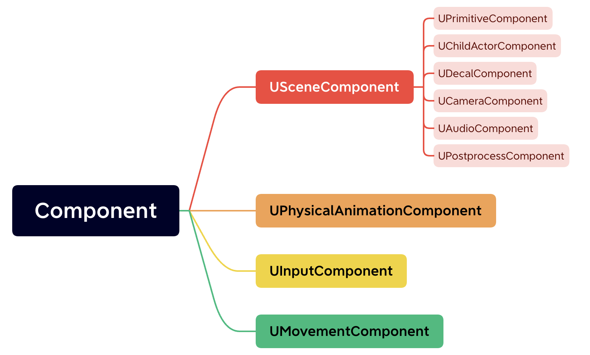
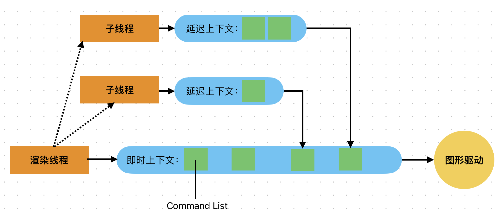

# UE学习笔记

## 基类

### UObject

一切对象的基类。UE为UObject类提供了

- 垃圾回收GC
  - 被`UProperty`标记的变量会自动进行生命周期管理
  - 非UObject可以使用C++标准推荐的智能指针
- 引用计数
- 反射
- 序列化
  - 资源的存储与加载
- 自动检测默认变量的更改
- 自动变量初始化
- 与Editor的交互
- 运行时类型识别
  - UE禁用了C++的`dynamic_cast`，你可以使用`Cast<>`替代
- 网络复制

#### 反射

反射分为静态反射和动态反射，C++没有该机制（尽管C++可以在编译时进行类型推导，但远不如Java那种**Class对象**的机制好用），于是UE自己做了一套

- 功能

  - 运行时知道类、函数的所有相关信息（属性表，函数表），进而实现可视化编程（蓝图，面板）

  - 通过函数名/类名+连续数据块访问对应函数/类

反射说白了就是将类、函数的信息（用哈希表）存储，运行时根据函数名、类名（key）查找信息，UE的反射是通过UBT和UHT实现的

- 通过宏标记C++代码
- UHT生成`.generated.h`和`.generated.cpp`文件
- 引擎初始化时注册反射信息

### Actor

一切实体的基类。能够被挂载组件（U）

#### Component

基类：`UActorComponent`

Component是一种属性+行为的集合



#### 通讯

Actor之间要进行通讯，Unity可以通过获得GO引用、获得GO的组件的方式进行通讯

UE Actor的通讯方式有

- 获取引用
- Cast
- 接口
- 事件

### Pawn

英语意思为棋子，指可以被操控的兵卒（可以被玩家操控，也可以被AI操控）

#### Charactor

继承自Pawn，是一个更复杂的可操控角色，该角色的特点是有一种特殊的组件，Charactor Movement

### Controller

控制器，负责控制Pawn、Charactor的行为

## 命名原则

通过类的前缀来区分类的类型

| 前缀 | 意义                           |
| ---- | ------------------------------ |
| F    | 纯C++类，通常为功能类          |
| U    | 继承自UObject，但不继承自Actor |
| A    | 继承自Actor                    |
| S    | Slate控件                      |
| H    | HitResult相关类                |
| T    | 模版类                         |
| E    | 枚举类                         |

## 对象

### 创建对象

- F类，使用new
- U类，使用NewObject
- A类，使用SpawnActor

```c++
new FClass();
NewObject<UxxxClass>();
GetWorld()->SpawnActor<AxxxClass>();
```

### UObject

生命周期

#### 创建

- 内存分配，返回一个分配好尺寸但没有初始化的指针（你steam下游戏也是先清出一片区域，再正式下载）
- 对象构建
  - 创建`FObjectInitializer`
  - 将`FObjectInitializer`作为参数传递给函数指针`ClassConstructor`，得到对象

#### 反序列化

- 获取类信息`GetClass`
- 判断类信息是否载入，若没有载入则进行预载
- 载入名字、Outer、类信息（类信息保存在ObjClass对象中，感觉和Java的类对象机制很接近）
- 载入脚本成员变量信息

反序列化的规则：

- 只反序列化`UPROPERTY`标记，且不等于默认值的数据
- 先创建出对象，再反序列化（还原数据）
- 对象具有所属关系
- 若一个对象所有信息和原始对象相同，尽管他们在内存的位置不同（指针值不同），该对象就是原始对象

#### 释放消亡

UObject无法手动释放，但是可以被请求，将其标记后等待引擎将其释放

GC分为两步，析构、回收

## 蓝图

- UPROPERTY：注册成员变量到蓝图
- UFUNCTION：注册函数到蓝图

## 引擎基础功能

### 正则表达式

```c++
#include "Regex.h"
...
FString TextStr("This is a string");
FRegexPattern TestPattern(TEXT("C.+H"));
FRegexMatcher TestMatcher(TestPattern, TextStr);
if(TestMatcher.FindNext()){
  UE_LOG(MyLog, Warning, TEXT("找到匹配内容 %d -%d"), 
        TestMatcher.GetMatchBeginning(),
        TestMatcher.GetMatchEnding());
}
```

### 路径

```c++
//获取xxx目录路径
FString FPaths::xxxDir();		
//判断文件是否存在
bool FPaths::FileExists(const FString& InPath);	
//相对路径转化为绝对路径
FString ConvertRelativePathToFull(const FString& BasePath, FString&& InPath)；	
```

### XML

```xml
<?xml version="1.0" encoding="utf-8" ?>
<note name="Ami" age="100">
  <from>John</from>
  <list>
  	<line>Hello</line>
    <line>world</line>
  </list>
</note>
```

使用`FXmlFile`或者`FastXML`操作xml文件

```c++
FString xmlFilePath = TEXT("xxx/Test.xml");
FXmlFile* xml = new FXmlFile();
xml->LoadFile(xmlFilePath);
FXmlNode* RootNode = xml->GetRootNode();
FString from_content = RootNode->FindChildNode("from")->GetContent();
FString note_name  = RootNode->GetAttribute("name");
TArray<FXmlNode*> list_node = RootNode->FindChildNode("list")->GetChildrenNodes();
```

### JSON

```c++
FString JsonStr = "[{\"author\": \"Tim\"}, {\"age\": \"100\"}]";
TArray<TSharedPtr<FJsonValue>> JsonParsed;
TSharedRef<TJsonReader<TCHAR>> JsonReader = TJsonReaderFactory<TCHAR>::Create(JsonStr);
bool BFlag = FJsonSerializer::Deserialize(JsonReader, JsonParsed);
{
  FString FStringAutor = JsonParsed[0]->AsObject()->GetStringField("autor");
}
```

### 文件

```c++
FPlatformFileManager::Get()->GetPlatformFile();
```

### GConfig

```c+
//写配置
GConfig->SetString(TEXT("Section"), TEXT("Key"), TEXT("Value"), FPaths::xxxDir()/"Config.ini");
//读配置
FString Result;
GConfig->GetString(TEXT("Section"), TEXT("Key"), Result, FPaths::xxxDir()/"Config.ini");
```

### UE_LOG

```c++
UE_LOG(log分类，log类型，log内容)；
```

### 字符串

|         | 能否修改 | 大小写敏感 | 语意                           |
| ------- | -------- | ---------- | ------------------------------ |
| FName   | 无法修改 | 不敏感     | 名字，在整个字符串表只出现一次 |
| FText   | 无法修改 | 敏感       | 被显示的字符串                 |
| FString | 能够修改 | 敏感       | 普通字符串                     |

### 图片

`ImagerWrapper`

## 模块

### 模块

模块就像Unity的Package，用于整理文件结构，便于编译

一个模块包含

- `Public`文件夹
  - `.h`文件
- `Private`文件夹
  - `.cpp`文件
- `模块名.build.cs`文件（继承自`ModuleRules`类）

### UBT

`Unreal Build Tool.cs`中有Main函数，主要做三个功能

1. 收集信息：环境变量、目录信息等
2. 确定生成的目标类型
3. 生成构建

### UHT

`Unreal Header Tool`，一个基于引擎代码，但不需要引擎完全启动，编译后得到一个`.exe`文件的程序

## 引擎核心

[UE Begin Play](https://dev.epicgames.com/community/learning/paths/0w/beginplay)

### 内存分配

提供了多套内存分配器，其中包含TBB（TBB的内存分配一大特点就是可以通过代理的方式全局替换new、malloc等操作符），TBB见《高性能C+++》笔记，那边有详细介绍

TBB内存分配主要包括

- LTS，线程内存池，每个线程会独立拥有一个局部的内存池，互不影响，但最后需要归约
- 缓存对齐，通过在变量间填充大量无效信息，使得不同变量处于不同缓存行中，于是避免了假共享问题

### 引擎初始化

- PreInit
  - 接收cmd命令，判断启动模式
  - 初始化游戏主线程（将当前线程当作主线程）
  - 初始化随机数
  - 初始化TaskGraph系统，设置线程数量，启动线程池
  - 调用`LoadCoreModules`，启动`CoreUObject`模块
  - 启动引擎、渲染、动画蓝图、Slate、贴图压缩、地形模块
- Init
  - 各个模块初始化，并执行所有`PostEngineInit`函数
  - 进入主循环

### 主循环

UE是一个多线程引擎，将游戏逻辑、渲染、声音、IO等系统分离

主线程是游戏逻辑线程，内含一个while循环，循环内有一个`Trick`，可以类比Unity的Update

渲染线程数游戏逻辑线程的从属，接收来自主线程的命令，进行渲染绘制。渲染线程比逻辑线程慢一帧

### 并发并行

- 线程
- 并行
- 并发
- Task Graph
  - UE最强大的多线程框架，将任务抽象为Task
  - UE内部使用了TBB，感觉这部分内容和TBB基本一致
  - 详情见`FBaseGraphTask`、`FTaskThreadBase`

- `FRunnableThread+FRunnable`
  - 详情见`QueuedThreadPoolWrapper.h`，并不是很好用


## 渲染

### 渲染线程

UE的游戏线程和渲染线程分离（事实上现在基本所有引擎都这样），渲染线程是游戏线程的“附庸”

在引擎Init时，会调用`StartRenderingThread`函数，启动渲染线程

该函数主要做：

1. 创建渲染线程
2. 从TaskGraph中取任务
3. 注册渲染线程
4. 注册Trick

### 运行

渲染线程的主要执行内容在`RenderingThreadMain`中，游戏线程可以通过`EQUEUE_Render_COMMAND`等宏命令向渲染线程的TaskMap中添加渲染任务，渲染线程提取这些命令后将其添加到`RHICommandList`中，最后传递到GPU中


### RHI

RHI（Render Hardware Interface），对图形库的一种封装，以供上层使用

|                         | UE5中含义                                    |
| ----------------------- | -------------------------------------------- |
| FRenderResource         | 渲染线程中的资源，如贴图、顶点buffer、顶点id |
| FRHIResource            | GPU侧的资源，如Texture2D、3D、Cube           |
| DynamicRHI              | 所有图形API适配器的基类                      |
| RHI                     |                                              |
| RHIContext              | RHI命令上下文                                |
| RHICommandList          | RHI指令队列                                  |
| FRHICommandListExecutor | 将RHI指令翻译为图形API                       |

### 多线程

#### DX11

DX11尝试从硬件层面解决多线程渲染，提供了两种设备上下文：即时上下文（Immediate Context）和延迟上下文（Deferred Context）

延迟上下文多线程并行，最后将生成的CommandList归约到即时上下文中，由即时上下文Execute

对于某些支持硬件级加速的驱动，延迟上下文可以将CommandList也直接提交给图形驱动



DX11的多线程，感觉就是一种简单的异步，仅仅是加速了指令录制，减少了等待

#### DX12

取消了DX11的渲染上下文，不再使用DrawCall，而是直接使用CommandList来调用图形驱动

1. DX12渲染线程并行进行指令录制，生成一些命令列表（CommandList）
2. 然后将这些命令列表提交给命令队列（CommandQueue）中
3. 命令队列根据指令类型，将指令放入不同的GPU引擎中

命令队列有三种：复制队列（Copy Queue）、计算队列（Compute Queue）、3D队列

GPU引擎有三种：复制引擎、计算引擎、3D引擎

命令队列和GPU引擎都可以并行执行


### 渲染管线


## 物理

UE5使用Chaos替代PhysX作为新的物理引擎

| Chaos                 | PhysX    |
| --------------------- | -------- |
| 基于位置（PBD）       | 基于速度 |
| 支持大世界坐标（LWC） | 不支持   |
| 支持网络同步          | 不支持   |

### 异步

UE5可以启用异步物理模拟，物理线程会作为单独的线程运行（类似渲染线程）

由于是独立线程，物理模拟可以以固定的间隔运行，既可以提高精确度，也方便C/S网络同步

但开启异步后物理线程无法即时获取游戏线程的输入，有可能影响游戏逻辑

### 功能

- 布料
- 破坏
- 载具
- 场

### PBD

[论文](https://matthias-research.github.io/pages/publications/PBDBodies.pdf)

### 大世界

World partition

