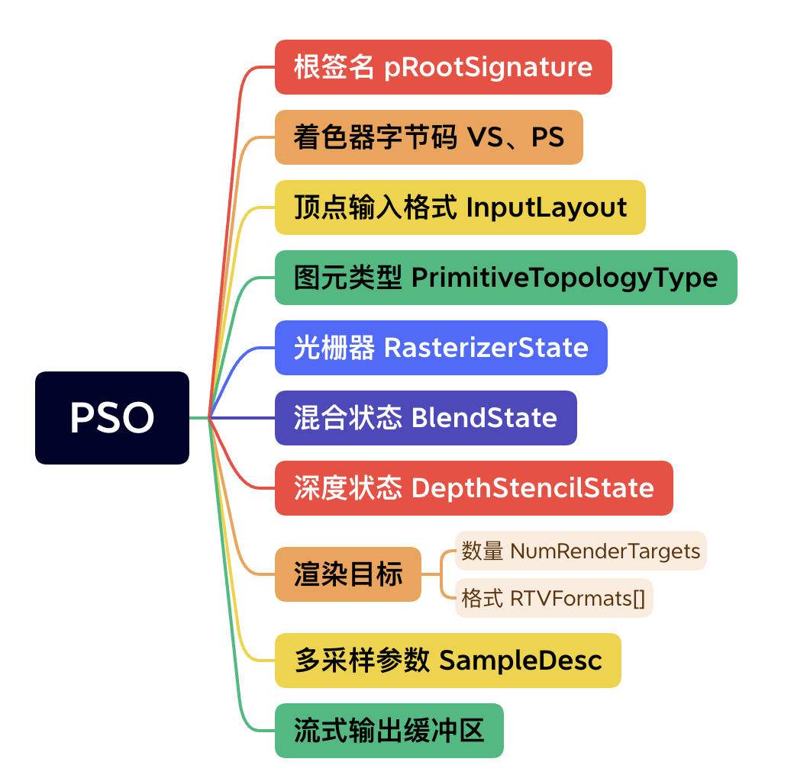

# 图形API

## DX12

### 环境搭建

Windows 10/11系统

安装[PIX](https://devblogs.microsoft.com/pix/download/)

安装Visual Studio 2019

### Windows应用程序

Windows应用程序使用事件驱动（详情可以去看WPF）

Windows应用程序的入口点是`WinMain`函数

```c++
int WINAPI WinMain(HINSTANCE hInstance, HINSTANCE, LPSTR, int nCmdShow)
{
    LearnDX::D3D12HelloWindow sample(1280, 720, L"D3D12 Hello Window");
    return LearnDX::Win32Application::Run(&sample, hInstance, nCmdShow);
}
```

主程序会创建一个窗口，并进入消息循环，检索处理操作系统发来的消息，并对其进行相应

| message        | 发送时机                      |
| -------------- | ----------------------------- |
| WM_CHAR        | 键盘输入一个字符              |
| WM_COMMAND     | 使用菜单栏、控件              |
| WM_CREATE      | 创建一个窗口                  |
| WM_DESTROY     | 一个窗口被摧毁                |
| WM_LBUTTONDOWN | 按下鼠标左键                  |
| WM_LBUTTONUP   | 鼠标左键被释放                |
| WM_MOUSEMOVE   | 鼠标指针被移动                |
| WM_PAINT       | 一个窗口需要重新粉刷          |
| WM_QUIT        | 应用程序即将终止，WinMain返回 |
| WM_SIZE        | 调整窗口大小                  |

当接收到`WM_QUIT`消息时（比如用户关闭窗口），会退出消息循环，应用程序即将结束，`WinMain`函数返回

### COM

#### 为什么要使用COM

> 我们在编写C++时，经常会生成dll文件，这是一种动态库，保存了许多通用的数据和函数，运行时软件可以通过函数指针的方式导出dll的函数，从而实现运行时动态链接
>
> 当我们在同一操作系统、同一编译器环境写构建C++项目，可以复用这个dll文件。然而当你使用其他语言时，如果这个语言读不懂dll的二进制，不知道如何与之沟通，这个语言就不能使用这个dll文件。
>
> 或者另一种情况，当你更新了这个dll文件，而应用还在用老办法调用dll，很有可能也会出错

为了解决上述问题，微软提出了**组件对象模型**（Component Object Model，COM），一套软件组件的二进制接口，可以实现跨编程语言的进程间通信、创建动态对象，在二进制层面打破了代码依赖

#### COM的优点

- 软件（apps）使用抽象接口访问服务器（servers，这里指dll文件），可以使用接口指针调用COM类的成员函数
- 软件无需知道COM的内部实现，COM对象的创建与释放由COM自行完成
- COM可能同时被多个软件使用，使用引用计数法进行GC
- 每个COM类都有独一无二的ID，因此内存中可以同时加载多个拥有相同接口的COM类，软件可以自行选择使用哪一个COM类
- COM规定了一种特殊的layout，可以被任何支持COM的语言所解析（但可惜的是，支持COM的语言并不多，因此你还是只能用C++去写DX）
- COM实际上是由指针和函数表组成（就像C++的虚函数）

#### COM的实现

COM中所有接口都继承于`IUnknown`，该接口提供了三个操作

- `AddRef`：增加引用计数的次数，每次拷贝接口指针时都会执行
- `Release`：减少引用计数的次数，当次数为0，释放对象
- `QueryInterface`：返回指向该对象的指针

不过显式控制COM对象的引用过于困难，C++推荐使用智能指针

### DXGI

DirectX Graphics Infrastructure (DXGI)，负责管理一些low-level的任务，比如如何将frame呈现在显示器上，gamma矫正，屏幕刷新，交换链等


### 依赖

VS添加DX12依赖

```
打开VS--项目--属性--配置属性--链接器--输入--附加依赖项
```


cmake添加依赖

```cmake
cmake_minimum_required(VERSION 3.20)
project(DXEngine)
set(CMAKE_CXX_STANDARD 17)

file(GLOB_RECURSE srcs CONFIGURE_DEPENDS src/*.cpp src/*.h)

add_executable(DXEngine WIN32 ${srcs})
target_include_directories(DXEngine PUBLIC include)
# 比较重要的是d3d12.lib dxgi.lib
target_link_libraries(DXEngine PRIVATE
        d3d12.lib dxgi.lib dxguid.lib uuid.lib
        kernel32.lib user32.lib
        comdlg32.lib advapi32.lib shell32.lib
        ole32.lib oleaut32.lib
        runtimeobject.lib
        )
```


### 批注

VS提供了一套批注系统，SAL（Source code annotation language）

### 字符串

Windows的字符串是一大噩梦

代码的字符编码主要有两种，`ASCII`和`UNICODE`，Windows内部使用了utf-16存储字符串，并支持两种API，用以支持`ASCII`和`UNICODE`，他们分布以`A`和`W`结尾

为了支持两种API，于是推出了一种新的字符类型**宽字符**：`wchat_t`，微软将其重命名为`WCHAR`

宽字符在使用时要在前面加`L`，比如`L'a'`

微软又将字符串进行重命名，提出了窄字符串STR和宽字符串WSTR，并给出了他们的指针`LPSTR`和`LPWSTR`

```c++
LPSTR = const char*
LPWSTR = const wchar_t*
```

如果你用VS开发，可以设置整个项目使用`UNICODE`，但我不建议这样做

强烈推荐当你要使用字符串函数时，明确使用后缀是`A`还是`W`，并且要注意你`WindowProc`的类型（是使用`DefWindowProcW`还是`DefWindowProcA`）

### d3dx12.h

这是一个`.h`文件，内含许多DX开发常用函数，将该文件复制到项目中

这个文件中使用了大量Windows SDK，因此你最好用VS2019的Toolchains（Clion的用户使用内置的MinGW可能会报一堆错）

至于为什么要求是VS2019，是因为这个文件与Windows10 SDK版本强相关，VS2019的SDK直接就是对应版本，2017需要手动下载，2015直接没法用

[详情](https://stackoverflow.com/questions/65294611/d3dx12-h-gives-a-bunch-of-errors)

### 创建第一个窗体

这个窗体啥也没有，就输出一个蓝色屏幕，下面是创建这个窗体的过程


- WindowProc是一个回调函数，用于处理传给窗口的消息


- `OnInt()`是`D3D12HelloWindow`的生命周期函数，包含两个部分，加载管线和加载资源


- 描述符堆（Descriptor Heap），用于CPU向GPU传递资源（比如数组、贴图），告诉GPU去哪里访问这些资源
  - 描述资源的类型、维度、GPU虚拟地址、硬件信息
  - 我们将描述符绑定在**slots**上，GPU可以通过访问slots上的描述符找到资源

- 栅栏（Fence），可以将其插入命令队列以实现同步

DX12支持多线程渲染，命令队列和命令列表的关系如下


### 硬件架构

- CPU
  - Cache占绝大部分面积
  - ALU、控制单元少，但复杂强大
- GPU
  - 计算核心占绝大部分面积
  - 计算核心数量极多，个头小，可编程，支持并行


### 渲染管线


#### 输入汇编器

输入汇编器（Input Assembler）

- 输入：顶点索引和顶点缓冲
- 行为：组装成图元
- 输出：传给顶点着色器

网格（Mesh）是由图元（通常为三角形）组成的几何体

顶点缓冲区（vertex buffers）存储了顶点相关的数据

输入布局（Input layout）描述了顶点缓冲区的布局，为顶点属性指定语意，使得输入汇编器能读懂顶点缓冲区

索引缓冲（index buffers）内含顶点索引，通过指向顶点缓冲区来组成图元


原始拓扑（Primitive topologies），描述了图元间的连接、邻接关系


特别的，Triangle Strip的三个顶点满足公式
$$
\Delta_i=\{i, i+(1+i\%2), i+(2-i\%2)\}
$$

#### 光栅器

光栅器（Rasterizer），发生在片元着色器之前

- 输入：NDC空间的2D图元
- 行为：
  - 剔除：裁剪掉视口外的图元，剔除背面（可选）
  - 画线：获得图元所覆盖的像素区域
  - 插值：根据重心坐标和顶点属性进行插值
- 输出：传给片元着色器

### 资源管理

#### 内存

GPU可以访问四种内存

- 专用视频内存（Dedicated video memory）：我们分配GPU资源最常用的地方
- 专用系统内存（Dedicated system memory）：GPU内部专用内存，应用程序不能使用
- 共享系统内存（Shared system memory）：CPU可见的显存，常用于CPU向GPU传递数据
- CPU系统内存（CPU system memory）：CPU可以任意访问，但GPU要通过PCI-e总线访问，速度极慢

#### 视图和描述符

视图=描述符≈资源指针

| 简称     | 全称                  | 意义                 |
| -------- | --------------------- | -------------------- |
| CBV      | Constant buffer view  | 描述常量缓冲区       |
| UAV      | Unordered access view | 常用于多线程读写     |
| SRV      | Shader resource view  | 描述只读纹理和缓冲区 |
| Samplers |                       | 采样器               |
| RTV      | Render Target View    | 描述渲染目标         |
| DSV      | Depth Stencil View    | 描述深度缓冲区       |
| IBV      | Index Buffer View     | 描述顶点索引缓冲区   |
| VBV      | Vertex Buffer View    | 描述顶点缓冲区       |
| SOV      | Stream Output View    | 描述流输出缓冲区     |

#### 资源状态

资源的多线程读写是冲突的，于是要通过资源状态实现互斥

GPU使用转化资源的状态来指定资源的预期用途，比如要读一张贴图，该贴图必须处于读取状态

DX12使用`ResourceBarrier`管理资源状态

#### 根签名

在HLSL中，我们可以声明一个变量

```hlsl
Texture2D g_texture : register(t0);
```

该变量的类型是SRV，绑定到`t`的第0槽

- `t`：SRV
- `s`：Samplers
- `u`：UAV
- `b`：CBV

### 管道状态

管道状态（pipeline state object ，PSO）定义了渲染管线的每个阶段的行为，PSO创建后不可变



### Bundles

捆绑包（Bundles），用于将少量命令组合在一起，方便使用

Bundles只能提交给CommandList，不能直接提交给命令队列

### 常量缓冲区

就是CBuffer，是一种访问延迟更低，适合CPU高频更新的缓冲区

在着色器程序执行期间，常量缓冲区不会发送改变

常量缓冲区需要256字节**对齐**，一般使用4KB或者64KB（关于为什么要对齐、什么是假引用、缓存行，可以去看《高性能C++》笔记）

### 纹理


## Metal

一个优雅的图形库

### 环境搭建

MacOS，强烈建议使用M1/M2芯片

Xcode

### SwiftUI

SwiftUI是苹果推出的新一代UI框架，可以开发跨苹果各种设备（手机，mac、手表、TV）的软件

程序入口：

```swift
@main
struct TinyMetalEngineApp: App {
    var body: some Scene {
        WindowGroup {
            ContentView().navigationTitle("Tiny Metal Engine")
        }
    }
}
```


## GNM

PS4平台的图形API库，做PS开发需要PS4_DevKit SDK、Taskbar Application、PS开发机，几乎没有公开的文档和SDK下载方式（可以去暗网找黑客买，之前他们攻击游戏公司时流出了相关SDK和license）

- Gnm Library
- Gnmx Library
- GpuAddress Library
- ShaderBinary Library
- Gnf Library

## XDK

Xbox主机的开发工具，只需要[19刀](https://learn.microsoft.com/en-us/windows/uwp/gaming/getting-started)，就能成为永久合作者，在零售Xbox主机制作调试游戏、应用程序

你可以使用Win32、UWP、Unity、HTML/JS进行游戏、应用程序的开发开发

[Xbox UWP](https://learn.microsoft.com/en-us/windows/uwp/xbox-apps/)

## 参考

[龙书代码](https://github.com/d3dcoder/d3d12book)

[learning-DX12](https://www.3dgep.com/learning-directx-12-1/)

[LearningDirectX](https://paminerva.github.io/docs/LearnDirectX/LearnDirectX)

[LearningDirectX Githunb](https://github.com/microsoft/DirectX-Graphics-Samples/tree/master/Samples/Desktop)

[Metal by tutorials](https://github.com/kodecocodes/met-materials/tree/editions/3.0)