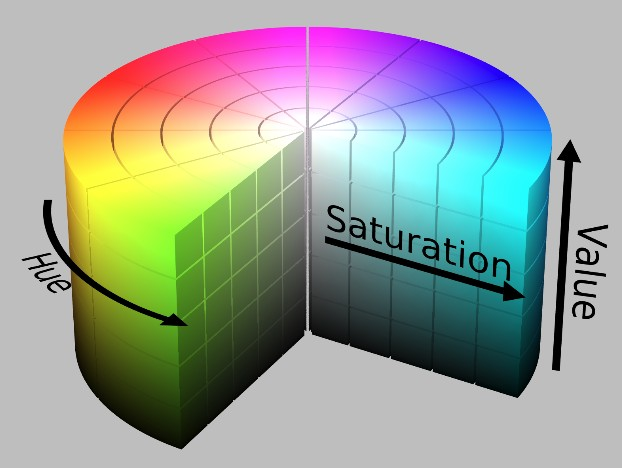
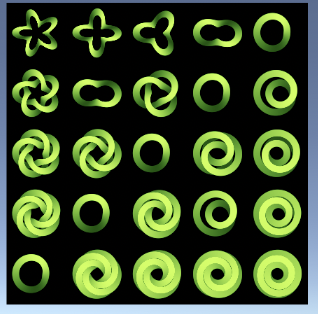

# 计算机图形学

*年轻人第一本图形学笔记，基于Unity ShaderLab和《Real-Time Rendering 4th Edition》*

### 图形

#### 什么是图形？

- Graphics图形e
  - 几何信息
    - 点线面 point curve surface
  - 非几何信息
    - 纹理 Texture 颜色 color
- images图像

#### 计算机图形学

计图第一定律：如果它看起来是对的，那么它就是对的


##### 基本概念

- Pixel 像素
- Raster 光栅
- Frame Buffer 帧缓存
- Depth 深度
- Resolution 分辨率
- Refresh Rate 刷新率

*你知道吗？电影放映机以 24 FPS 来显示，但是会用一个快门系统(Shutter System)去让每帧显示 2 ~ 4 次以防止闪烁，一个每帧显示3次的快门具有 72 赫兹的刷新率*

#### 色彩

##### RGB/HSV颜色空间

**RGB** —— 适合显示系统，不适合图像处理

- 最常见的颜色空间，使用三个颜色分量线性组合表示颜色
- 是一种加色模型
- 由于人眼对三种颜色敏感程度不同（蓝 > 绿 > 红），所以RGB均匀性较差
- 三个分量高度相关，而且易受亮度影响


**HSV** —— 用于图像处理

- Hue（色调、色相）*用角度度量，取值范围为0～360°*
- Saturation（饱和度、色彩纯净度）
- Value（明度）



**CMYK** —— 用于印刷

- 即青、洋红（品红）、黄、黑四种色彩

- 是一种减色模型


**YUV** —— 用于颜色编码

- Y表示明亮度（Luminance或Luma）
- U和V表示的则是色度（Chrominance或Chroma）

**RGB和HSV互转**

`Color.RGBToHSV()`

`Color.HSVToRGB()`

**RGB转YUV**

ITU-R BT.709的亮度公式为 `Y＝0.2125R+0.7154G+0.0721B`

##### 色彩格式

- RGB16
  - RGB565
  - RGB555
- RGB24
- RGB32
  - ARGB32

RBG565


BGB555


BGB24


ABGB32


##### 拮抗原理

人眼对光产生视觉反应的过程是由三对互相拮抗的组织主导的，它们分别为红与绿、黄与蓝和黑与白，对某一种颜色产生兴奋的时候，就会对相拮抗的颜色产生抑制（比如对蓝色兴奋时，对黄色的感知会被抑制）

##### HDR

**高动态范围（High Dynamic Range，HDR）**

HDR可以更真实的反映光照。如果我们场景中有很多光源或光源强度非常大，那么一个物体在经过多次光照渲染叠加后最终得到的光照亮度很可能会超过1，如果没有使用HDR，那么这些超过的部分就会全部截取到1，使得场景丢失了很多亮度的细节。而开启HDR后，我们就可以保留这些细节，然后使用**色调映射(Tone Mapping)**技术将HDR转换到LDR，以最大程度的保留我们需要的亮度细节

### 变换

**变换（transform）**是一种操作，它接受点（points），向量（vectors）或颜色（colors）之类的实体（entities），并且以某种方式转换它们

#### 1.数理基础

##### 笛卡尔坐标系

- 二维笛卡尔坐标系
- 三维笛卡尔坐标系

##### 点point

n维空间的一个位置

##### 矢量vector

n维空间中包含**模**（magnitude）和**方向**（direction）的有向线段

**切线tangent**

与纹理空间对齐，与法线方向垂直

**法线normal**

##### 矩阵matrix

*给我去看线性代数*

##### 四元数（Quaternions）

*给我去看线性代数*


#### 2.基本变换

缩放（scale）和旋转（rotation）都是**线性变换（linear transform）**

线性变换是保留向量加法和标量乘法的变换

但平移不是线性变换，所有引入**仿射变换（affine transform）**，将矢量拓展到四维空间，这个空间被称为**齐次坐标空间**

仿射矩阵（affine matrix）的主要特征就是它保留了线的平行性，但不一定保留长度和角度

##### 平移

矩阵左乘平移矩阵实现**平移**

****

##### 缩放

矩阵左乘缩放矩阵实现**缩放**

****

##### 旋转

**旋转**矩阵


绕着x/y/z轴旋转 𝜃 度

##### 剪切（Shearing）

##### 复合变换（级联）

矩阵左乘顺序不一致，结果可能不同，于是复合变换要约定变换顺序

##### 刚体变换

仅由平移和旋转的串联组成的变换称为刚体变换。它具有保留长度，角度和惯用性的特性

##### 法线变换

直接变换，可能表面法线不再与表面垂直，于是表面法线变换时是使用矩阵的**伴随矩阵**的转置相乘，但法线不能保证在变换后仍是单位长度，因此通常需要将其归一化（normalized）

计算伴随矩阵成本很高，由于向量可以平移，于是平移、统一缩放不影响法线，而旋转矩阵本身就是通过其转置矩阵为逆来定义的，于是旋转也可以直接使用原始矩阵

#### 3.特殊变换

##### 欧拉变化

##### 矩阵分解

##### 绕任意轴旋转

#### 4.变形（Morphing）

两个核心问题：顶点对应问题（the vertex correspondence problemp）和插值问题（the interpolation problem）

#### 5.几何缓存回放（Geometry Cache Playback）

#### 6.投影

##### 坐标空间

- 模型空间（model space）/ 局部空间（local space）
- 世界空间（world space） *在unity是左手系*
- 观察空间（view space）/ 摄像机空间（camera space）*在unity是右手系*

观察空间是三维空间，但屏幕空间是二维空间

**投影** 观察空间 -> 屏幕空间

**观察变换** 世界空间 -> 观察空间

- 裁剪空间（clip space） *位于裁剪空间内的图元被保留，空间外的图元被剔除*

裁剪空间由视锥体决定，视锥体由六个裁剪平面包围

**投影**：透视投影，正交投影

- 屏幕空间(screen space)

**齐次除法** 用齐次坐标的w分量除xyz分量

齐次除法后得到的坐标叫做**归一化的设备坐标NDC**


### 渲染流水线

**图形渲染管线**（graphics rendering pipeline），也被简称为“管线”（the pipeline），渲染流水线的工作就是**由一个三维场景出发，生成一张二维图像**


#### 1.渲染步骤

- 应用阶段（application）
  -  主要在CPU中进行
  - 将渲染图元（primitives）提交给几何阶段
  - 准备好场景数据（摄像机机位、模型、光源）
  - 使用加速算法（如剔除）
  - 使用材质、纹理、shader
  - 进行碰撞检测，处理IO
- 几何阶段（geometry processing）
  -  主要在GPU中进行，进行逐顶点/逐三角的操作
  - 包含顶点着色（vertex shading），投影（projection），裁剪（clipping）和屏幕映射（screen mapping）几个阶段
- 光栅化阶段（rasterization）
- 像素处理阶段（pixel processing）

*注意，在OpenGL中像素处理阶段叫片元着色器，并将其分在光栅化中*


渲染速度可以表示为每秒帧数（FPS），即每秒渲染的图像个数

#### 2.CPU和GPU通信

1. 把数据加载到显存(VRAM)中
2. 设置渲染状态
3. 调用Draw Call

##### Draw Call

是一种命令，CPU发起，GPU接收，指向需要被渲染的图源列表

#### 3.渲染流水线


绿色的可编程，黄色可配置不可编程，蓝色不可控制

实线表示shader中必有，虚线表示shader中可选

##### 顶点着色器（vertex shading）

- 是流水线的第一阶段，输入来自CPU
- 处理单位是顶点，每一个顶点都会调用一次顶点着色器
- 顶点着色器相互独立，不知道顶点间的关系
- 主要工作
  - 计算顶点位置（坐标变换）：把顶点坐标从模型空间转化到齐次裁剪空间
  - 计算顶点颜色，对三角形进行插值（现在GPU顶点着色器以经不再计算着色方程了）

##### 投影（projection）

- 正交投影（orthographic，也称为平行投影，parallel）
- 透视投影（perspective）

##### 可选顶点处理 Optional Vertex Processing

- 曲面细分（tessellation）
- 几何着色器（geometry shading）
- 流输出（stream output）：常用于粒子效果

##### 裁剪（clipping）

只有那些全部或部分位于视景体（view volume）内的图元（primitives）才需要传递到光栅化阶段

- 完全不在视景体之内的图元不会进一步传递，因为它们不会被渲染。

- 部分位于视景体内的图元只需要裁剪后的那部分

##### 屏幕映射（screen mapping）

- 裁剪后的图元仍然是三维的

- 屏幕映射把图元的xy坐标转换到**屏幕坐标系（screen coordinates）**


屏幕坐标系和z坐标一起构成**窗口坐标系（window coordinates）**

##### 三角形设置（Triangle Setup）

计算光栅化一个三角网格所需的信息

##### 三角形遍历（ Triangle Traversal）

检查每一个像素，若像素被三角网格覆盖，则生成一个片元（fragment）

此阶段会根据上个阶段的计算结果来判断三角网格覆盖了哪些像素，并使用三个顶点的信息对整个覆盖区域进行插值


##### 片元（像素）着色器

输入上一阶段的顶点信息插值，输出一个或多个颜色值

##### 逐片元（像素）操作

- 主要任务
  - 决定每个片元的可见性（模版测试，深度测试）
  - （若可见）把这个片元的颜色和缓冲区的颜色进行合并


#### 4.渲染方法

- 光栅化		Forward, Deferred, TBDR, Forward+
- 光线追踪    离线渲染、路径追踪
- 混合式渲染

### GPU

图形处理单元（GPU，Graphics Processing Unit）

#### 流处理器

##### SP

**流处理器**又称**流处理单元**，简称**SP单元（Streaming Processor）**，显卡厂商将其称为核心（core）

微软推出DirectX10后，顶点处理单元/像素处理单元就被SP单元取代了，SP单元可以处理顶点着色和像素着色，这种概念被称为**统一着色架构（Unified Shader Architecture）**

##### SM

**流多重处理器（Streaming Multiprocessor）**是指多个SP+共享内存、特殊函数单元（SFU）、寄存器、多边形引擎、指令缓存和L1缓存的组合

SM中SP一般为32个（也有16或64个的）

SFU（Special Function Units）用于处理三角函数和指对数运算

SM由**Warp Scheduler(束管理器)**驱动，束管理器会一次性向SM中所有的SP发送同一个指令，这种特性被称为**单指令多线程（SIMT，Single Instruction Multiple Thread）**

#### 数据并行架构

GPU的大部分芯片区域专用于称为着色器核心（shader cores）的大量处理器，通常数量多达数千个

- 流处理器，依次处理相似数据的有序几何，因此可以并行计算
- 调用独立，不需要相邻调用的信息（可以手动违反）

吞吐量（throughput）：可以处理数据的最大速率

由于专用于高速缓存存储器和控制逻辑的芯片面积较小，因此每个着色器内核的等待时间通常比CPU处理器遇到的等待时间长得多

着色器处理时可能会需要一些纹理，这些纹理从内存中读取需要大量时间，在此期间着色器不能继续工作，于是我们为每个片元提供一些用于其本地寄存器的存储空间，允许着色器处理器切换并执行另一个片元，直到纹理读取完毕后继续执行。这样与着色器处理器（shader processor）始终专注于一个片元相比，执行单个片元所需的时间更长，但是整个片元的总体执行时间将大大减少。在这种架构中，通过切换到另一个片元使GPU保持忙碌来隐藏延迟。GPU通过将指令执行逻辑与数据分离开来，使该设计更进一步。称为**单指令多数据**（SIMD，single instruction, multiple data）

GPU的**线程**和CPU不同，是由用于着色器输入值的一点**内存**以及着色器执行所需的任何**寄存器空间**组成，每个片元的像素着色器调用都称为线程。使用相同着色器程序的线程被分为几组，被NVIDIA称为warp，被AMD称为wavefronts

warp交换是所有GPU使用的主要延迟隐藏机制

### 着色基础

#### 着色模型

渲染的第一步就是选择**着色模型（shading model）**

#### 光源

**光源（ Light Sources）**提供了着色的主要方向。

光线方向向量 𝐥

现实中光照可能十分复杂，受很多因素影响，基于物理的着色模型要考虑所有这些因素

一些高度风格化的模型可能没有光照的概念，也可能仅仅使用光照提供一些简单的方向性

##### 方向光

方向光（Directional Lights）是光源的最简单模型

- 𝐥 在整个场景恒定（会受阴影衰减）
- 无位置

##### 精确光

精确光 （Punctual Lights）

包含点**光源（point light）**和**聚光灯（spotlight）**
$$
\mathbf{l} =\frac{\mathbf{p}_{l} -\mathbf{p}_{0} }{\| \mathbf{p}_{l} -\mathbf{p}_{0}\| }
$$
**平方反比光衰减（inverse-square light attenuation）**
$$
\mathrm{c}_{l} \left( r\right)  =\mathrm{c}_{0} \left( \frac{r_{0}}{r} \right)^{2}
$$
1.平方反比会导致距离趋近于0时，c~l~会非常大，可以取一个最小距离

如，UE中的平方反比光衰减
$$
\mathrm{c}_{l} \left( r\right)  =\mathrm{c}_{0} \left( \frac{r_{0}}{\max_{} \left( r,r_{\min_{} }\right)  } \right)^{2}
$$
r~min~是发射光的物理对象的半径

2.平方反比会在距离较大处仍然生效，为了提高性能，要设置最远距离，该点是导数和函数值同时为0的地方

如，UE中将平方反比光乘以一个开窗函数
$$
f_{win}\left( r\right)  = \left( 1-\left( \frac{r}{r_{max}} \right)^{4}  \right)^{2}  
$$


或者像《正当防卫2》乘以一个距离衰减函数

#### 实现着色模型

##### 计算频率

当设计一个着色实现时，需要根据他们的**计算频率（frequency of evaluation）**对计算进行划分

若在每次**绘制调用（draw call）**中计算结果保持恒定，则该计算可以由CPU执行，使用某个预处理

若计算结果每帧变化不大，而且计算昂贵，可以将结果平摊到多帧

其他情况下每帧计算一次

### 采样与滤波

#### 采样

**采样（sampling）**：将连续信号变成离散信号

**采样定理（sampling theorem）**：为了使一个信号被合适地采样，采样频率必须大于被采样信号最大频率的两倍。

*采样定理也被称为奈奎斯特率（Nyquist rate）或奈奎斯特极限（Nyquist limit）*

##### 重建

**重建（reconstructed）**：将离散信号恢复成连续信号，重建过程中需要用到**滤波（filtering）**

#### 滤波

纹素坐标是整数值，但UV坐标不是，可能过大，也可能过小，所以要有一种方法由UV坐标获得纹素值

##### 最近相邻滤波(Nearest neighbor filtering，或者Point sampling)

- UV坐标 x 纹理大小，然后四舍五入取最近的纹素
- 有明显的像素块
- 类似于box滤波器

##### 双线性滤波(Bilinear filtering，或者liner filtering)

- 根据一个坐标到其附近最近的四个像素点的距离进行加权平均，得到一个混合的颜色


- 类似于tent滤波器

##### 三线性滤波(Trilinear filtering)

- 在相邻的两个Mipmap层次上分别进行双线性滤波，再对得到的两个值进行线性插值
- 当距离非常大或非常小的时候，三线性滤波会退化为双线性滤波
- 类似于sinc滤波器

##### 各项异性滤波(Anisotropic filtering)

当一个目标表面和透视摄像机之间的角度较大时，纹理的填充面积实际上并不是正方形，这引入了模糊和闪烁等瑕疵

- 需要在一个非正方形区域内采样和混合
- 有的使用长方形，有的使用梯形


常见滤波器：


滤波过程：


##### 重采样

**重采样（resampling）**被用来放大后者缩小一个采样信号


#### 走样与反走样

三角形、线在像素中的显示是要么存在，要么不存在，于是会出现**锯齿（the jaggies）**，物体运动被称为**爬虫（crawlies）**，这些视觉伪像**（visual artifact）**被称为**走样（aliasing）**，解决走样问题的技术称为**反走样（antialiasing）**

当一个信号以过慢的频率进行采样时，走样就会出现。比如相机拍摄快速转动的车轮胎，车轮胎看起来像是向后旋转，这就是因为视频的采样频率过低，这称为**时间走样（temporal aliasing）**

##### 基于屏幕空间的反走样

使用一个针对屏幕的采样模式，并且对这些样本进行加权与求和，以得出像素的颜色


**全场景反走样**（full-scene antialiasing, **FSAA**），又名“**超级采样反走样**”（supersampling antialiasing, **SSAA**），以更高的分辨率渲染场景，然后对相邻的样本进行滤波以得到图像，这个方法最简单，但是要消耗非常多的性能（要得到2x2的图形，需要渲染4x4的内容）

**多重采样反走样**（Multisampling antialiasing，**MSAA**）通过一次的逐像素计算表面着色，并在样本间共享计算结果，从而降低了高额的计算成本

**覆盖采样反走样**（coverage sampling antialiasing，**CSAA**）

**增强质量反走样**（enhanced quality antialiasing，**EQAA**）


### Unity Shader

单独的unity shader没有用，必须配合材质发挥作用

#### 1.ShaderLab

unity shader其实不是shader，而是一种和shader语法近似的语言CG/HLSL

##### 文件结构

```c#
Shader "Unlit/TestShader"		//路径
{
    Properties		//用于暴露变量，与逻辑无关
    {
        _MainTex ("Texture", 2D) = "white" {}
    }
    SubShader			//与逻辑有关，可以写多个
    {
        Tags { "RenderType"="Opaque" }
        LOD 100

        Pass	//可以写多个
        {
            CGPROGRAM		//Cg Program开始，类似于一种大括号
            #pragma vertex vert
            #pragma fragment frag
            // make fog work
            #pragma multi_compile_fog

            #include "UnityCG.cginc"	//导入库文件

            struct appdata		//C#填充到vert中传递的变量
            {
                float4 vertex : POSITION;
                float2 uv : TEXCOORD0;
            };

            struct v2f		//C#填充到Frag时chuan di
            {
                float2 uv : TEXCOORD0;
                UNITY_FOG_COORDS(1)
                float4 vertex : SV_POSITION;
            };

            sampler2D _MainTex;			//与Properties中的属性进行链接
            float4 _MainTex_ST;			//C#脚本中SetColor改这里的变量

            v2f vert (appdata v)		//顶点着色器
            {
                v2f o;
                o.vertex = UnityObjectToClipPos(v.vertex);
                o.uv = TRANSFORM_TEX(v.uv, _MainTex);
                UNITY_TRANSFER_FOG(o,o.vertex);
                return o;
            }

            fixed4 frag (v2f i) : SV_Target		//片元着色器，可以看作main函数
            {
                // sample the texture
                fixed4 col = tex2D(_MainTex, i.uv);
                // apply fog
                UNITY_APPLY_FOG(i.fogCoord, col);
                return col;	//这里返回的就是最后的颜色
            }
            ENDCG		//Cg Program结束
        }
    }
}
```

#### 2.属性property

property的作用仅仅是为了这些属性出现在材质面板上，即使不暴露也能在CG中方使用

```c#
Properties		
    {
        Name ("display name", PropertyType) = DefaultValue
    }
```

- `Name` 变量名
- `display name` 出现在材质面板上的名字
- `PropertyType` 类型

##### 常见类型

| 属性类型        | 默认值定义语法                           | 例子                                     |
| --------------- | ---------------------------------------- | ---------------------------------------- |
| Int             | number                                   | `_Int("Int", Int) = 2`                   |
| Float           | number                                   | `_Float("Float", Float) = 1.5`           |
| Range(min, max) | number                                   | `_Range("Range", Range(0.0, 5.0)) = 3.0` |
| Color           | (number, number, number, number, number) | `_Color("Color", Color) = (1,1,1,1)`     |
| Vector          | (number, number, number, number, number) | `_Vector("Vector", Vector) = (2,3,6,1)`  |
| 2D              | "defaulttexture"{}                       | `_2D("2D", 2D) = "while"{}`              |
| Cube            | "defaulttexture"{}                       | `_Cube("Cube", Cube) = "while"{}`        |
| 3D              | "defaulttexture"{}                       | `_3D("3D", 3D) = "black"{}`              |

#### 3.SubShader

一个shader中至少有一个*SubShade*r，unity在加载shader时会扫描所有的*SubShader*，选择第一个能在目标平台运行的*SubShader*，若全不能使用则使用*Fallback*语义指定的Unity Shader

```c#
SubShader			//与逻辑有关，可以写多个
{
	Tags {"TagName1" = "Value1" "TagName2" = "Value2"}
	
	[RenderTags]
	
  Pass{
  }
}                      
```

- `RenderTags` 状态
- `Tags` 标签

| TagName              | 说明                                               | 例子                            |
| -------------------- | -------------------------------------------------- | ------------------------------- |
| Queue                | 控制渲染顺序（透明物体要在不透明物体渲染之后进行） | `Tags{"Queue" = "Transparent"}` |
| RenderType           | 对着色器分类                                       | `Tags{"RenderType" = "Opaque"}` |
| PreviewType          | 如何预览材质                                       | `Tags{"PreviewType" = "Plane"}` |
| DisableBatching      | 是否使用批处理                                     |                                 |
| ForceNoShadowCasting | 是否会投射阴影                                     |                                 |
| IgnoreProjector      | 是否忽略projector影响                              |                                 |
| CanUseSpriteAtlas    | 是否用于精灵                                       |                                 |

#### 4.表面着色器

unity自己的着色器代码类型，本质上和顶点/片源着色器一样

写在`CGPROGRAM`和`ENDCG`间，在`Pass`外

#### 5.顶点/片元着色器

写在`CGPROGRAM`和`ENDCG`间，在`Pass`内

#### 6.Unity内置变量

**变换矩阵**

UNITY_MATRIX_MVP 模型空间变换到投影空间

UNITY_MATRIX_MV 模型空间变换到观察空间

UNITY_MATRIX_V 视图空间

UNITY_MATRIX_P 投影空间

UNITY_MATRIX_VP 视图空间变换到投影空间

unity_ObjectToWorld 模型空间变换到世界空间

unity_WorldToObject 世界空间变换到模型空间

**灯光**

_ScreenParams 屏幕的相关参数，单位为像素 x 屏幕的宽度 y 屏幕的高度 z 1+1/屏幕宽度 w 1+1/屏幕高度


#### 7.Unity内置文件

| 函数名                                         | 描述                                                         |
| ---------------------------------------------- | ------------------------------------------------------------ |
| `float3 WorldSpaceViewDir(float4 v)`           | 输入一个模型顶点坐标，得到世界空间中从该点到摄像机的观察方向 |
| `float3 ObjSpaceViewDir(float4 v)`             | 输入一个模型顶点坐标，得到模型空间中从该点到摄像机的观察方向 |
| `float3 WorldSpaceLightDir(float4 v)`          | 输入一个模型顶点坐标，得到世界空间中从该点到光源的光照方向（方向没有归一化，且只可用于前向渲染） |
| `float3 ObjSpaceLightDir(float4 v)`            | 输入一个模型顶点坐标，得到模型空间中从该点到光源的光照方向（方向没有归一化，且只可用于前向渲染） |
| `float3 UnityObjectToWorldNormal(float3 norm)` | 将法线从模型空间转换到世界空间                               |
| `float3 UnityObjectToWorldDir(in float3 dir)`  | 把方向矢量从模型空间转换到世界空间                           |
| `float3 UnityWorldToObjectDir(float3 dir)`     | 把方向矢量从世界空间转换到模型空间                           |


#### 8.Unity提供的语义

**语义semantic**

语义用于描述参数的含义，告诉shader从哪里读取数据，将数据输出到哪里

**系统数值语义system-value semantics**

这类语义以SV开头，表示系统数值

**（应用阶段）传给顶点着色器的语义**

| 语义      | 描述                               |
| --------- | ---------------------------------- |
| POSITION  | 模型空间中的顶点位置，通常是float4 |
| NORMAL    | 顶点法线，通常是float3             |
| TANGENT   | 顶点切线，通常是float4             |
| TEXCOORDn | 顶点的纹理坐标，通常是float2/4     |
| COLOR     | 顶点颜色，通常是fixed4或者float4   |

**（顶点着色器）传给片元着色器的语义**

| 语义        | 描述                 |
| ----------- | -------------------- |
| SV_POSITION | 裁剪空间中的顶点坐标 |
| COLORn      | 顶点颜色             |
| TEXCOORDn   | 顶点的纹理坐标       |

**片元着色器输出的语义**

| 语义      | 描述                                  |
| --------- | ------------------------------------- |
| SV_Target | 输出值会存储到渲染目标render target上 |

#### 9.Unity内置函数

##### 数学函数

- abs(x) 绝对值
- all(x) 全部不为0
- any(x) 存在一个不为0
- 各种三角函数
- ceil(x) 向上取整
- floor(x) 向下取整
-  round(x) 四舍五入
- clamp(x, a, b) 饱和运算
- cross(A, B) 两个三元向量的叉积
- degrees(x) 弧度转角度
- radians(x) 角度转弧度
- determinant(m) 计算行列式因子
- **dot(A, B) 点积**
- 各种对数函数，指数函数
- fmod(x, y) 取模
- frexp(x, out exp) 将浮点数 x 分解为尾数和指数，即 x = m* 2^exp
- ldexp(x, n) 计算x∗2ⁿ 的值
- max(a, b)
- min(a, b)
- **mul(M, N**) 矩阵相乘
- **saturate(x)** 如果 x 小于 0，返回 0；如果 x 大于 1，返回1；否则，返回 x
- sqrt(x) 求平方根
- transpose(M) 计算转置矩阵

##### 几何函数

- **normalize(v)** 归一化向量
- **reflect(I, N)** 根据入射光方向向量 I，和顶点法向量 N，计算反射光方向向量
- **refract(I,N,eta)** 计算折射向量，I 为入射光线，N 为法向量，eta 为折射系数
- length(v) 返回向量的模
- distance( pt1, pt2) 两点之间的欧几里德距离

##### 纹理映射函数

*略*

##### 偏导函数

- ddx(a) 参数 a 对应一个像素位置，返回该像素值在 X 轴上的偏导数
- ddy(a) 参数 a 对应一个像素位置，返回该像素值在 Y 轴上的偏导数


#### 10.Debug

**假色彩图像**

把需要调试到变量映射到[0,1]，并将其作为颜色输出到屏幕，通过观察颜色判断是否正确

#### 11.其他知识

##### fixed4/float4

`fixed4(Red, Green, Blue, Alpha)`

Alpha是不透明度，1的时候不透明，0的时候透明

直接改Alpha不会变透明，需要配置

*fixed4和float4的区别就是精度的区别*


### 光照模型

#### 1.光

##### 光源

光源是没有体积的点，用 𝒍 表示方向，用**辐照值**表示强度

#####  吸收和散射

**吸收absorption**

不改变光的方向，只改变密度和颜色

**散射scattering**

只改变光的方向，不改变密度和颜色

- 物体表面
  - 折射refraction/透射transmission
  - 反射reflection

- 不透明物体内部，与内部颗粒进行相交，一部分光会重新发射出物体表面

**高光反射specular**

用于表示物体表面是如何反射光线的

**漫反射diffuse**

用于表示多少光线会被折射、吸收、散射出表面

**出射度exitance**

指光源上每单位面积向半个空间（2π球面度）内发出的光通量，与辐射度满足线性关系

##### 着色shading

根据材质属性、光源信息，使用**某个等式**去计算研某个观察方向的出射度的过程，这个等式被称为**光照模型**

##### BRDF光照模型

Bidirectional Reflectance Distribution Function，双向反射分布函数

#### 2.标准（局部）光照模型

- 局部光照模型：仅处理光源直接照射物体表面的光照模型
- 全局光照模型：计算漫反射和镜面反射

标准光照模型只关注**直接光照direct light**，将光线分为四个部分，自发光、高光反射、漫反射、环境光

##### 环境光ambient

标准光照模型使用环境光模拟**间接光照indirect light**

##### 自发光emissive

等于材质自发光颜色

##### 漫反射diffuse

漫反射视角不重要，各个视角看到到都是一样的，但入射角度很重要。

**兰伯特定理Lambert's law**：反射光的强度与表面法线和光源方向之间夹角的余弦值成正比

Lambert模型是一种经典的漫反射模型

##### 高光反射specular

高光反射是一种经验模型，并不符合真实世界中的高光反射现象

Blinn-Phong模型是一种经典的高光反射模型

##### 逐像素/逐顶点

**逐像素光照per-pixel lighting** 在**片元着色器**中计算

以每个像素为基础，得到法线，进行计算。

这种在面片之间对顶点法线进行插值对技术称为**Phong着色（Phong shading）**

**逐顶点光照per-vertex lighting** 在**顶点着色器**中计算

在每个顶点计算光照，然后在渲染图元内部进行线性插值，计算量远小于逐像素光照，但依赖线性插值，如果光照模型中有非线性的计算，会出现问题。而且图元内部颜色总是暗于顶点处颜色，可能出现棱角现象

这种方法称为**高洛德着色（Gouraud shading）**

#### 3.漫反射光照模型在Unity的实现

##### 逐顶点光照

```c#
Shader "Unlit/PerVertex"
{
    Properties
    {
        _Diffuse ("Diffuse", Color) = (1,1,1,1)
    }
    SubShader
    {
        
        Pass
        {
            Tags {"LightMode" = "ForwardBase"}  //设置光照模式

            CGPROGRAM
            #pragma vertex vert
            #pragma fragment frag
            
            #include "Lighting.cginc"

            fixed4 _Diffuse;

            struct a2v {
                float4 vertex: POSITION;
                float3 normal: NORMAL;
            };

            struct v2f {
                float4 pos: SV_POSITION;
                fixed3 color: COLOR;
            };

            v2f vert(a2v v) {
                v2f o;
                o.pos = UnityObjectToClipPos(v.vertex);

                fixed3 ambient = UNITY_LIGHTMODEL_AMBIENT.xyz;
                fixed3 worldNormal = normalize(mul(v.normal, (float3x3)unity_WorldToObject));
                fixed3 worldLight = normalize(_WorldSpaceLightPos0.xyz);
                fixed3 diffue = _LightColor0.rgb * _Diffuse.rgb * saturate(dot(worldNormal, worldLight));

                o.color = ambient + diffue;
                return o;
            }

            fixed4 frag(v2f i): SV_Target {
                return fixed4(i.color, 1.0);
            }

            ENDCG
        }

    }
    Fallback "Diffuse"
}
```


##### 逐像素光照

```c#
Shader "Unlit/PerPixel"
{
    Properties
    {
        _Diffuse ("Diffuse", Color) = (1,1,1,1)
    }
    SubShader
    {
        
        Pass
        {
            Tags {"LightMode" = "ForwardBase"}  //设置光照模式

            CGPROGRAM
            #pragma vertex vert
            #pragma fragment frag
            
            #include "Lighting.cginc"

            fixed4 _Diffuse;

            struct a2v {
                float4 vertex: POSITION;
                float3 normal: NORMAL;
            };

            struct v2f {
                float4 pos: SV_POSITION;
                fixed3 worldNormal: TEXCOORD0;
            };

            v2f vert(a2v v) {
                v2f o;
                o.pos = UnityObjectToClipPos(v.vertex);
                o.worldNormal = mul(v.normal, (float3x3)unity_WorldToObject);
                return o;
            }

            fixed4 frag(v2f i): SV_Target {
                fixed3 ambient = UNITY_LIGHTMODEL_AMBIENT.xyz;
                fixed3 worldNormal = normalize(i.worldNormal);
                fixed3 worldLightDir = normalize(_WorldSpaceLightPos0.xyz);
                fixed3 diffuse = _LightColor0.rgb * _Diffuse.rgb * saturate(dot(worldNormal, worldLightDir));
                fixed3 color = ambient + diffuse;
                return fixed4(color, 1.0);
            }

            ENDCG
        }

    }
    Fallback "Diffuse"
    
}
```

逐像素比逐顶点更平滑，但如果光照无法到达，模型全黑，于是一种改进技术被提出，这就是**半兰伯特光照模型**


##### 半兰伯特(HalfLambert)光照模型

```C#
Shader "Unlit/HalfLambert"
{
    Properties
    {
        _Diffuse ("Diffuse", Color) = (1,1,1,1)
    }
    SubShader
    {
        
        Pass
        {
            Tags {"LightMode" = "ForwardBase"}  //设置光照模式

            CGPROGRAM
            #pragma vertex vert
            #pragma fragment frag
            
            #include "Lighting.cginc"

            fixed4 _Diffuse;

            struct a2v {
                float4 vertex: POSITION;
                float3 normal: NORMAL;
            };

            struct v2f {
                float4 pos: SV_POSITION;
                fixed3 worldNormal: TEXCOORD0;
            };

            v2f vert(a2v v) {
                v2f o;
                o.pos = UnityObjectToClipPos(v.vertex);
                o.worldNormal = mul(v.normal, (float3x3)unity_WorldToObject);
                return o;
            }

            fixed4 frag(v2f i): SV_Target {
                fixed3 ambient = UNITY_LIGHTMODEL_AMBIENT.xyz;
                fixed3 worldNormal = normalize(i.worldNormal);
                fixed3 worldLightDir = normalize(_WorldSpaceLightPos0.xyz);
                //从这里开始和逐像素不一样
                fixed halfLambert = dot(worldNormal, worldLightDir) * 0.5 + 0.5;
                fixed3 diffuse = _LightColor0.rgb * _Diffuse.rgb * halfLambert;
                fixed3 color = ambient + diffuse;
                return fixed4(color, 1.0);
            }

            ENDCG
        }

    }
    Fallback "Diffuse"
    
}

```

#### 4.高光反射光照模型在Unity的实现

##### 逐顶点光照

```c#
Shader "Unlit/PerVertexSpecular"
{
    Properties
    {
        _Diffuse ("Diffuse", Color) = (1,1,1,1)
        _Specular ("Specular", Color) = (1,1,1,1)
        _Gloss ("Gloss", Range(8.0, 256)) = 20
    }
    SubShader
    {
        Pass {
            Tags {"LightMode" = "ForwardBase"}

            CGPROGRAM
// Upgrade NOTE: excluded shader from DX11; has structs without semantics (struct v2f members pos)
#pragma exclude_renderers d3d11

            #pragma vertex vert
            #pragma fragment frag

            #include "Lighting.cginc"

            fixed4 _Diffuse;
            fixed4 _Specular;
            float _Gloss;

            struct a2v {
                float4 vertex: POSITION;
                float3 normal: NORMAL;
            };

            struct v2f {
                float4 pos: SV_POSITION;
                fixed3 color: COLOR;
            };

            v2f vert(a2v v) {
                v2f o;
                o.pos = UnityObjectToClipPos(v.vertex);

                fixed3 ambient = UNITY_LIGHTMODEL_AMBIENT.xyz;
                fixed3 worldNormal = normalize(mul(v.normal, (float3x3)unity_WorldToObject));
                fixed3 worldLightDir = normalize(_WorldSpaceLightPos0.xyz);
                fixed3 diffuse = _LightColor0.rgb * _Diffuse.rgb * saturate(dot(worldNormal, worldLightDir));
                //上面和漫反射完全一致，下面是高光反射部分
                fixed3 reflectDir = normalize(reflect(-worldLightDir, worldNormal));
                fixed3 viewDir = normalize(_WorldSpaceCameraPos.xyz - mul(unity_ObjectToWorld, v.vertex).xyz);
                fixed3 specular = _LightColor0.rgb * _Specular.rgb * pow(saturate(dot(reflectDir, viewDir)), _Gloss);

                o.color = ambient + diffuse + specular;
                return o;
            }

            fixed4 frag(v2f i): SV_Target {
                return fixed4(i.color, 1.0);
            }

            ENDCG
        }
    }
    Fallback "Specular"
}
```

##### 逐像素光照

```c#
Shader "Unlit/PerPixelSpecular"
{
    Properties
    {
        _Diffuse ("Diffuse", Color) = (1,1,1,1)
        _Specular ("Specular", Color) = (1,1,1,1)
        _Gloss ("Gloss", Range(8.0, 256)) = 20
    }
    SubShader
    {
        Pass {
            Tags {"LightMode" = "ForwardBase"}

            CGPROGRAM
// Upgrade NOTE: excluded shader from DX11; has structs without semantics (struct v2f members pos)
#pragma exclude_renderers d3d11

            #pragma vertex vert
            #pragma fragment frag

            #include "Lighting.cginc"

            fixed4 _Diffuse;
            fixed4 _Specular;
            float _Gloss;

            struct a2v {
                float4 vertex: POSITION;
                float3 normal: NORMAL;
            };

            struct v2f {    //与逐顶点不同
                float4 pos: SV_POSITION;
                fixed3 worldNormal: TEXCOORD0;
                float3 worldPos: TEXCOORD1;
            };

            v2f vert(a2v v) {
                v2f o;
                o.pos = UnityObjectToClipPos(v.vertex);
                o.worldNormal = mul(v.normal, (float3x3)unity_WorldToObject);
                o.worldPos = mul(unity_ObjectToWorld, v.vertex).xyz;
                return o;
            }

            fixed4 frag(v2f i): SV_Target {
                fixed3 ambient = UNITY_LIGHTMODEL_AMBIENT.xyz;

                fixed3 worldNormal = normalize(i.worldNormal);
                fixed3 worldLightDir = normalize(_WorldSpaceLightPos0.xyz);

                fixed3 diffuse = _LightColor0.rgb * _Diffuse.rgb * saturate(dot(worldNormal, worldLightDir));
                fixed3 reflectDir = normalize(reflect(-worldLightDir, worldNormal));
                
                fixed3 viewDir = normalize(_WorldSpaceCameraPos.xyz - i.worldPos.xyz);
                fixed3 specular = _LightColor0.rgb * _Specular.rgb * pow(saturate(dot(reflectDir, viewDir)), _Gloss);

                return fixed4(ambient + diffuse + specular, 1.0);
            }

            ENDCG
        }
    }
    Fallback "Specular"
}

```


##### 高光反射Blinn-Phong模型

```C#
Shader "Unlit/BlinnPhong"
{
    Properties
    {
        _Diffuse ("Diffuse", Color) = (1,1,1,1)
        _Specular ("Specular", Color) = (1,1,1,1)
        _Gloss ("Gloss", Range(8.0, 256)) = 20
    }
    SubShader
    {
        Pass {
            Tags {"LightMode" = "ForwardBase"}

            CGPROGRAM
// Upgrade NOTE: excluded shader from DX11; has structs without semantics (struct v2f members pos)
#pragma exclude_renderers d3d11

            #pragma vertex vert
            #pragma fragment frag

            #include "Lighting.cginc"

            fixed4 _Diffuse;
            fixed4 _Specular;
            float _Gloss;

            struct a2v {
                float4 vertex: POSITION;
                float3 normal: NORMAL;
            };

            struct v2f {    //与逐顶点不同
                float4 pos: SV_POSITION;
                fixed3 worldNormal: TEXCOORD0;
                float3 worldPos: TEXCOORD1;
            };

            v2f vert(a2v v) {
                v2f o;
                o.pos = UnityObjectToClipPos(v.vertex);
                o.worldNormal = mul(v.normal, (float3x3)unity_WorldToObject);
                o.worldPos = mul(unity_ObjectToWorld, v.vertex).xyz;
                return o;
            }

            fixed4 frag(v2f i): SV_Target { //只修改片元着色器
                fixed3 ambient = UNITY_LIGHTMODEL_AMBIENT.xyz;

                fixed3 worldNormal = normalize(i.worldNormal);
                fixed3 worldLightDir = normalize(_WorldSpaceLightPos0.xyz);

                fixed3 diffuse = _LightColor0.rgb * _Diffuse.rgb * saturate(dot(worldNormal, worldLightDir));
                fixed3 reflectDir = normalize(reflect(-worldLightDir, worldNormal));
                //从这开始
                fixed3 viewDir = normalize(_WorldSpaceCameraPos.xyz - i.worldPos.xyz);
                fixed3 halfDir = normalize(worldLightDir + viewDir);
                fixed3 specular = _LightColor0.rgb * _Specular.rgb * pow(max(0, dot(worldNormal, halfDir)), _Gloss);

                return fixed4(ambient + diffuse + specular, 1.0);
            }

            ENDCG
        }
    }
    Fallback "Specular"
}
```


### 基础纹理

#### 纹理

纹理最初的目的是使用一张图片来控制模型的外观。

使用**纹理映射(texture mapping)**技术，可以将一张图“黏”在模型表面，逐**纹素(texel)**控制模型颜色

**纹理映射坐标(texture-mapping coordinates)**定义了该顶点在纹理中对应的2D坐标

**UV坐标**范围被归一化到[0, 1]

#### 单张纹理

我们通常使用一张纹理来代替物体的漫反射颜色

##### 纹理属性

- Texture Type
- Alpha from Grayscale 透明通道是否由像素的灰度生成
- Wrap Mode 平铺模式（重复/截取）
- Filter Mode 纹理拉伸时使用的滤波模式

纹理缩小比放大更复杂，因为要处理抗锯齿，一种技术叫**多级渐进纹理**，将原纹理提前使用滤波处理，可以快速获得结果像素，但会多占用内存（1/3）

#### 凹凸映射

**凹凸映射(bump mapping)**使用一张纹理来修改模型表面的法线，为模型提供更多的细节

- 使用**高度纹理(height map)**来模拟**表面位移(displacement)**，得到修改后的法线值，这种方法也叫做**高度映射(height map)**

- 使用一张**法线纹理(normal map)**直接存储表面法线，这种方法又称为**法线映射(normal mapping)**


##### 高度纹理

使用一张高度图，高度图存储强度值

颜色越浅越向外凸起，越深越向内凹，比较直观

但不能直接获得表面法线，需要耗费更多的性能

##### 法线纹理

- 模型空间的法线纹理
  - 实现简单，直观
  - 可以提供平滑的边界
- 切线空间的法线纹理
  - 自由度高，而且纹理可以用于不同的网格中（模型空间不行）
  - 可以进行UV动画
  - 可以重用法线纹理
  - 可以压缩

#### 纹理映射

**纹理映射 (Texture Mapping)** 是一种将物体空间坐标点转化为纹理坐标，进而从纹理上获取对应点的值，以增强着色细节的方法

*就是将三维的空间坐标点转化为二维的纹理坐标点*

**步骤**：

1. 投影映射
2. 变换函数
3. 纹理采样
4. 纹理转换


##### 投影映射

**投影**

下图是将一个红绿相间的纹理投影到几何体的结果


世界地图的绘制方法就是Spherical 形式

**UV Mapping**

投影只适合简单的集合体，像人物那种复杂的集合体要用uv mapping

将三维模型每一个顶点与二维纹理坐标一一对应，在渲染时将uv信息保存在顶点中信息中，然后通过uv信息对纹理进行采样

*这是《原神》里芭芭拉的部分纹理*


uv map由建模师制作

##### 变换函数

投影映射后，我们将三维空间坐标转化为二维的uv坐标，我们可以对其进行变换

**坐标范围处理**

我们获得的uv坐标可能不是[0,1]范围内的值，需要按需求对其进行处理


**坐标自由变换**

对uv坐标施加**变换矩阵**（其实是变换矩阵的逆矩阵）

 **转到纹理空间**

uv的范围是[0,1]，但纹理坐标并不是这样的，一张256x256像素的纹理图，它的宽高为[256,256]，需要进行转换

##### 纹理采样

采样理论见**采样与滤波**

纹理分辨率过小，需要放大（Magnification）

- 最邻近采样

- 双线性采样 

-  三次卷积采样

纹理分辨率过大，一个显示像素（pixel）会覆盖到多个纹理像素（texel），而一个显示像素只能有一种颜色，需要缩小（Minification）

缩小和放大方法不同，如果使用于放大相似的方法，会产生走样（见采样理论），下面有三个方法

**1.Mipmapping**

建立一系列不同尺寸的多级纹理，纹理采样时计算对应细节级别，最后三线形插值

- 建立（需要两个步骤）
  - 滤波，box滤波、高斯滤波、Lanczos滤波
  - 伽马矫正，sRGB是非线形的，所以要先转化为线形空间，变化后再变回sRGB
- 使用
- 优点
  - 占用内存固定，使用时计算量固定
- 缺点
  - 各向同性（如果横向长度大于纵向长度，但计算时两个方向却使用了相同的纹理细节等级，于是纵向会变薄糊）


**2.Summed-Area Table**

SAT（范围查询表）是一种各项异性技术，解决了Mipmapping的缺点

**一维SAT**

空间换时间，用$O(n)$的时间和空间来预处理，表中存储的值是从原点加到该点的值的和（前缀和算法）

*当我要求3+7+1的sum，只需要用20-9*


**二维SAT**


从图中可以看出，这四个新矩形的起点都是左上角，那么我们可以预计算一个表，这个表中存储了从左上角加到某一点的值的和（类比一维SAT），这样这四个矩形的值都可以通过查找SAT来获得

生成二维SAT的方法也很简单，对每行做一次一维SAT，再对每一列做一次一维SAT，成本是$O(m*n)$，而且该过程可以并行进行的

*从这里可以看出，二维SAT只能处理轴向的矩形* 

**SAT用于采样**

思想：计算该像素（pixel）在纹理空间上覆盖texel区域的AABB（轴向最小包围盒），然后以包围盒的纹理值的平均值作为采样结果

- 优点
  - 解决了横向和纵向过度模糊与抗锯齿的平衡问题
- 缺点
  - 内存占用过高
  - 不能解决对角线方向的过度模糊问题


*对角线过度模糊（为什么会模糊，因为采样区域远大于像素的区域，采样不够精确，采集了周围信息，就像是在周围做了一次模糊处理，自然会模糊）*


**3.Anisotropic Filtering**

Texram 算法：沿着主方向增加采样点，再平均混合


##### 纹理转换

纹理不一定是颜色纹理，也可以作为高度纹理、法线纹理等

#### 纹理压缩

传统图片压缩技术都是对整幅图片进行压（比如霍夫曼编码），像素和像素间存在依赖关系，无法直接实现单个像素级别的解析，无法利用显卡的并行能力，于是无论是png还是jpg，一张256x256的RGB纹理在显卡中占据256x256x4的空间

##### 调色盘技术

*只有很老的显卡才支持，现在已经被淘汰了*


缺点

- 纹理中颜色数量不能超过256
- 对颜色插值支持不好
- 渲染每一个顶点时，显卡都需要从内存中读取颜色，效率低下

##### 纹理压缩

这是一种有损压缩，对于一张原始纹理，会创建两张小纹理A和B，同时还有一个矩阵M，M的行列和原始纹理的长宽一致，里面的值类似于调色板中的索引，实现纹理A和纹理B的混合


**常见纹理压缩格式**

- DXT：把4x4的像素块压缩成一个64或128位的数据块
- ETC：把4x4的像素块压缩成一个64或128位的数据块，其依据是人眼对**亮度**改变的反应要高于色度改变
- PVRTC：用2张双线性放大的低分辨率图，根据精度和每个像素的权重，融合到一起来呈现纹理


### 透明效果

#### 1.不透明

**不透明物体(opaque)**不需要考虑渲染顺序，因为有强大的**深度缓冲(depth buffer/z-buffer)**的存在

在实时渲染中，深度缓冲用于解决**可见性(visibility)**问题

基本思想：根据深度缓冲中的值来判断片元距离摄像机的位置，当渲染一个片元的时候，需要和深度缓冲中已经存在的的值进行比较。如果这个片元更远，则不渲染；如果这个片元更近，则覆盖，并将深度缓冲中的深度值更新（这个过程叫**深度写入(ZWrite)**）

#### 2.透明

**透明通道(Alpha Channel)**

开启透明混合后，片元除了颜色、深度值以外还有了一个属性——透明度。当透明度为1时，完全不透明，当透明度为0时，像素完全不显示

**实现透明效果的方法：**

- **透明度测试(Alpha Text)**
  - 只要片元的透明度不满足条件，对应片元就会被舍弃
  - 只要片元的透明度满足条件，就按照不透明物体的方式处理
  - 要不看不到，要不完全不透明，无法实现真正的半透明效果
  - 不需要关闭深度写入

- **透明度混合(Alpha Blending)**
  - 当前片元的透明度和颜色缓冲中的颜色进行混合，得到新的颜色
  - 需要关闭深度写入（但不关闭深度测试），深度缓冲只读

#### 3.渲染顺序

##### 渲染顺序很重要

*为什么透明度混合要关闭深度写入？*

*答：因为半透明物体背后的东西可以透过物体被看到，深度测试的结果认为半透明物体更近，导致后面的东西会被剔除，于是就看不到背后的东西了*

渲染引擎的渲染顺序：

1. 先渲染所有不透明物体，开启他们的深度测试和深度写入
2. 把半透明物体按照距离摄像机的距离进行排序，按从远向近的顺序渲染这些半透明物体，开启深度测试，关闭深度写入

*这种排序顺序无法正确渲染 循环重叠的半透明物体（一般解决方法是分割网络）*

##### Unity Shader的渲染顺序

Unity使用了**渲染队列(render queue)**，索引号越小越先渲染

`Tags { "Queue" = "Background"}`

#### 4.透明度测试

在片元着色器中使用`clip(x)`函数

```c#
Shader "Unlit/AlphaTest"
{
    Properties
    {
        _MainTex ("Main Tex", 2D) = "white" {}
        _Color ("Main Tint", Color) = (1,1,1,1)
        _Cutoff ("Alpha Cutoff", Range(0,1)) = 0.5
    }
    SubShader
    {
        Tags { "Queue" = "AlphaTest" "IgnoreProjector" = "True" "RenderType" = "TransparentCutout" }
        Pass
        {
            Tags { "LightMode" = "Forwardbase" }

            CGPROGRAM
            #pragma vertex vert
            #pragma fragment frag
            
            #include "Lighting.cginc"

            fixed4 _Color;
            sampler2D _MainTex;
            float4 _MainTex_ST;
            fixed _Cutoff;

            struct a2v
            {
                float4 vertex : POSITION;
                float3 normal : NORMAL;
                float4 texcoord : TEXCOORD0; 
            };

            struct v2f
            {
                float4 pos : SV_POSITION;
                float3 worldNormal : TEXCOORD0;
                float3 worldPos : TEXCOORD1;
                float2 uv : TEXCOORD2;
            };


            v2f vert (a2v v)
            {
                v2f o;
                
                o.pos = UnityObjectToClipPos(v.vertex);
                o.worldNormal = UnityObjectToWorldNormal(v.normal);
                o.worldPos = mul(unity_ObjectToWorld, v.vertex).xyz;
                o.uv = TRANSFORM_TEX(v.texcoord, _MainTex);

                return o;
            }

            fixed4 frag (v2f i) : SV_Target
            {
                fixed3 worldNormal = normalize(i.worldNormal);
                fixed3 worldLightDir = normalize(UnityWorldSpaceLightDir(i.worldPos));
                fixed4 texColor = tex2D(_MainTex, i.uv);

                clip(texColor.a - _Cutoff); //如果texColor.a - _Cutoff < 0，直接discard

                fixed3 albedo = texColor.rgb * _Color.rgb;
                fixed3 ambient = UNITY_LIGHTMODEL_AMBIENT.xyz * albedo;
                fixed3 diffuse = _LightColor0.rgb * albedo * max(0, dot(worldNormal, worldLightDir));
                return fixed4(ambient + diffuse, 1.0);
            }
            ENDCG
        }
    }
    Fallback "Transparent/Cutout/VertexLit"
}
```


#### 5.透明度混合

使用`Blend`指令

```c#
Shader "Unlit/AlphaBlending"
{
    Properties
    {
        _MainTex ("Main Tex", 2D) = "white" {}
        _Color ("Main Tint", Color) = (1,1,1,1)
        _AlphaScale ("Alpha Scale", Range(0,1)) = 1
    }
    SubShader
    {
        Tags { "Queue" = "Transparent" "IgnoreProjector" = "True" "RenderType" = "Transparent" }
        Pass
        {
            Tags { "LightMode" = "Forwardbase" }

            ZWrite Off      //关闭深度缓冲写入
            Blend SrcAlpha OneMinusSrcAlpha   //设置源颜色混合因子为SrcAlpha，目标颜色混合因子为OneMinusSrcAlpha

            CGPROGRAM
            #pragma vertex vert
            #pragma fragment frag
            
            #include "Lighting.cginc"

            fixed4 _Color;
            sampler2D _MainTex;
            float4 _MainTex_ST;
            fixed _AlphaScale;

            struct a2v
            {
                float4 vertex : POSITION;
                float3 normal : NORMAL;
                float4 texcoord : TEXCOORD0; 
            };

            struct v2f
            {
                float4 pos : SV_POSITION;
                float3 worldNormal : TEXCOORD0;
                float3 worldPos : TEXCOORD1;
                float2 uv : TEXCOORD2;
            };


            v2f vert (a2v v)
            {
                v2f o;
                
                o.pos = UnityObjectToClipPos(v.vertex);
                o.worldNormal = UnityObjectToWorldNormal(v.normal);
                o.worldPos = mul(unity_ObjectToWorld, v.vertex).xyz;
                o.uv = TRANSFORM_TEX(v.texcoord, _MainTex);

                return o;
            }

            fixed4 frag (v2f i) : SV_Target     //与ALphaTest不同
            {
                fixed3 worldNormal = normalize(i.worldNormal);
                fixed3 worldLightDir = normalize(UnityWorldSpaceLightDir(i.worldPos));
                fixed4 texColor = tex2D(_MainTex, i.uv);

                fixed3 albedo = texColor.rgb * _Color.rgb;
                fixed3 ambient = UNITY_LIGHTMODEL_AMBIENT.xyz * albedo;
                fixed3 diffuse = _LightColor0.rgb * albedo * max(0, dot(worldNormal, worldLightDir));

                return fixed4(ambient + diffuse, texColor.a * _AlphaScale);
            }
            ENDCG
        }
    }
    Fallback "Transparent/VertexLit"
}
```

#### 6.开启深度写入的半透明效果

多开一个Pass，进行正常多透明度混合

```c#
Shader "Unlit/AlphaBlendZWrite"
{
    Properties
    {
        _MainTex ("Main Tex", 2D) = "white" {}
        _Color ("Main Tint", Color) = (1,1,1,1)
        _AlphaScale ("Alpha Scale", Range(0,1)) = 1
    }
    SubShader
    {
        Tags { "Queue" = "Transparent" "IgnoreProjector" = "True" "RenderType" = "Transparent" }
        Pass 
        {
            ZWrite On
            ColorMask 0
        }
        Pass
        {
            Tags { "LightMode" = "Forwardbase" }

            ZWrite Off      //关闭深度缓冲写入
            Blend SrcAlpha OneMinusSrcAlpha   //设置源颜色混合因子为SrcAlpha，目标颜色混合因子为OneMinusSrcAlpha

            CGPROGRAM
            #pragma vertex vert
            #pragma fragment frag
            
            #include "Lighting.cginc"

            fixed4 _Color;
            sampler2D _MainTex;
            float4 _MainTex_ST;
            fixed _AlphaScale;

            struct a2v
            {
                float4 vertex : POSITION;
                float3 normal : NORMAL;
                float4 texcoord : TEXCOORD0; 
            };

            struct v2f
            {
                float4 pos : SV_POSITION;
                float3 worldNormal : TEXCOORD0;
                float3 worldPos : TEXCOORD1;
                float2 uv : TEXCOORD2;
            };


            v2f vert (a2v v)
            {
                v2f o;
                
                o.pos = UnityObjectToClipPos(v.vertex);
                o.worldNormal = UnityObjectToWorldNormal(v.normal);
                o.worldPos = mul(unity_ObjectToWorld, v.vertex).xyz;
                o.uv = TRANSFORM_TEX(v.texcoord, _MainTex);

                return o;
            }

            fixed4 frag (v2f i) : SV_Target     //与ALphaTest不同
            {
                fixed3 worldNormal = normalize(i.worldNormal);
                fixed3 worldLightDir = normalize(UnityWorldSpaceLightDir(i.worldPos));
                fixed4 texColor = tex2D(_MainTex, i.uv);

                fixed3 albedo = texColor.rgb * _Color.rgb;
                fixed3 ambient = UNITY_LIGHTMODEL_AMBIENT.xyz * albedo;
                fixed3 diffuse = _LightColor0.rgb * albedo * max(0, dot(worldNormal, worldLightDir));

                return fixed4(ambient + diffuse, texColor.a * _AlphaScale);
            }
            ENDCG
        }
    }
    Fallback "Diffuse"
}

```

#### 7.双面渲染的透明效果

##### 透明度测试

*跟透明度测试比只多加了一句`Cull Off`*

```c#
Pass {
		Tags { "LightMode" = "ForwardBase" }
		Cull Off
}
```

##### 透明度混合

```c#
Shader "Unlit/AlphaBothSidedBlend"
{
    Properties
    {
        _MainTex ("Main Tex", 2D) = "white" {}
        _Color ("Main Tint", Color) = (1,1,1,1)
        _AlphaScale ("Alpha Scale", Range(0,1)) = 1
    }
    SubShader
    {
        Tags { "Queue" = "Transparent" "IgnoreProjector" = "True" "RenderType" = "Transparent" }

        Pass 
        {
            Tags { "LightMode" = "Forwardbase" }
            Cull Front	//!!!

            ZWrite Off      //关闭深度缓冲写入
            Blend SrcAlpha OneMinusSrcAlpha   //设置源颜色混合因子为SrcAlpha，目标颜色混合因子为OneMinusSrcAlpha

            CGPROGRAM
            #pragma vertex vert
            #pragma fragment frag
            
            #include "Lighting.cginc"

            fixed4 _Color;
            sampler2D _MainTex;
            float4 _MainTex_ST;
            fixed _AlphaScale;

            struct a2v
            {
                float4 vertex : POSITION;
                float3 normal : NORMAL;
                float4 texcoord : TEXCOORD0; 
            };

            struct v2f
            {
                float4 pos : SV_POSITION;
                float3 worldNormal : TEXCOORD0;
                float3 worldPos : TEXCOORD1;
                float2 uv : TEXCOORD2;
            };


            v2f vert (a2v v)
            {
                v2f o;
                
                o.pos = UnityObjectToClipPos(v.vertex);
                o.worldNormal = UnityObjectToWorldNormal(v.normal);
                o.worldPos = mul(unity_ObjectToWorld, v.vertex).xyz;
                o.uv = TRANSFORM_TEX(v.texcoord, _MainTex);

                return o;
            }

            fixed4 frag (v2f i) : SV_Target     //与ALphaTest不同
            {
                fixed3 worldNormal = normalize(i.worldNormal);
                fixed3 worldLightDir = normalize(UnityWorldSpaceLightDir(i.worldPos));
                fixed4 texColor = tex2D(_MainTex, i.uv);

                fixed3 albedo = texColor.rgb * _Color.rgb;
                fixed3 ambient = UNITY_LIGHTMODEL_AMBIENT.xyz * albedo;
                fixed3 diffuse = _LightColor0.rgb * albedo * max(0, dot(worldNormal, worldLightDir));

                return fixed4(ambient + diffuse, texColor.a * _AlphaScale);
            }
            ENDCG
        }
        Pass
        {
            Tags { "LightMode" = "Forwardbase" }

            Cull Back  //!!!
            ZWrite Off      //关闭深度缓冲写入
            Blend SrcAlpha OneMinusSrcAlpha   //设置源颜色混合因子为SrcAlpha，目标颜色混合因子为OneMinusSrcAlpha

            CGPROGRAM
            #pragma vertex vert
            #pragma fragment frag
            
            #include "Lighting.cginc"

            fixed4 _Color;
            sampler2D _MainTex;
            float4 _MainTex_ST;
            fixed _AlphaScale;

            struct a2v
            {
                float4 vertex : POSITION;
                float3 normal : NORMAL;
                float4 texcoord : TEXCOORD0; 
            };

            struct v2f
            {
                float4 pos : SV_POSITION;
                float3 worldNormal : TEXCOORD0;
                float3 worldPos : TEXCOORD1;
                float2 uv : TEXCOORD2;
            };


            v2f vert (a2v v)
            {
                v2f o;
                
                o.pos = UnityObjectToClipPos(v.vertex);
                o.worldNormal = UnityObjectToWorldNormal(v.normal);
                o.worldPos = mul(unity_ObjectToWorld, v.vertex).xyz;
                o.uv = TRANSFORM_TEX(v.texcoord, _MainTex);

                return o;
            }

            fixed4 frag (v2f i) : SV_Target     //与ALphaTest不同
            {
                fixed3 worldNormal = normalize(i.worldNormal);
                fixed3 worldLightDir = normalize(UnityWorldSpaceLightDir(i.worldPos));
                fixed4 texColor = tex2D(_MainTex, i.uv);

                fixed3 albedo = texColor.rgb * _Color.rgb;
                fixed3 ambient = UNITY_LIGHTMODEL_AMBIENT.xyz * albedo;
                fixed3 diffuse = _LightColor0.rgb * albedo * max(0, dot(worldNormal, worldLightDir));

                return fixed4(ambient + diffuse, texColor.a * _AlphaScale);
            }
            ENDCG
        }
    }
    Fallback "Transparent/Cutout/VertexLit"
}

```


### 复杂光照

#### 渲染路径

**渲染路径Rendering Path**

- 前向渲染 Forward Rendering Path
- 延迟渲染 Deferred Rendering Path（**已经被Unity替换为新版本**）
- 顶点照明渲染路径 Vertex Lit Rendering Path（**已经被Unity抛弃**）

大多数情况下，一个项目只使用一种渲染路径

可以在每个Pass里使用标签指定渲染路径

`Tags { "LightMode" = "ForwardBase" }`

| 标签名       | 描述                                                         |
| ------------ | ------------------------------------------------------------ |
| Always       | 无论使用什么路径，都会被渲染，不会计算任何光照               |
| ForwardBase  | 用于前向渲染，会计算环境光、平行光、逐顶点/SH光源、Lightmaps |
| ForwardAdd   | 用于前向渲染，会计算额外的逐像素光源                         |
| Deferred     | 用于延迟渲染                                                 |
| ShadowCaster | 把物体的深度信息渲染到新颖映射纹理或深度纹理中               |

##### 前向渲染

###### 原理

计算深度缓冲区和颜色缓冲区，根据深度缓冲区决定片元是否可见，若可见，就更新颜色缓冲区中的颜色

要限制逐像素的光源数量，过多会严重影响性能

###### Unity中的前向渲染

逐顶点处理、逐像素处理、球谐函数处理(Spherical Harmonics)

光源类型是指光源是平行光还是其他类型的光，光源的渲染类型是指该光源是否**重要(Important)**

- 最亮的平行光会逐像素处理
- 重要的光源会逐像素处理
- 不重要的会逐顶点或SH处理

###### 内置变量和函数

**光照变量**

| 名称                 | 类型     | 描述                                               |
| -------------------- | -------- | -------------------------------------------------- |
| _LightColor0         | float4   | 该Pass处理的逐像素光源的颜色                       |
| _WorldSpaceLightPos0 | float4   | xyz是逐像素光源的位置，如果是平行光，w是0，否则是1 |
| _LightMatrix0        | float4x4 | 世界空间到光源空间到变换矩阵                       |

**光照函数**

| 函数名                                     | 描述                                                         |
| ------------------------------------------ | ------------------------------------------------------------ |
| `float3 WorldSpaceLightDir(float4 v)`      | 输入一个模型空间的顶点位置，返回世界空间中从该点到光源的光照方向 |
| `float3 UnityWorldSpaceLightDir(float4 v)` | 输入一个世界空间的顶点位置，返回世界空间中从该点到光源的光照方向 |
| `float3 ObjSpaceLightDir(float4 v)`        | 输入一个模型空间的顶点位置，返回模型空间中从该点到光源的光照方向 |
| `float3 Shade4PointLights(...)`            |                                                              |

##### 顶点照明渲染

运算最少，效果最差的光照

##### 延迟渲染

当场景包含大量实时光源时，前向渲染性能会急剧下降

**延迟渲染**是一种将着色计算延迟到深度测试的一种渲染方法，可以将光源的数量和场景中物体的数量在复杂面上完全分开

延迟渲染出了使用颜色缓冲和深度缓冲，还会利用额外的缓冲区**G缓冲(G-buffer)**

延迟渲染使用两个Pass，其中一个Pass不计算任何光照计算，只计算哪些片元是可见的，若片元可见，就将其信息存储到G缓冲中，然后逐光源对该缓冲进行着色

**优点**

- 复杂度仅$O(m+n)$
- 对后处理支持良好
- 在光源较多的情况下优势明显

**缺点**

- 不支持真正的抗锯齿（anti- aliasing）
- 不能处理半透明物体
- 对显卡有要求
- 读写G-Buffer的内存带宽量是性能瓶颈
- 物体材质信息丢失，在处理多变的渲染风格时需要额外的操作

*这个shader只负责写G-Buffer，你可以直接用内建的延迟渲染管线*

```glsl
Shader "Unlit/DeferredShading"
{
    //unity参数入口 
    Properties
    {
        _MainTex("Main Texture",2D)="white"{} 
        _Diffuse("Diffuse",Color) = (1,1,1,1) 
        _Specular("Specular",Color) = (1,1,1,1) 
        _Gloss("Gloss",Range(1,100)) = 50
    }
    SubShader
    {
        //非透明队列 
        Tags
        {
            "RenderType" = "Opaque"
        }
        LOD 100
        //延迟渲染几何通路 
        Pass
        {
            //设置 光照模式为延迟渲染 
            Tags
            {
                "LightMode" = "Deferred"
            }
            CGPROGRAM
            #pragma target 3.0
            #pragma vertex vert
            #pragma fragment frag
            #include"UnityCG.cginc"
            #pragma multi_compile __ UNITY_HDR_ON
            uniform sampler2D _MainTex;
            uniform float4 _MainTex_ST;
            uniform float4 _Diffuse;
            uniform float4 _Specular;
            uniform float _Gloss;

            struct a2v
            {
                float4 pos : POSITION;
                float3 normal : NORMAL;
                float2 uv : TEXCOORD0;
            };

            struct v2f
            {
                float4 pos : SV_POSITION;
                float2 uv : TEXCOORD0;
                float3 worldPos : TEXCOORD1;
                float3 worldNormal : TEXCOORD2;
            };

            // 延迟渲染所需的输出结构。正向渲染只需要输出1个Target，而延迟渲染的片元需 要输出4个Target
            struct DeferredOutput
            {
                // RGB存储漫反射颜色，A通道存储遮罩
                float4 gBuffer0:SV_TARGET0;
                // RGB存储高光（镜面）反射颜色，A通道存储高光反射的指数部分，也就是平滑 度
                float4 gBuffer1:SV_TARGET1;
                // RGB通道存储世界空间法线，A通道没用
                float4 gBuffer2:SV_TARGET2;
                // Emission + lighting + lightmaps + reflection probes (高动 态光照渲染/低动态光照渲染)用于存储自发光+lightmap+反射探针深度缓冲和模板缓冲
                float4 gBuffer3:SV_TARGET3;
            };

            v2f vert(a2v v)
            {
                v2f o;
                o.pos = UnityObjectToClipPos(v.pos);
                o.uv = TRANSFORM_TEX(v.uv, _MainTex);
                o.worldPos = mul(unity_ObjectToWorld, v.pos).xyz;
                o.worldNormal = UnityObjectToWorldNormal(v.normal);
                return o;
            }

            DeferredOutput frag(v2f i)
            {
                DeferredOutput o;
                fixed3 worldNormal = normalize(i.worldNormal);
                fixed3 worldLightDir = normalize(_WorldSpaceLightPos0.xyz);
                
                fixed3 color = tex2D(_MainTex, i.uv).rgb * _Diffuse.rgb;
                // 漫反射
                o.gBuffer0.rgb = color;
                // 透明度
                o.gBuffer0.a = 1;
                // 镜面反射
                o.gBuffer1.rgb = _Specular.rgb;
                // 粗糙度
                o.gBuffer1.a = _Gloss / 100;
                // 法线
                o.gBuffer2 = float4(i.worldNormal * 0.5 + 0.5, 1);

                // 如果没开启HDR，要给颜色编码转换一下数据exp2，后面在lightpass2里则 是进行解码log2
                #if !defined(UNITY_HDR_ON)
                color.rgb = exp2(-color.rgb);
                #endif
                o.gBuffer3 = fixed4(color, 1);
                return o;
            }
            ENDCG
        }
    }
}
```

##### G-Buffer结构

默认的G-Buffer包含以下几个渲染目标（SV_TARGET）

| 可渲染纹理/缓冲区 | 纹素格式                                  | 功能描述                                                 |
| ----------------- | ----------------------------------------- | -------------------------------------------------------- |
| RT0               | ARGB32                                    | RGB：漫反射颜色；A：遮蔽值（occlusion）                  |
| RT1               | ARGB32                                    | RGB：镜面反射颜色；A：粗糙度（roughness）                |
| RT2               | ARGB2101010                               | RGB：法线（世界空间）                                    |
| RT3               | ARGB2101010(非HDR模式)或ARGBHalf(HDR模式) | 自发光，光照贴图，光照探针                               |
| RT4               | ARGB32                                    | 如果使用了阴影蒙版和距离式阴影蒙版，则储存了光源遮蔽信息 |
| 模版缓冲区        |                                           |                                                          |
| 深度缓冲区        |                                           |                                                          |


#### Unity的光源类型

##### 平行光

只有方向，没有位置

##### 点光源point light

照亮空间有限，是空间中的一个球，光照强度随着距离逐渐减小

##### 聚光灯spot light

照明空间是空间中的一块锥形区域

#### Unity的光照衰减

- 使用光照衰减的纹理
- 使用数学公式

#### Unity的阴影

**Shadow Map阴影纹理映射**技术，首先吧摄像机的位置放在与光源重合的地方，场景中该光源的阴影区域就是那些摄像机看不到的地方

#### Unity Shader实现

unity计算阴影的内置宏

- SHADOW_COORDS	声明阴影坐标
- TRANSFER_SHADOW	向片元着色器传递阴影坐标（顶点着色器中使用
- UNITY_LIGHT_ATTENUATION  计算阴影和光照衰减（片元着色器中使用

##### BumpedDiffuse

```c#
Shader "Unlit/BumpedDiffuse"
{
    Properties {
		_Color ("Color Tint", Color) = (1, 1, 1, 1)
		_MainTex ("Main Tex", 2D) = "white" {}
		_BumpMap ("Normal Map", 2D) = "bump" {}
	}
	SubShader {
		Tags { "RenderType"="Opaque" "Queue"="Geometry"}

		Pass { 
			Tags { "LightMode"="ForwardBase" }
		
			CGPROGRAM
			
			#pragma multi_compile_fwdbase
			
			#pragma vertex vert
			#pragma fragment frag
			
			#include "Lighting.cginc"
			#include "AutoLight.cginc"
			
			fixed4 _Color;
			sampler2D _MainTex;
			float4 _MainTex_ST;
			sampler2D _BumpMap;
			float4 _BumpMap_ST;
			
			struct a2v {
				float4 vertex : POSITION;
				float3 normal : NORMAL;
				float4 tangent : TANGENT;
				float4 texcoord : TEXCOORD0;
			};
			
			struct v2f {
				float4 pos : SV_POSITION;
				float4 uv : TEXCOORD0;
				float4 TtoW0 : TEXCOORD1;  
				float4 TtoW1 : TEXCOORD2;  
				float4 TtoW2 : TEXCOORD3;
				SHADOW_COORDS(4)
			};
			
			v2f vert(a2v v) {
				v2f o;
				o.pos = UnityObjectToClipPos(v.vertex);
				
				o.uv.xy = v.texcoord.xy * _MainTex_ST.xy + _MainTex_ST.zw;
				o.uv.zw = v.texcoord.xy * _BumpMap_ST.xy + _BumpMap_ST.zw;
				
				float3 worldPos = mul(unity_ObjectToWorld, v.vertex).xyz;  
				fixed3 worldNormal = UnityObjectToWorldNormal(v.normal);  
				fixed3 worldTangent = UnityObjectToWorldDir(v.tangent.xyz);  
				fixed3 worldBinormal = cross(worldNormal, worldTangent) * v.tangent.w; 
				
				o.TtoW0 = float4(worldTangent.x, worldBinormal.x, worldNormal.x, worldPos.x);
				o.TtoW1 = float4(worldTangent.y, worldBinormal.y, worldNormal.y, worldPos.y);
				o.TtoW2 = float4(worldTangent.z, worldBinormal.z, worldNormal.z, worldPos.z);  
				
				TRANSFER_SHADOW(o);
				
				return o;
			}
			
			fixed4 frag(v2f i) : SV_Target {
				float3 worldPos = float3(i.TtoW0.w, i.TtoW1.w, i.TtoW2.w);
				fixed3 lightDir = normalize(UnityWorldSpaceLightDir(worldPos));
				fixed3 viewDir = normalize(UnityWorldSpaceViewDir(worldPos));
				
				fixed3 bump = UnpackNormal(tex2D(_BumpMap, i.uv.zw));
				bump = normalize(half3(dot(i.TtoW0.xyz, bump), dot(i.TtoW1.xyz, bump), dot(i.TtoW2.xyz, bump)));
				
				fixed3 albedo = tex2D(_MainTex, i.uv.xy).rgb * _Color.rgb;
				
				fixed3 ambient = UNITY_LIGHTMODEL_AMBIENT.xyz * albedo;
			
			 	fixed3 diffuse = _LightColor0.rgb * albedo * max(0, dot(bump, lightDir));
				
				UNITY_LIGHT_ATTENUATION(atten, i, worldPos);	//计算光照衰减因子和阴影值
				
				return fixed4(ambient + diffuse * atten, 1.0);
			}
			
			ENDCG
		}
		
		Pass { 
			Tags { "LightMode"="ForwardAdd" }
			
			Blend One One		//混合系数
		
			CGPROGRAM
			
			#pragma multi_compile_fwdadd
			// Use the line below to add shadows for point and spot lights
//			#pragma multi_compile_fwdadd_fullshadows
			
			#pragma vertex vert
			#pragma fragment frag
			
			#include "Lighting.cginc"
			#include "AutoLight.cginc"
			
			fixed4 _Color;
			sampler2D _MainTex;
			float4 _MainTex_ST;
			sampler2D _BumpMap;
			float4 _BumpMap_ST;
			
			struct a2v {
				float4 vertex : POSITION;
				float3 normal : NORMAL;
				float4 tangent : TANGENT;
				float4 texcoord : TEXCOORD0;
			};
			
			struct v2f {
				float4 pos : SV_POSITION;
				float4 uv : TEXCOORD0;
				float4 TtoW0 : TEXCOORD1;  
				float4 TtoW1 : TEXCOORD2;  
				float4 TtoW2 : TEXCOORD3;
				SHADOW_COORDS(4)
			};
			
			v2f vert(a2v v) {
				v2f o;
				o.pos = UnityObjectToClipPos(v.vertex);
				
				o.uv.xy = v.texcoord.xy * _MainTex_ST.xy + _MainTex_ST.zw;
				o.uv.zw = v.texcoord.xy * _BumpMap_ST.xy + _BumpMap_ST.zw;
				
				float3 worldPos = mul(unity_ObjectToWorld, v.vertex).xyz;  
				fixed3 worldNormal = UnityObjectToWorldNormal(v.normal);  
				fixed3 worldTangent = UnityObjectToWorldDir(v.tangent.xyz);  
				fixed3 worldBinormal = cross(worldNormal, worldTangent) * v.tangent.w; 
				
				o.TtoW0 = float4(worldTangent.x, worldBinormal.x, worldNormal.x, worldPos.x);
				o.TtoW1 = float4(worldTangent.y, worldBinormal.y, worldNormal.y, worldPos.y);
				o.TtoW2 = float4(worldTangent.z, worldBinormal.z, worldNormal.z, worldPos.z);  
				
				TRANSFER_SHADOW(o);
				
				return o;
			}
			
			fixed4 frag(v2f i) : SV_Target {
				float3 worldPos = float3(i.TtoW0.w, i.TtoW1.w, i.TtoW2.w);
				fixed3 lightDir = normalize(UnityWorldSpaceLightDir(worldPos));
				fixed3 viewDir = normalize(UnityWorldSpaceViewDir(worldPos));
				
				fixed3 bump = UnpackNormal(tex2D(_BumpMap, i.uv.zw));
				bump = normalize(half3(dot(i.TtoW0.xyz, bump), dot(i.TtoW1.xyz, bump), dot(i.TtoW2.xyz, bump)));
				
				fixed3 albedo = tex2D(_MainTex, i.uv.xy).rgb * _Color.rgb;
				
			 	fixed3 diffuse = _LightColor0.rgb * albedo * max(0, dot(bump, lightDir));
				
				UNITY_LIGHT_ATTENUATION(atten, i, worldPos);
				
				return fixed4(diffuse * atten, 1.0);
			}
			
			ENDCG
		}
	} 
	FallBack "Diffuse"
}
```


##### BumpedSpecular

```c#
Shader "Unlit/BumpedSpecular"
{
    Properties {
		_Color ("Color Tint", Color) = (1, 1, 1, 1)
		_MainTex ("Main Tex", 2D) = "white" {}
		_BumpMap ("Normal Map", 2D) = "bump" {}
		_Specular ("Specular Color", Color) = (1, 1, 1, 1)
		_Gloss ("Gloss", Range(8.0, 256)) = 20
	}
	SubShader {
		Tags { "RenderType"="Opaque" "Queue"="Geometry"}
		
		Pass { 
			Tags { "LightMode"="ForwardBase" }
		
			CGPROGRAM
			
			#pragma multi_compile_fwdbase	
			
			#pragma vertex vert
			#pragma fragment frag
			
			#include "UnityCG.cginc"
			#include "Lighting.cginc"
			#include "AutoLight.cginc"
			
			fixed4 _Color;
			sampler2D _MainTex;
			float4 _MainTex_ST;
			sampler2D _BumpMap;
			float4 _BumpMap_ST;
			fixed4 _Specular;
			float _Gloss;
			
			struct a2v {
				float4 vertex : POSITION;
				float3 normal : NORMAL;
				float4 tangent : TANGENT;
				float4 texcoord : TEXCOORD0;
			};
			
			struct v2f {
				float4 pos : SV_POSITION;
				float4 uv : TEXCOORD0;
				float4 TtoW0 : TEXCOORD1;  
                float4 TtoW1 : TEXCOORD2;  
                float4 TtoW2 : TEXCOORD3; 
				SHADOW_COORDS(4)
			};
			
			v2f vert(a2v v) {
			 	v2f o;
			 	o.pos = UnityObjectToClipPos(v.vertex);
			 
			 	o.uv.xy = v.texcoord.xy * _MainTex_ST.xy + _MainTex_ST.zw;
			 	o.uv.zw = v.texcoord.xy * _BumpMap_ST.xy + _BumpMap_ST.zw;

				TANGENT_SPACE_ROTATION;
				
				float3 worldPos = mul(unity_ObjectToWorld, v.vertex).xyz;  
        fixed3 worldNormal = UnityObjectToWorldNormal(v.normal);  
        fixed3 worldTangent = UnityObjectToWorldDir(v.tangent.xyz);  
        fixed3 worldBinormal = cross(worldNormal, worldTangent) * v.tangent.w; 

        o.TtoW0 = float4(worldTangent.x, worldBinormal.x, worldNormal.x, worldPos.x);  
        o.TtoW1 = float4(worldTangent.y, worldBinormal.y, worldNormal.y, worldPos.y);  
        o.TtoW2 = float4(worldTangent.z, worldBinormal.z, worldNormal.z, worldPos.z);  
  				
        TRANSFER_SHADOW(o);
			 	
			 	return o;
			}
			
			fixed4 frag(v2f i) : SV_Target {
				float3 worldPos = float3(i.TtoW0.w, i.TtoW1.w, i.TtoW2.w);
				fixed3 lightDir = normalize(UnityWorldSpaceLightDir(worldPos));
				fixed3 viewDir = normalize(UnityWorldSpaceViewDir(worldPos));
				
				fixed3 bump = UnpackNormal(tex2D(_BumpMap, i.uv.zw));
				bump = normalize(half3(dot(i.TtoW0.xyz, bump), dot(i.TtoW1.xyz, bump), dot(i.TtoW2.xyz, bump)));

				fixed3 albedo = tex2D(_MainTex, i.uv.xy).rgb * _Color.rgb;
				
				fixed3 ambient = UNITY_LIGHTMODEL_AMBIENT.xyz * albedo;
				
			 	fixed3 diffuse = _LightColor0.rgb * albedo * max(0, dot(bump, lightDir));
			 	
			 	fixed3 halfDir = normalize(lightDir + viewDir);
			 	fixed3 specular = _LightColor0.rgb * _Specular.rgb * pow(max(0, dot(bump, halfDir)), _Gloss);
			
				UNITY_LIGHT_ATTENUATION(atten, i, worldPos);

				return fixed4(ambient + (diffuse + specular) * atten, 1.0);
			}
			
			ENDCG
		}
		
		Pass { 
			Tags { "LightMode"="ForwardAdd" }
			
			Blend One One
		
			CGPROGRAM
			
			#pragma multi_compile_fwdadd
			// Use the line below to add shadows for point and spot lights
//			#pragma multi_compile_fwdadd_fullshadows
			
			#pragma vertex vert
			#pragma fragment frag
			
			#include "Lighting.cginc"
			#include "AutoLight.cginc"
			
			fixed4 _Color;
			sampler2D _MainTex;
			float4 _MainTex_ST;
			sampler2D _BumpMap;
			float4 _BumpMap_ST;
			float _BumpScale;
			fixed4 _Specular;
			float _Gloss;
			
			struct a2v {
				float4 vertex : POSITION;
				float3 normal : NORMAL;
				float4 tangent : TANGENT;
				float4 texcoord : TEXCOORD0;
			};
			
			struct v2f {
				float4 pos : SV_POSITION;
				float4 uv : TEXCOORD0;
				float4 TtoW0 : TEXCOORD1;  
                float4 TtoW1 : TEXCOORD2;  
                float4 TtoW2 : TEXCOORD3;
				SHADOW_COORDS(4)
			};
			
			v2f vert(a2v v) {
			 	v2f o;
			 	o.pos = UnityObjectToClipPos(v.vertex);
			 
			 	o.uv.xy = v.texcoord.xy * _MainTex_ST.xy + _MainTex_ST.zw;
			 	o.uv.zw = v.texcoord.xy * _BumpMap_ST.xy + _BumpMap_ST.zw;

				float3 worldPos = mul(unity_ObjectToWorld, v.vertex).xyz;  
                fixed3 worldNormal = UnityObjectToWorldNormal(v.normal);  
                fixed3 worldTangent = UnityObjectToWorldDir(v.tangent.xyz);  
                fixed3 worldBinormal = cross(worldNormal, worldTangent) * v.tangent.w; 
	
  				o.TtoW0 = float4(worldTangent.x, worldBinormal.x, worldNormal.x, worldPos.x);
			  	o.TtoW1 = float4(worldTangent.y, worldBinormal.y, worldNormal.y, worldPos.y);
			  	o.TtoW2 = float4(worldTangent.z, worldBinormal.z, worldNormal.z, worldPos.z);  
			 	
			 	TRANSFER_SHADOW(o);
			 	
			 	return o;
			}
			
			fixed4 frag(v2f i) : SV_Target {
				float3 worldPos = float3(i.TtoW0.w, i.TtoW1.w, i.TtoW2.w);
				fixed3 lightDir = normalize(UnityWorldSpaceLightDir(worldPos));
				fixed3 viewDir = normalize(UnityWorldSpaceViewDir(worldPos));
				
				fixed3 bump = UnpackNormal(tex2D(_BumpMap, i.uv.zw));
				bump = normalize(half3(dot(i.TtoW0.xyz, bump), dot(i.TtoW1.xyz, bump), dot(i.TtoW2.xyz, bump)));
				
				fixed3 albedo = tex2D(_MainTex, i.uv.xy).rgb * _Color.rgb;
				
			 	fixed3 diffuse = _LightColor0.rgb * albedo * max(0, dot(bump, lightDir));
			 	
			 	fixed3 halfDir = normalize(lightDir + viewDir);
			 	fixed3 specular = _LightColor0.rgb * _Specular.rgb * pow(max(0, dot(bump, halfDir)), _Gloss);
			
				UNITY_LIGHT_ATTENUATION(atten, i, worldPos);

				return fixed4((diffuse + specular) * atten, 1.0);
			}
			
			ENDCG
		}
	} 
	FallBack "Specular"
}
```


### 高级纹理

#### 立方体纹理Cubemap

立方体纹理是**环境映射(Environment Mapping)**的一种实现方法，使用环境映射的物体看起来就像镀了一层金属，可以反射周围的环境

立方体纹理包含6张图片，组成一个立方体，对立方体纹理采样时需要提供一个三维坐标，表示从立方体中心点出发的方向，方向矢量与立方体相交，交点就是采样结果

##### 天空盒子Skybox

天空盒子时游戏中用于模拟背景的一种方法，整个场景就被包围在立方体中

##### 环境映射

用于模拟金属质感

##### 反射

使用反射的物体看起来像镀了层金属

##### 折射

**斯涅尔定律(Snell's Law)**根据介质的折射率和入射光的角度，计算折射方向

##### 菲涅耳反射(Fresnel reflection)

根据视角控制反射程度

*看河里的东西，垂直看的时候能看到底，看远处只能看到反射光*


#### 渲染纹理

**渲染目标纹理(Render Target Texture, RTT)**把整个三维场景渲染到一个中间缓冲中

**多重渲染目标(Multiple Render Target, MRT)**把场景同时渲染到多个渲染目标纹理中

##### 镜子效果

##### 玻璃效果


#### 程序纹理

**Procedural Texture** 指那些由计算机生成的图像


#### MatCup

**MatCap (Material Capture)**：材质捕获， 使用特定材质球的贴图，作为当前材质的视图空间环境贴图，从而实现具有均匀表面着色的反射材质物体的显示。

PBR着色效果非常好，但非常吃性能，尤其是移动端算力有限，难以应用。MatCup可以使用比较低的成本，实现类似PBR的效果。

matcap 将光源、材质信息直接**烘焙**到一张纹理上，渲染时直接拿来用。它不考虑光源信息，也就没有实际的光照计算，你可以把材质的各种属性（粗糙度、各向异性），以及各种效果（硬阴影、反射、Fresnel）信息预先写入纹理，渲染时不会增加开销


### 计算机动画

#### 动画类型

- 刚体动画
- 骨骼动画
- 精灵动画
- 物理动画（比如布料解算）
- 变形动画（改变网格，耗费巨大）
- 视频动画
- 粒子动画
- 可编程动画

#### Unity Shader中的时间变量

| 名称            | 类型   | 描述                     |
| --------------- | ------ | ------------------------ |
| _Time           | float4 | 从场景加载开始经过的时间 |
| _SinTime        | float4 | 时间的正弦值             |
| _CosTime        | float4 | 时间的余弦值             |
| unity_DeltaTime | float4 | 时间增量                 |

#### 纹理动画

##### 序列帧动画

```c#
Shader "Unlit/ImageSequenceAnimation"
{
    Properties
    {
        _Color ("Color Tint", Color) = (1,1,1,1)
        _MainTex ("Image Sequence", 2D) = "White" {}
        _HorizontalAmount ("Horizontal Amount", Float) = 4
        _VerticalAmount ("Vertical Amount", Float) = 4
        _Speed ("Speed", Range(1, 100)) = 30
    }
    SubShader
    {
        Tags {"Queue" = "Transparent" "IgnoreProjector" = "True" "RenderType" = "Transparent"}
        Pass {
            Tags {"LightMode" = "ForwardBase"}
            ZWrite Off
            Blend SrcAlpha OneMinusSrcAlpha

            CGPROGRAM
			
			#pragma vertex vert  
			#pragma fragment frag
			
			#include "UnityCG.cginc"
			
			fixed4 _Color;
			sampler2D _MainTex;
			float4 _MainTex_ST;
			float _HorizontalAmount;
			float _VerticalAmount;
			float _Speed;
			  
			struct a2v {  
			    float4 vertex : POSITION; 
			    float2 texcoord : TEXCOORD0;
			};  
			
			struct v2f {  
			    float4 pos : SV_POSITION;
			    float2 uv : TEXCOORD0;
			};  
			
			v2f vert (a2v v) {
                v2f o;
                o.pos = UnityObjectToClipPos(v.vertex);
                o.uv = TRANSFORM_TEX(v.texcoord, _MainTex);
                return o;
            }

            fixed4 frag (v2f i) : SV_Target {
                float time = floor(_Time.y * _Speed);
                float row = floor(time / _HorizontalAmount);
                float column = time - row * _VerticalAmount;
                half2 uv = i.uv + half2(column, -row);
                uv.x /= _HorizontalAmount;
                uv.y /= _VerticalAmount;
                
                fixed4 c = tex2D(_MainTex, uv);
                c.rgb *= _Color;
                return c;
            }
            ENDCG
        }

    }
    Fallback "Transparent/VertexLit"
}
```

##### 滚动的背景

```c#
Shader "Unity Shaders Book/Chapter 11/Scrolling Background" {
	Properties {
		_MainTex ("Base Layer (RGB)", 2D) = "white" {}
		_DetailTex ("2nd Layer (RGB)", 2D) = "white" {}
		_ScrollX ("Base layer Scroll Speed", Float) = 1.0
		_Scroll2X ("2nd layer Scroll Speed", Float) = 1.0
		_Multiplier ("Layer Multiplier", Float) = 1
	}
	SubShader {
		Tags { "RenderType"="Opaque" "Queue"="Geometry"}
		
		Pass { 
			Tags { "LightMode"="ForwardBase" }
			
			CGPROGRAM
			
			#pragma vertex vert
			#pragma fragment frag
			
			#include "UnityCG.cginc"
			
			sampler2D _MainTex;
			sampler2D _DetailTex;
			float4 _MainTex_ST;
			float4 _DetailTex_ST;
			float _ScrollX;
			float _Scroll2X;
			float _Multiplier;
			
			struct a2v {
				float4 vertex : POSITION;
				float4 texcoord : TEXCOORD0;
			};
			
			struct v2f {
				float4 pos : SV_POSITION;
				float4 uv : TEXCOORD0;
			};
			
			v2f vert (a2v v) {
				v2f o;
				o.pos = mul(UNITY_MATRIX_MVP, v.vertex);
				
				o.uv.xy = TRANSFORM_TEX(v.texcoord, _MainTex) + frac(float2(_ScrollX, 0.0) * _Time.y);
				o.uv.zw = TRANSFORM_TEX(v.texcoord, _DetailTex) + frac(float2(_Scroll2X, 0.0) * _Time.y);
				
				return o;
			}
			
			fixed4 frag (v2f i) : SV_Target {
				fixed4 firstLayer = tex2D(_MainTex, i.uv.xy);
				fixed4 secondLayer = tex2D(_DetailTex, i.uv.zw);
				
				fixed4 c = lerp(firstLayer, secondLayer, secondLayer.a);
				c.rgb *= _Multiplier;
				
				return c;
			}
			
			ENDCG
		}
	}
	FallBack "VertexLit"
}
```


### 屏幕后处理

**屏幕后处理screen post-processing effects**

#### 亮度对比度饱和度

##### 相机处理脚本

```C#
using System;
using System.Collections;
using System.Collections.Generic;
using UnityEngine;

[ExecuteInEditMode]
[RequireComponent(typeof(Camera))]
public class PostEffectsBase : MonoBehaviour
{

    void Start()
    {
        CheckResources();
    }

    void Update()
    {

    }

    protected Material CheckShaderAndCreateMaterial(Shader shader, Material material)
    {
        if (shader == null)
        {
            return null;
        }
        if (shader.isSupported && material && material.shader == shader)
        {
            return material;
        }
        if (!shader.isSupported)
        {
            return null;
        }
        else
        {
            material = new Material(shader);
            material.hideFlags = HideFlags.DontSave;
            if (material)
            {
                return material;
            }
            else
            {
                return null;
            }
        }
    }

    void CheckResources()   //检查资源是否满足条件
    {
        bool isSupported = CheckSupport();
        if (!isSupported)
        {
            NotSupported();
        }
    }

    void NotSupported()
    {
        enabled = false;
    }

    bool CheckSupport()
    {
        if (!SystemInfo.supportsImageEffects || !SystemInfo.supportsRenderTextures)
        {
            Debug.LogWarning("no supported");
            return false;
        }
        return true;
    }
}
```

```c#
using System.Collections;
using System.Collections.Generic;
using UnityEngine;

public class BrightnessAndContrast : PostEffectsBase
{
    public Shader briSatConShader;
    Material briSatConMaterial;

    public Material material
    {
        get
        {
            briSatConMaterial = CheckShaderAndCreateMaterial(briSatConShader, briSatConMaterial);
            return briSatConMaterial;
        }
    }

    [Range(0.0f, 3.0f)]
    public float brightness = 1.0f;
    [Range(0.0f, 3.0f)]
    public float saturation = 1.0f;
    [Range(0.0f, 3.0f)]
    public float contrast = 1.0f;

    private void OnRenderImage(RenderTexture source, RenderTexture destination)
    {
        if(material != null)
        {
            material.SetFloat("_Brightness", brightness);
            material.SetFloat("_Saturation", saturation);
            material.SetFloat("_Contrast", contrast);

            Graphics.Blit(source, destination, material);

        }
        else
        {
            Graphics.Blit(source, destination);
        }
    }
}
```

将*BrightnessAndContrast*脚本挂到摄像机上

##### Shader

```c#
Shader "Unlit/BrightnessAndContrast"
{
    Properties
    {
        _MainTex ("Base (RGB)", 2D) = "while" {}
        _Brightness ("Brightness", Float) = 1
        _Saturation ("Saturation", Float) = 1
        _Contrast ("Contrast", Float) = 1
    }
    SubShader
    {
        Pass
        {
            ZTest Always Cull Off ZWrite Off
            CGPROGRAM
            #pragma vertex vert
            #pragma fragment frag
            // make fog work
            #pragma multi_compile_fog

            #include "UnityCG.cginc"

            struct v2f {
				float4 pos : SV_POSITION;
				half2 uv: TEXCOORD0;
			};

            sampler2D _MainTex;
            half _Brightness;
            half _Saturation;
            half _Contrast;

            v2f vert (appdata_img v)
            {
                v2f o;
                o.pos = UnityObjectToClipPos(v.vertex);
                o.uv = v.texcoord;
                return o;
            }

            fixed4 frag (v2f i) : SV_Target
            {
                //亮度
                fixed4 renderTex = tex2D(_MainTex, i.uv);
                fixed3 finalColor = renderTex.rgb * _Brightness;
                //饱和度
                fixed luminance = 0.2125 * renderTex.r + 0.7154 * renderTex.g + 0.0721 * renderTex.b;
                fixed3 luminanceColor = fixed3(luminance, luminance, luminance);
                finalColor = lerp(luminanceColor, finalColor, _Saturation);
                //对比度
                fixed3 avgColor = fixed3(0.5, 0.5, 0.5);
                finalColor = lerp(avgColor, finalColor, _Contrast);

                return fixed4(finalColor, renderTex.a);
            }
            ENDCG
        }
    }
    Fallback Off
}
```

#### 边缘检测

边缘检测的原理是利用一些边缘检测算子队图像进行**卷积convolution**操作

##### 卷积

卷积就是使用一个**卷积核Kernel**对图像中每一个像素进行一系列操作，卷积核通常是一个四方形的网络结构，当对某个像素进行卷积时，把卷积核的中心放在该像素上

相邻像素间的差值可以用**梯度gradient**来表示，边缘的梯度绝对值会比较大

##### 描边

常见的描边方法有法线外扩、法线外移、模板法线外扩、菲涅尔描边、Sobel卷积描边、深度/法线纹理卷积描边等

##### 相机处理脚本

```C#
using System.Collections;
using System.Collections.Generic;
using UnityEngine;

public class EdgeDetection : PostEffectsBase
{
    public Shader edgeDetectShader;
    private Material edgeDetectMaterial = null;
    public Material material
    {
        get
        {
            edgeDetectMaterial = CheckShaderAndCreateMaterial(edgeDetectShader, edgeDetectMaterial);
            return edgeDetectMaterial;
        }
    }
    [Range(0.0f, 1.0f)]
    public float edgesOnly = 0.0f;
    public Color edgeColor = Color.black;
    public Color backgroundColor = Color.white;

    private void OnRenderImage(RenderTexture source, RenderTexture destination)
    {
        if(material != null)
        {
            material.SetFloat("_EdgeOnly", edgesOnly);
            material.SetColor("_EdgeColor", edgeColor);
            material.SetColor("_BackgroundColor", backgroundColor);

            Graphics.Blit(source, destination, material);
        }
        else
        {
            Graphics.Blit(source, destination);
        }
    }
}
```

##### Shader

```C#
Shader "Unlit/EdgeDetection"
{
    Properties
    {
        _MainTex ("Base (RGB)", 2D) = "white" {}
        _EdgeOnly ("Edge Only", Float) = 1.0
        _EdgeColor ("Edge Color", Color) = (0, 0, 0, 1)
        _BackgroundColor ("Background Color", Color) = (1, 1, 1, 1)
    }
    SubShader
    {
        Pass
        {
            ZTest Always Cull Off ZWrite Off 
            CGPROGRAM
            #pragma vertex vert
            #pragma fragment fragSobel

            #include "UnityCG.cginc"

            
            struct v2f
            {
                float4 pos : SV_POSITION;
                half2 uv[9] : TEXCOORD0;
            };

            sampler2D _MainTex;
            half4 _MainTex_TexelSize;
            fixed _EdgeOnly;
            fixed4 _EdgeColor;
            fixed4 _BackgroundColor;

            v2f vert (appdata_img v)
            {
                v2f o;
                o.pos = UnityObjectToClipPos(v.vertex);
                half2 uv = v.texcoord;

                o.uv[0] = uv + _MainTex_TexelSize.xy * half2(-1, -1);
                o.uv[1] = uv + _MainTex_TexelSize.xy * half2(0, -1);
                o.uv[2] = uv + _MainTex_TexelSize.xy * half2(1, -1);
                o.uv[3] = uv + _MainTex_TexelSize.xy * half2(-1, 0);
                o.uv[4] = uv + _MainTex_TexelSize.xy * half2(0, 0);
                o.uv[5] = uv + _MainTex_TexelSize.xy * half2(1, 0);
                o.uv[6] = uv + _MainTex_TexelSize.xy * half2(-1, 1);
                o.uv[7] = uv + _MainTex_TexelSize.xy * half2(0, 1);
                o.uv[8] = uv + _MainTex_TexelSize.xy * half2(1, 1);

                return o;
            }

            fixed luminance(fixed4 color){
                return 0.2125 * color.r + 0.7154 * color.g + 0.0721 * color.b;
            }

            half Sobel(v2f i) {
                const half Gx[9] = {
                    -1, -2, -1,
                    0, 0, 0,
                    1, 2, 1
                };
                const half Gy[9] = {
                    -1, 0, 1, 
                    -2, 0, 2,
                    -1, 0, 1
                };
                half texColor;
                half edgeX = 0;
                half edgeY = 0;
                for(int it = 0; it < 9; it++){
                    texColor = luminance(tex2D(_MainTex, i.uv[it]));
                    edgeX += texColor * Gx[it];
                    edgeY += texColor * Gy[it];
                }
                half edge = 1 - abs(edgeX) - abs(edgeY);
                return edge;
            }

            fixed4 fragSobel(v2f i) : SV_Target {
                half edge = Sobel(i);
                fixed4 withEdgeColor = lerp(_EdgeColor, tex2D(_MainTex, i.uv[4]), edge);
                fixed4 onlyEdgeColor = lerp(_EdgeColor, _BackgroundColor, edge);
                return lerp(withEdgeColor, onlyEdgeColor, _EdgeOnly);
            } 

            ENDCG
        }
    }
    Fallback Off
}
```

#### 高斯模糊

高斯模糊是卷积的另一个常用应用

##### 模糊

- 均值模糊，卷积后的像素值是其临域像素值的平均值
- 中值模糊，卷积后的像素值是其临域像素值排序后的中值
- 高斯模糊

##### 高斯滤波

使用**高斯核**进行卷积计算，高斯核每一个元素都基于高斯方程

临域像素，距离越近，影响越大，高斯核维数越高，模糊程度越大

二维高斯函数可以拆分为两个一维函数

**一维高斯函数**


##### 镜头处理脚本

```C#
using System.Collections;
using System.Collections.Generic;
using UnityEngine;

public class GaussianBlur : PostEffectsBase
{
    public Shader gaussianBlurShader;
    private Material gaussianBlurMaterial = null;
    public Material material
    {
        get
        {
            gaussianBlurMaterial = CheckShaderAndCreateMaterial(gaussianBlurShader, gaussianBlurMaterial);
            return gaussianBlurMaterial;
        }
    }
    [Range(0, 4)]
    public int iterations = 3;	//高斯模糊迭代次数
    [Range(0.2f, 3.0f)]
    public float blurSpread = 0.6f;		//模糊范围
    [Range(1, 8)]
    public int downSample = 2;	//缩放系数，越大需要处理的像素数越少，过大会像素化

    private void OnRenderImage(RenderTexture source, RenderTexture destination)
    {
        if(material != null)
        {
            int rtW = source.width/downSample;
            int rtH = source.height/downSample;

            RenderTexture buffer0 = RenderTexture.GetTemporary(rtW, rtH, 0);
            buffer0.filterMode = FilterMode.Bilinear;

            Graphics.Blit(source, buffer0);

            for(int i = 0; i < iterations; i++)
            {
                material.SetFloat("_BlurSize", 1.0f + i * blurSpread);
                RenderTexture buffer1 = RenderTexture.GetTemporary(rtW, rtH, 0);

                Graphics.Blit(buffer0, buffer1, material, 0);

                RenderTexture.ReleaseTemporary(buffer0);
                buffer0 = buffer1;
                buffer1 = RenderTexture.GetTemporary(rtW, rtH, 0);

                Graphics.Blit(buffer0, buffer1, material, 1);

                RenderTexture.ReleaseTemporary(buffer0);
                buffer0 = buffer1;
            }
            Graphics.Blit(buffer0, destination);
                                                       
            RenderTexture.ReleaseTemporary(buffer0);
        }
        else
        {
            Graphics.Blit(source, destination);
        }
    }
}
```

##### Shader

```c#
Shader "Unlit/GaussianBlur"
{
    Properties
    {
        _MainTex ("Base (RGB)", 2D) = "white" {}
        _BlurSize ("Blur Size", Float) = 1.0
    }
    SubShader
    {
        CGINCLUDE

        #include "UnityCG.cginc"

        sampler2D _MainTex;
        half4 _MainTex_TexelSize;
        float _BlurSize;

        struct v2f {
            float4 pos : SV_POSITION;
            half2 uv[5] : TEXCOORD0;
        };

        v2f vertBlurVertical(appdata_img v) {
            v2f o;

            o.pos = UnityObjectToClipPos(v.vertex);
            half2 uv = v.texcoord;
            o.uv[0] = uv;
            o.uv[1] = uv + float2(0.0, _MainTex_TexelSize.y * 1.0) * _BlurSize;
            o.uv[2] = uv - float2(0.0, _MainTex_TexelSize.y * 1.0) * _BlurSize;
            o.uv[3] = uv + float2(0.0, _MainTex_TexelSize.y * 2.0) * _BlurSize;
            o.uv[4] = uv - float2(0.0, _MainTex_TexelSize.y * 2.0) * _BlurSize;

            return o;
        }

        v2f vertBlurHorizontal(appdata_img v) {
			v2f o;
			o.pos = UnityObjectToClipPos(v.vertex);
			
			half2 uv = v.texcoord;
			
			o.uv[0] = uv;
			o.uv[1] = uv + float2(_MainTex_TexelSize.x * 1.0, 0.0) * _BlurSize;
			o.uv[2] = uv - float2(_MainTex_TexelSize.x * 1.0, 0.0) * _BlurSize;
			o.uv[3] = uv + float2(_MainTex_TexelSize.x * 2.0, 0.0) * _BlurSize;
			o.uv[4] = uv - float2(_MainTex_TexelSize.x * 2.0, 0.0) * _BlurSize;
					 
			return o;
		}

        fixed4 fragBlur(v2f i) : SV_Target {    //共用的片元着色器
			float weight[3] = {0.4026, 0.2442, 0.0545};
			
			fixed3 sum = tex2D(_MainTex, i.uv[0]).rgb * weight[0];
			
			for (int it = 1; it < 3; it++) {
				sum += tex2D(_MainTex, i.uv[it*2-1]).rgb * weight[it];
				sum += tex2D(_MainTex, i.uv[it*2]).rgb * weight[it];
			}
			
			return fixed4(sum, 1.0);
		}

        ENDCG

        ZTest Always Cull Off ZWrite Off
		
		Pass {
			NAME "GAUSSIAN_BLUR_VERTICAL"
			
			CGPROGRAM
			  
			#pragma vertex vertBlurVertical  
			#pragma fragment fragBlur
			  
			ENDCG  
		}
		
		Pass {  
			NAME "GAUSSIAN_BLUR_HORIZONTAL"
			
			CGPROGRAM  
			
			#pragma vertex vertBlurHorizontal  
			#pragma fragment fragBlur
			
			ENDCG
        }    
    }
    Fallback Off
}
```

#### Bloom效果

使画面中比较亮的区域扩散到周围的区域内，造成一种朦胧的效果

- 第一步： 先获取屏幕图像，然后对每个像素进行亮度检测，若大于某个阀值即保留原始颜色值，否则置为黑色；
- 第二步：对上一步获取的图像，做一个模糊，通常使用高斯模糊。
- 第三步：将模糊后的图片和原图片做一个加权和。

##### 镜头处理脚本

```c#
using System.Collections;
using System.Collections.Generic;
using UnityEngine;

public class Bloom : PostEffectsBase
{
    public Shader bloomShader;
    private Material bloomMaterial = null;
    public Material material
    {
        get
        {
            bloomMaterial = CheckShaderAndCreateMaterial(bloomShader, bloomMaterial);
            return bloomMaterial;
        }
    }
    [Range(0, 4)]
    public int iterations = 3;
    [Range(0.2f, 3.0f)]
    public float blurSpread = 0.6f;
    [Range(1, 8)]
    public int downSample = 2;
    [Range(0.0f, 4.0f)]
    public float luminanceThreshold = 0.6f;

    private void OnRenderImage(RenderTexture source, RenderTexture destination)
    {
        if(material != null)
        {
            material.SetFloat("_LuminanceThreshold", luminanceThreshold);

            int rtW = source.width/downSample;
            int rtH = source.height / downSample;

            RenderTexture buffer0 = RenderTexture.GetTemporary(rtW, rtH, 0);
            buffer0.filterMode = FilterMode.Bilinear;

            Graphics.Blit(source, buffer0, material, 0);

            for(int i = 0; i < iterations; i++)
            {
                material.SetFloat("_BlurSize", 1.0f + i * blurSpread);
                RenderTexture buffer1 = RenderTexture.GetTemporary(rtW, rtH, 0);

                Graphics.Blit(buffer0, buffer1, material, 1);

                RenderTexture.ReleaseTemporary(buffer0);
                buffer0 = buffer1;
                buffer1 = RenderTexture.GetTemporary(rtW, rtH, 0);

                Graphics.Blit(buffer0, buffer1, material, 2);
                RenderTexture.ReleaseTemporary(buffer0);
                buffer0 = buffer1;

            }
            material.SetTexture("_Bloom", buffer0);
            Graphics.Blit(source, destination, material, 3);
            RenderTexture.ReleaseTemporary(buffer0);
        }
        else
        {
            Graphics.Blit(source, destination);
        }
    }

}
```

##### Shader

本次的Shader调用了高斯模糊中的Pass

```c#
Shader "Unlit/Bloom"
{
    Properties
    {
        _MainTex ("Base (RGB)", 2D) = "white" {}
        _Bloom ("Bloom (RGB)", 2D) = "black" {}
        _LuminanceThreshold ("Luminance Threshold", Float) = 0.5
        _BlurSize ("Blur Size", Float) = 1.0
    }
    SubShader
    {
        CGINCLUDE
		
		#include "UnityCG.cginc"
		
		sampler2D _MainTex;
		half4 _MainTex_TexelSize;
		sampler2D _Bloom;
		float _LuminanceThreshold;
		float _BlurSize;
		
		struct v2f {
			float4 pos : SV_POSITION; 
			half2 uv : TEXCOORD0;
		};	
		
		v2f vertExtractBright(appdata_img v) {
			v2f o;
			
			o.pos = UnityObjectToClipPos(v.vertex);
			
			o.uv = v.texcoord;
					 
			return o;
		}
		
		fixed luminance(fixed4 color) {
			return  0.2125 * color.r + 0.7154 * color.g + 0.0721 * color.b; 
		}
		
		fixed4 fragExtractBright(v2f i) : SV_Target {
			fixed4 c = tex2D(_MainTex, i.uv);
			fixed val = clamp(luminance(c) - _LuminanceThreshold, 0.0, 1.0);
			
			return c * val;
		}
		
		struct v2fBloom {
			float4 pos : SV_POSITION; 
			half4 uv : TEXCOORD0;
		};
		
		v2fBloom vertBloom(appdata_img v) {
			v2fBloom o;
			
			o.pos = UnityObjectToClipPos (v.vertex);
			o.uv.xy = v.texcoord;		
			o.uv.zw = v.texcoord;
			
			#if UNITY_UV_STARTS_AT_TOP			
			if (_MainTex_TexelSize.y < 0.0)
				o.uv.w = 1.0 - o.uv.w;
			#endif
				        	
			return o; 
		}
		
		fixed4 fragBloom(v2fBloom i) : SV_Target {
			return tex2D(_MainTex, i.uv.xy) + tex2D(_Bloom, i.uv.zw);
		} 
		

		ENDCG
		
		ZTest Always Cull Off ZWrite Off
		//使用四个Pass
		Pass {  
			CGPROGRAM  
			#pragma vertex vertExtractBright  
			#pragma fragment fragExtractBright  
			
			ENDCG  
		}
		//使用高斯模糊中的Pass
		UsePass "Unlit/GaussianBlur/GAUSSIAN_BLUR_VERTICAL"
		
		UsePass "Unlit/GaussianBlur/GAUSSIAN_BLUR_HORIZONTAL"
		
		Pass {  
			CGPROGRAM  
			#pragma vertex vertBloom  
			#pragma fragment fragBloom  
			
			ENDCG  
        }
    }
    Fallback Off
}
```

#### 动态模糊

实现方法：

- 积累缓存，当物体快速移动产生多张图像后，取平均值作为最后的模糊图像，比较暴力
- 速度缓存，存储像素的移动速度

##### 屏幕处理脚本（积累缓存）

```C#
using UnityEngine;
using System.Collections;

public class MotionBlur : PostEffectsBase {

	public Shader motionBlurShader;
	private Material motionBlurMaterial = null;

	public Material material {  
		get {
			motionBlurMaterial = CheckShaderAndCreateMaterial(motionBlurShader, motionBlurMaterial);
			return motionBlurMaterial;
		}  
	}

	[Range(0.0f, 0.9f)]
	public float blurAmount = 0.5f;
	
	private RenderTexture accumulationTexture;

	void OnDisable() {
		DestroyImmediate(accumulationTexture);
	}

	void OnRenderImage (RenderTexture src, RenderTexture dest) {
		if (material != null) {
			// Create the accumulation texture
			if (accumulationTexture == null || accumulationTexture.width != src.width || accumulationTexture.height != src.height) {
				DestroyImmediate(accumulationTexture);
				accumulationTexture = new RenderTexture(src.width, src.height, 0);
				accumulationTexture.hideFlags = HideFlags.HideAndDontSave;
				Graphics.Blit(src, accumulationTexture);
			}

			// We are accumulating motion over frames without clear/discard
			// by design, so silence any performance warnings from Unity
			accumulationTexture.MarkRestoreExpected();

			material.SetFloat("_BlurAmount", 1.0f - blurAmount);

			Graphics.Blit (src, accumulationTexture, material);
			Graphics.Blit (accumulationTexture, dest);
		} else {
			Graphics.Blit(src, dest);
		}
	}
}
```

##### Shader

```C#
Shader "Unity Shaders Book/Chapter 12/Motion Blur" {
	Properties {
		_MainTex ("Base (RGB)", 2D) = "white" {}
		_BlurAmount ("Blur Amount", Float) = 1.0
	}
	SubShader {
		CGINCLUDE
		
		#include "UnityCG.cginc"
		
		sampler2D _MainTex;
		fixed _BlurAmount;
		
		struct v2f {
			float4 pos : SV_POSITION;
			half2 uv : TEXCOORD0;
		};
		
		v2f vert(appdata_img v) {
			v2f o;
			
			o.pos = mul(UNITY_MATRIX_MVP, v.vertex);
			
			o.uv = v.texcoord;
					 
			return o;
		}
		
		fixed4 fragRGB (v2f i) : SV_Target {
			return fixed4(tex2D(_MainTex, i.uv).rgb, _BlurAmount);
		}
		
		half4 fragA (v2f i) : SV_Target {
			return tex2D(_MainTex, i.uv);
		}
		
		ENDCG
		
		ZTest Always Cull Off ZWrite Off
		
		Pass {
			Blend SrcAlpha OneMinusSrcAlpha
			ColorMask RGB
			
			CGPROGRAM
			
			#pragma vertex vert  
			#pragma fragment fragRGB  
			
			ENDCG
		}
		
		Pass {   
			Blend One Zero
			ColorMask A
			   	
			CGPROGRAM  
			
			#pragma vertex vert  
			#pragma fragment fragA
			  
			ENDCG
		}
	}
 	FallBack Offs
}
```


### 深度和法线纹理

#### 动态模糊


#### 全局雾效


#### 边缘检测


### 非真实渲染

**非真实感渲染（Non-photorealistic rendering，NPR）**也称为风格化渲染，

#### 卡通渲染

**卡通渲染（Toon Shading）**的核心是**艺术化光影效果**和**轮廓描边**，简化颜色+多阶色阶+镜面高光、边缘光

*就是用实线绘制对象，并以实线分隔不同的纯色区域*

#### 描边

外描边是许多游戏的画面需求，通常大体分为法线外扩和后处理边缘检测两种，法线外扩通常用于特殊需求，如外描边高亮关键物体，选中外描边高亮等，后处理边缘检测画面表现力更强一点，通常用于全屏的风格化描边，如卡通渲染，素描风格画面等

##### 法线外扩

一个shader两个pass，第一个pass绘制法线外扩后的纯色，第二个pass正常绘制

```glsl
Shader "Unlit/NormalExtension"
{
    Properties{
		_MainTex("Texture", 2D) = "white"{}
		_Diffuse("DiffuseColor", Color) = (1,1,1,1)
		_Specular("SpecularColor",Color)=(1,1,1,1)
		_Gloss("Gloss",Range(8,256))=32
		_OutlineColor("OutlineColor", Color) = (1,0,0,1)
		_OutlineLength("OutlineLength", Range(0,1)) = 0.1
	}
	
	SubShader
	{

		//第一个pass，各顶点沿法线向外位移指定距离，只输出描边的纯颜色
		Pass
		{
			//剔除正面，只渲染背面，防止描边pass与正常渲染pass的模型交叉
			Cull Front
			//深度偏移操作，两个参数的数值越大，深度测试时该pass渲染的片元将获得比原先更大的深度值
			//即距离相机更远，更容易被正常渲染的pass覆盖，防止描边pass与正常渲染pass的模型交叉
			Offset 20,20
			//Zwrite Off

			CGPROGRAM
			#include "UnityCG.cginc"
			fixed4 _OutlineColor;
			float _OutlineLength;

			struct v2f
			{
				float4 pos : SV_POSITION;
			};

			v2f vert(appdata_full v)
			{
				v2f o;
				//在物体空间下，每个顶点沿法线位移，这种描边会造成近大远小的透视问题
				//v.vertex.xyz += v.normal * _OutlineLength;
				o.pos = UnityObjectToClipPos(v.vertex);
				//将法线方向转换到视空间，为接下来转换到投影空间做准备
				float3 normalView = mul((float3x3)UNITY_MATRIX_IT_MV, v.normal);
				//将视空间法线xy坐标转换到投影空间，z深度不转换的原因是尽量避免垂直于视平面的顶点位移
				//防止描边pass与正常渲染pass的模型交叉
				float2 offset = TransformViewToProjection(normalView.xy);
				//最终在投影空间进行顶点沿法线位移操作
				o.pos.xy += offset * _OutlineLength;
				return o;
			}

			fixed4 frag(v2f i) : SV_Target
			{
				//这个Pass直接输出描边颜色
				return _OutlineColor;
			}

			#pragma vertex vert
			#pragma fragment frag
			ENDCG
		}

		//第二个pass利用Blinn-Phong着色模型正常渲染
		Pass
		{
			CGPROGRAM

			#include "Lighting.cginc"

			fixed4 _Diffuse;
			sampler2D _MainTex;
			//使用了TRANSFROM_TEX宏就需要定义XXX_ST
			float4 _MainTex_ST;
			fixed4 _Specular;
			float _Gloss;

			struct v2f
			{
				float4 pos : SV_POSITION;
				float3 worldNormal : TEXCOORD0;
				float2 uv : TEXCOORD1;
				float3 worldPos : TEXCOORD2;
			};

			v2f vert(appdata_base v)
			{
				v2f o;
				o.pos = UnityObjectToClipPos(v.vertex);
				o.worldPos = mul((float3x3)unity_ObjectToWorld, v.vertex);
				//通过TRANSFORM_TEX转化纹理坐标，主要处理了Offset和Tiling的改变,默认时等同于o.uv = v.texcoord.xy;
				o.uv = TRANSFORM_TEX(v.texcoord, _MainTex);
				o.worldNormal = mul(v.normal, (float3x3)unity_WorldToObject);
				return o;
			}

			fixed4 frag(v2f i) : SV_Target
			{

				fixed3 ambient = UNITY_LIGHTMODEL_AMBIENT.xyz;
				fixed3 worldNormal = normalize(i.worldNormal);
				fixed3 worldLightDir = normalize(_WorldSpaceLightPos0.xyz);
				fixed3 viewDir = normalize(_WorldSpaceCameraPos.xyz - i.worldPos);
				fixed3 halfDir = normalize(viewDir + worldLightDir);
				fixed3 specular = _Specular * pow(saturate(dot(halfDir, worldNormal)), _Gloss);
				fixed3 diffuse =_LightColor0.xyz * _Diffuse *  saturate(dot(worldNormal, worldLightDir));
				fixed4 color = tex2D(_MainTex, i.uv);
				color.rgb = color.rgb * diffuse + ambient;
				return color;
			}
			#pragma vertex vert
			#pragma fragment frag	

			ENDCG
		}
	}
	FallBack "Diffuse"
}

```

*这个方法在光滑曲面效果比较好，像立方体这种边缘没有面积的效果很差*


注意，在unity中天空盒的深度无限小，如果在描边shader中使用ZWrite Off，一遇到天空盒就会失效

##### 菲涅尔描边

##### 后处理描边

对屏幕进行卷积操作，


### 噪声

#### 消融

**消融dissolve**通常从不同区域开始，并进行砍死随机的扩张，最后整个物体都消失不见

原理：噪声采样，与消融程度相减，若结果小于0，就剔除（透明度测试）

```c#
Shader "Unlit/Dissolove"
{
    Properties {
		_BurnAmount ("Burn Amount", Range(0.0, 1.0)) = 0.0	//消融程度
		_LineWidth("Burn Line Width", Range(0.0, 0.2)) = 0.1
		_MainTex ("Base (RGB)", 2D) = "white" {}
		_BumpMap ("Normal Map", 2D) = "bump" {}
		_BurnFirstColor("Burn First Color", Color) = (1, 0, 0, 1)
		_BurnSecondColor("Burn Second Color", Color) = (1, 0, 0, 1)
		_BurnMap("Burn Map", 2D) = "white"{}
	}
	SubShader {
		Tags { "RenderType"="Opaque" "Queue"="Geometry"}
		
		Pass {
			Tags { "LightMode"="ForwardBase" }

			Cull Off
			
			CGPROGRAM
			
			#include "Lighting.cginc"
			#include "AutoLight.cginc"
			
			#pragma multi_compile_fwdbase
			
			#pragma vertex vert
			#pragma fragment frag
			
			fixed _BurnAmount;
			fixed _LineWidth;
			sampler2D _MainTex;
			sampler2D _BumpMap;
			fixed4 _BurnFirstColor;
			fixed4 _BurnSecondColor;
			sampler2D _BurnMap;
			
			float4 _MainTex_ST;
			float4 _BumpMap_ST;
			float4 _BurnMap_ST;
			
			struct a2v {
				float4 vertex : POSITION;
				float3 normal : NORMAL;
				float4 tangent : TANGENT;
				float4 texcoord : TEXCOORD0;
			};
			
			struct v2f {
				float4 pos : SV_POSITION;
				float2 uvMainTex : TEXCOORD0;
				float2 uvBumpMap : TEXCOORD1;
				float2 uvBurnMap : TEXCOORD2;
				float3 lightDir : TEXCOORD3;
				float3 worldPos : TEXCOORD4;
				SHADOW_COORDS(5)
			};
			
			v2f vert(a2v v) {
				v2f o;
				o.pos = UnityObjectToClipPos(v.vertex);
				//计算纹理坐标
				o.uvMainTex = TRANSFORM_TEX(v.texcoord, _MainTex);
				o.uvBumpMap = TRANSFORM_TEX(v.texcoord, _BumpMap);
				o.uvBurnMap = TRANSFORM_TEX(v.texcoord, _BurnMap);
				
				TANGENT_SPACE_ROTATION;
  				o.lightDir = mul(rotation, ObjSpaceLightDir(v.vertex)).xyz;
  				
  				o.worldPos = mul(unity_ObjectToWorld, v.vertex).xyz;
  				
  				TRANSFER_SHADOW(o);
				
				return o;
			}
			//模拟消融效果
			fixed4 frag(v2f i) : SV_Target {
				fixed3 burn = tex2D(_BurnMap, i.uvBurnMap).rgb; //噪声采样
				
				clip(burn.r - _BurnAmount); //小于0会被剔除
				
				float3 tangentLightDir = normalize(i.lightDir);
				fixed3 tangentNormal = UnpackNormal(tex2D(_BumpMap, i.uvBumpMap));
				
				fixed3 albedo = tex2D(_MainTex, i.uvMainTex).rgb;
				
				fixed3 ambient = UNITY_LIGHTMODEL_AMBIENT.xyz * albedo;
				
				fixed3 diffuse = _LightColor0.rgb * albedo * max(0, dot(tangentNormal, tangentLightDir));

				fixed t = 1 - smoothstep(0.0, _LineWidth, burn.r - _BurnAmount);
				fixed3 burnColor = lerp(_BurnFirstColor, _BurnSecondColor, t);
				burnColor = pow(burnColor, 5);
				
				UNITY_LIGHT_ATTENUATION(atten, i, i.worldPos);
				fixed3 finalColor = lerp(ambient + diffuse * atten, burnColor, t * step(0.0001, _BurnAmount));
				
				return fixed4(finalColor, 1);
			}
			
			ENDCG
		}
		
		//自定义一个投影Pass，使被剔除的物体不会继续投射阴影
		Pass {
			Tags { "LightMode" = "ShadowCaster" }
			
			CGPROGRAM
			
			#pragma vertex vert
			#pragma fragment frag
			
			#pragma multi_compile_shadowcaster
			
			#include "UnityCG.cginc"
			
			fixed _BurnAmount;
			sampler2D _BurnMap;
			float4 _BurnMap_ST;
			
			struct v2f {
				V2F_SHADOW_CASTER;
				float2 uvBurnMap : TEXCOORD1;
			};
			
			v2f vert(appdata_base v) {
				v2f o;
				
				TRANSFER_SHADOW_CASTER_NORMALOFFSET(o)
				
				o.uvBurnMap = TRANSFORM_TEX(v.texcoord, _BurnMap);
				
				return o;
			}
			
			fixed4 frag(v2f i) : SV_Target {
				fixed3 burn = tex2D(_BurnMap, i.uvBurnMap).rgb;
				
				clip(burn.r - _BurnAmount);
				
				SHADOW_CASTER_FRAGMENT(i)
			}
			ENDCG
		}
	}
	FallBack "Diffuse"
}
```

#### 水波

```c#
Shader "Unlit/WaterWase"
{
    Properties {
		_Color ("Main Color", Color) = (0, 0.15, 0.115, 1)
		_MainTex ("Base (RGB)", 2D) = "white" {}
		_WaveMap ("Wave Map", 2D) = "bump" {}
		_Cubemap ("Environment Cubemap", Cube) = "_Skybox" {}
		_WaveXSpeed ("Wave Horizontal Speed", Range(-0.1, 0.1)) = 0.01
		_WaveYSpeed ("Wave Vertical Speed", Range(-0.1, 0.1)) = 0.01
		_Distortion ("Distortion", Range(0, 100)) = 10
	}
	SubShader {
		// We must be transparent, so other objects are drawn before this one.
		Tags { "Queue"="Transparent" "RenderType"="Opaque" }
		
		// This pass grabs the screen behind the object into a texture.
		// We can access the result in the next pass as _RefractionTex
		GrabPass { "_RefractionTex" }
		
		Pass {
			Tags { "LightMode"="ForwardBase" }
			
			CGPROGRAM
			
			#include "UnityCG.cginc"
			#include "Lighting.cginc"
			
			#pragma multi_compile_fwdbase
			
			#pragma vertex vert
			#pragma fragment frag
			
			fixed4 _Color;
			sampler2D _MainTex;
			float4 _MainTex_ST;
			sampler2D _WaveMap;
			float4 _WaveMap_ST;
			samplerCUBE _Cubemap;
			fixed _WaveXSpeed;
			fixed _WaveYSpeed;
			float _Distortion;	
			sampler2D _RefractionTex;
			float4 _RefractionTex_TexelSize;
			
			struct a2v {
				float4 vertex : POSITION;
				float3 normal : NORMAL;
				float4 tangent : TANGENT; 
				float4 texcoord : TEXCOORD0;
			};
			
			struct v2f {
				float4 pos : SV_POSITION;
				float4 scrPos : TEXCOORD0;
				float4 uv : TEXCOORD1;
				float4 TtoW0 : TEXCOORD2;  
				float4 TtoW1 : TEXCOORD3;  
				float4 TtoW2 : TEXCOORD4; 
			};
			
			v2f vert(a2v v) {
				v2f o;
				o.pos = UnityObjectToClipPos(v.vertex);
				
				o.scrPos = ComputeGrabScreenPos(o.pos);
				
				o.uv.xy = TRANSFORM_TEX(v.texcoord, _MainTex);
				o.uv.zw = TRANSFORM_TEX(v.texcoord, _WaveMap);
				
				float3 worldPos = mul(unity_ObjectToWorld, v.vertex).xyz;  
				fixed3 worldNormal = UnityObjectToWorldNormal(v.normal);  
				fixed3 worldTangent = UnityObjectToWorldDir(v.tangent.xyz);  
				fixed3 worldBinormal = cross(worldNormal, worldTangent) * v.tangent.w; 
				
				o.TtoW0 = float4(worldTangent.x, worldBinormal.x, worldNormal.x, worldPos.x);  
				o.TtoW1 = float4(worldTangent.y, worldBinormal.y, worldNormal.y, worldPos.y);  
				o.TtoW2 = float4(worldTangent.z, worldBinormal.z, worldNormal.z, worldPos.z);  
				
				return o;
			}
			
			fixed4 frag(v2f i) : SV_Target {
				float3 worldPos = float3(i.TtoW0.w, i.TtoW1.w, i.TtoW2.w);
				fixed3 viewDir = normalize(UnityWorldSpaceViewDir(worldPos));
				float2 speed = _Time.y * float2(_WaveXSpeed, _WaveYSpeed);
				
				// Get the normal in tangent space
				fixed3 bump1 = UnpackNormal(tex2D(_WaveMap, i.uv.zw + speed)).rgb;
				fixed3 bump2 = UnpackNormal(tex2D(_WaveMap, i.uv.zw - speed)).rgb;
				fixed3 bump = normalize(bump1 + bump2);
				
				// Compute the offset in tangent space
				float2 offset = bump.xy * _Distortion * _RefractionTex_TexelSize.xy;
				i.scrPos.xy = offset * i.scrPos.z + i.scrPos.xy;
				fixed3 refrCol = tex2D( _RefractionTex, i.scrPos.xy/i.scrPos.w).rgb;
				
				// Convert the normal to world space
				bump = normalize(half3(dot(i.TtoW0.xyz, bump), dot(i.TtoW1.xyz, bump), dot(i.TtoW2.xyz, bump)));
				fixed4 texColor = tex2D(_MainTex, i.uv.xy + speed);
				fixed3 reflDir = reflect(-viewDir, bump);
				fixed3 reflCol = texCUBE(_Cubemap, reflDir).rgb * texColor.rgb * _Color.rgb;
				
				fixed fresnel = pow(1 - saturate(dot(viewDir, bump)), 4);
				fixed3 finalColor = reflCol * fresnel + refrCol * (1 - fresnel);
				
				return fixed4(finalColor, 1);
			}
			
			ENDCG
		}
	}
	// Do not cast shadow
	FallBack Off
}
```

#### 全局雾效


### 基于物理的渲染

###### 详情请看年轻人的第三本图形学笔记《基于物理的渲染》

**基于物理的渲染（Physically Based Shading，PBR）**

unity自带的*Standard Shader*就是基于PBR

使用PBR不一定是写实风，迪士尼也使用PBR但也极具风格化

#### 光

光是一种电磁波，可以被**吸收（absorption）**、**散射（scattering）** *其实还有自发光*

在均匀的介质中光沿直线传播，若介质的**折射率（refractive index）**发生变化，光传播的方向会发生改变

在理想情况下，我们认为两个介质之间边界无限大，并且光学光滑，于是光可以被分割成两个部分：反射方向和折射方向，而反射和折射的比例可以使用**菲涅尔等式（Fresnel equations）**计算


光滑物体表面仍有许多凹凸不平的微表面，但这些微表面的法线变化角度小（粗糙物体法线变化大），于是高光反射仍比较清晰


金属材质具有很高的吸收系数，光会被金属内部的电子吸收变成其他形式的能量，而非金属即会吸收也会散射，这些被散射出去的光被称为**次表面散射光（subsurface-scattered light）**


##### 双向反射分布函数

**双向反射分布函数（Bidirectional Reflectance Distribution Function，BRDF）**，BRDF决定了着色过程是否基于物理
$$
f\left( \mathbf{l} ,\mathbf{v} \right)
$$

- 𝐥：入射角度
- 𝐯：观察角度/出射角度

给定入射角度后，BRDF可以给出所有出射方向上反射和散射的相对分布情况

给定出射角度后，BRDF可以给出所有从入射方向到出射方向的光线分布

**反射等式**
$$
L_{0}\left( \mathbf{v} \right)  =\int^{}_{\Omega } f\left( \mathbf{l} ,\mathbf{v} \right)  \times L_{i}\left( \mathbf{l} \right)  \left( \mathbf{n} \cdot \mathbf{l} \right)  d\omega_{i}
$$

- L0：出射辐射值

BRDF满足**交换率（reciprocity）**和**能量守恒（energy conservation）**

**交换率**
$$
f\left( \mathbf{l} ,\mathbf{v} \right)=f\left( \mathbf{v} ,\mathbf{l} \right)
$$
**能量守恒**

表面反射的能量不能超过入射

##### 漫反射

Lambert就是一种BRDF

##### 高光反射

BDRF的高光上建立在**微面元理论（microfacet theory）**，该理论人物物体表面是由许多微面元组成，这些微面元本身是光学光滑的，但他们的排列是粗糙的

#### Cook-Torrance光照模型

这是一种基于物理材质的光照模型，用来模拟不同材质的镜面反射效果。

它通常用来描述一个物体的高光部分.这个模型将物体描述为由无数的微面组成的整体.在粗糙的物体上,微面之间的夹角变化大,光滑的物体上则更趋近一致

高光由FDG组成

##### 片元着色器输出

$$
\mathbf{r} =ambient+\sum^{}_{l} \left( n\cdot l\right)  \times \left( k+\left( 1-k\right)  \times r_{s}\right)
$$

- ambient ：环境光
- k ：高光反射和漫反射的比例，根据光复合能量守恒定律，入射光的总能量和出射光的总能量相等
- r~s~ ：镜面反射

$$
r_{s}=\frac{F\times D\times G}{\pi \left( n\cdot l\right)  \left( n\cdot v\right)  } 
$$

- F：菲涅尔反射（水，垂看通透，斜视如镜）
  $$
  F_{\lambda }\left( u\right)  =f_{\lambda }+\left( 1-f_{\lambda }\right)  \left( 1-\left( h\cdot v\right)  \right)^{5}
  $$

  - f~𝝀~：反射因子

  - h：半角向量（halfway vector）即视点和光线的中间向量

  - v：视点的方向（视线）

    

- D：微平面法线分布函数（物体表面由无数微小的镜面组成，面向视点的平面贡献大）

  - m：微表面法线
  - l：光线

$$
D=\frac{1}{\pi m^{2}\left( n\cdot h\right)^{4}  }e^{\left( \frac{\left( n\cdot h\right)^{2}  -1}{m^{2}\left( n\cdot h\right)^{2}  } \right)  }
$$


- G：几何项

$$
G=\min_{} \left( 1,\frac{2\left( n\cdot h\right)  \left( n\cdot v\right)  }{v\cdot h} ,\frac{2\left( n\cdot h\right)  \left( n\cdot l\right)  }{l\cdot h} \right)
$$

##### 	Shader

```c#
Shader "JQM/Cook-Torrance"
{
    Properties
    {
        _Color("Base Color",Color) = (1,1,1,1)
        _MainTex ("Texture", 2D) = "white" {}

        _Roughness("Roughness",Range(0,1)) = 1
        _Fresnel("Fresnel",Range(0,1)) = 1
        _K("K",Range(0,1)) = 1

        _Environment ("Environment", Cube) = "white"
    }

    
    SubShader
    {

        Pass
        {
            Tags { "LightMode" = "ForwardBase"}
            CGPROGRAM
            #pragma vertex vert
            #pragma fragment frag
            
            #include "UnityCG.cginc"

            float4 _Color;
            //使用Unity定义的变量:灯光
            uniform float4 _LightColor0;


            float _Roughness;
            float _Fresnel;
            float _K;
            samplerCUBE _Environment;

            struct VertexOutput
            {
                float4 pos : SV_POSITION;
                float4 posWorld : TEXCOORD1;
                float2 uv : TEXCOORD2;
                float3 normal:Normal;
                
            };

            sampler2D _MainTex;
            float4 _MainTex_ST;

            VertexOutput vert (appdata_full v)
            {
                VertexOutput o;
                o.pos = mul(UNITY_MATRIX_MVP, v.vertex);
                o.posWorld = mul(_Object2World, v.vertex);
                o.uv = TRANSFORM_TEX(v.texcoord, _MainTex);
                o.normal = v.normal;

                return o;
            }

            fixed4 frag (VertexOutput i) : COLOR
            {
                //将法线转到世界空间:乘以变换矩阵的逆的转置
                //float3 normalWorld  = mul(_Object2World,i.normal);
                float3 normalWorld  = mul(i.normal,_World2Object);

                //观察者
                float3 eyeDir = normalize(_WorldSpaceCameraPos -i.posWorld).xyz;

                //光源
                float3 lightDir = normalize(_WorldSpaceLightPos0).xyz;

                fixed4 col = tex2D(_MainTex, i.uv);

                ///计算漫反射
                float3 diffuse = _Color;

                //计算天空盒
                float3 r = reflect(-eyeDir,normalWorld);
                float4 reflectiveColor = texCUBE(_Environment,r);

                //计算高光
                //float3 h = (eyeDir+lightDir)/2;
                //float3 r = normalize(reflect(-lightDir,normalWorld));
                //float3 specular = saturate(dot(lightDir,normalWorld))* _SpecularColor * pow(saturate(dot(r,eyeDir)),_SpecularPower);

                //计算Cook-Torrance高光
                float s;
                float ln = saturate(dot(lightDir,normalWorld));

                if(ln > 0.0)//在光照范围内
                {
                    float3 h = normalize(eyeDir+lightDir);
                    float nh = saturate(dot(normalWorld, h));
                    float nv = saturate(dot(normalWorld, eyeDir));                
                    float vh = saturate(dot(eyeDir, h));
                    
                    //G项
                    float nh2 = 2.0*nh;
                    float g1 = (nh2*nv)/vh;
                    float g2 = (nh2*ln)/vh;
                    float g = min(1.0,min(g1,g2));

                    //D项：beckmann distribution function
                    float m2 = _Roughness*_Roughness;
                    float r1 = 1.0/(4.0 * m2 *pow(nh,4.0));
                    float r2 = (nh*nh -1.0)/(m2 * nh*nh);
                    float roughness = r1*exp(r2);

                    //F项
                    float fresnel = pow(1.0 - vh,5.0);
                    fresnel *= (1.0-_Fresnel);
                    fresnel += _Fresnel;
                    s = saturate((fresnel*g*roughness)/(nv*ln*3.14));

                    //reflectiveColor *= fresnel;
                }
                
                float3 final =_LightColor0*ln*(_K*diffuse*reflectiveColor*2 + s*(1-_K)*reflectiveColor*2) + UNITY_LIGHTMODEL_AMBIENT.xyz;
                return float4(final,1);
            }
            ENDCG
        }
    }
}
```

#### 实时全局光照技术

##### 深度阴影法

**深度阴影法（Shadow Map）**是最简单的阴影算法，核心思路是在有向平行光的光源坐标空间下渲染一张深度阴影纹理，以此为依据判断哪些片元在光照过程中被遮挡了

- 纹理分辨率不足，多个片元被采样到同一个深度上，会产生明暗相交的条纹，这种现象被称为**阴影渗漏（Shadow Acne）**，可以将片元坐标超光源方向上拉近（Shadow Bias）
- 产生的阴影被称为**硬阴影**，因为阴影边缘没有渐变
- 阴影边缘锯齿问题，这是因为深度纹理分辨率不足导致的，小物体阴影尤其糟糕，可以渲染多张不同细节程度的深度阴影纹理来改善，这个算法被称为**层叠式阴影纹理（Cascaded Shadow Map，CSM）**

减弱硬阴影的算法有很多，比如基于屏幕空间的软阴影算法（如屏幕空间阴影高斯模糊），基于光源空间的软阴影算法（如百分比渐进滤波PCF算法）

##### 体积阴影法

**体积阴影法（Shadow Volme）**，根据光源和物体生成一个**阴影体**，这是一个实实在在的网格，由三角形构成，起始于产生阴影的物体面向光源的面，终止于接受光源的物体

- 更能规避锯齿阴影
- 实现半透明物体的阴影投射
- 更难规避硬阴影

##### 深度透射法

深度阴影纹理还可以用于实现投射效果，常用于半透明的物体中

##### 屏幕空间全局光照

**屏幕空间全局光照算法（SSGI）**可以分为

- 屏幕空间反射（Screen Space Reflection，SSR）
- 屏幕空间环境光遮蔽（Screen Space Ambient Occlusion，SSAO）

这些技术都使用了类似光线追踪的思路，性能比光追要好，比预处理的全局光照算法比慢很多，于是这种技术一般使用在具有大量动态物体的场景中

##### 实时光线追踪

光线追踪是一种历史悠久的仿真算法，它并不是用于替代光栅化的全新算法，相反，光栅化是为了解决光线追踪算法的性能缺陷而开发出来的。但随着微软的**DXR算法**、英伟达的**RTX**的硬件架构、配合**DLSS（深度学习超级采样）**的推出，光追成为现在的热门话题

*为什么需要光追呢？举个例子，通过SSR方法渲染时，只有在视锥之内的Geometry会被光栅化，于是丢失了一些细节，在处理水面效果的时候会出现问题*

**BVH算法**

**层次包围盒（Bounding Volume Hierarchy）**是一种基于物体（Object）的场景管理技术，常用于碰撞检测。

*比如渲染对象是一只兔子，要计算一条光线和兔子本身的交互，就把兔子所在空间划分成N个包围盒，计算光线和哪一个包围盒相交，是的话就再把这个包围盒继续划分成N个更小的包围盒，再次计算相交，如此反复，一直找到和光线相交的三角形所在的包围盒，再对这个三角形进行最终的渲染*

**DXR算法**

一种基于BVH的光追算法，略

目前的光线追踪算法想要实现实时渲染，仍需要于光栅化算法混合使用，当下主流引擎仍仅将光追看作一种后处理方案。在这种结构下，通常将光线追踪特性渲染到一个**离屏表面（Off-Screen Surface）**上，再与光栅化的场景混合到一起。

这样有两个优点，一，光追精度和画面精度分离，可以通过降低光追精度来加速。二，将很多光追难以实现的特性使用光栅化管线实现

##### 蒙特卡洛光线追踪

**蒙特卡洛积分**是图形学中常用的数值方法，核心思想是，对于难以解出解析解，就随机产生若干次变量，获得若干特殊解，当随机次数比较大的时候，就可以根据特殊解以及随机变量的概率密度函数来逼近解析解
$$
\int^{\infty }_{-\infty } g\left( x\right)  dx\approx\frac{1}{N} \sum^{N}_{k=1} \frac{g\left( x_{k}\right)  }{f\left( x_{k}\right)  }
$$
其中$f\left( x_{k}\right)  $是$x$在$x_{k}$的概率密度函数

*等年轻人第三本图形学书再细讲*

#### 预处理全局光照技术

##### 烘焙式全局光照

将场景中静止不动的物体和光源预先跟对间接光源进行计算，将计算结果存储在**光照贴图（Lighting Map）**中，然后用这些信息进行渲染

生成光照贴图的算法称为**烘焙（baking）**，一个经典的烘焙算法被称为**辐照度法**

- 只能处理静止的物体和光源

##### 预计算实时全局光照

**预计算实时全局光照（Precomputed Realtime Global Illumination，PRGI)**

- 只能处理光源属性可变的环境
- 无法实现动态物体的实时全局光照渲染
- 需要处理入射和出射光线方向问题
- 可以实现比较柔和的阴影，但效果比烘焙式的全局光照要差

##### 环境法线算法

**环境法线算法（Bent Normal)**是在运行前对法线进行修正的算法，简单的说就是把表面法线修正到不被其他几何体遮挡的平均方向，也就是光线穿入的主要方向

在任何一种反射模型中都存在这样一种性质：入射方向和法线方向越接近，反射的强度越大，所以修正过的法线可以保证物体在遮罩最小的方向上最亮，从而得到类似于环境光遮罩的自遮挡阴影效果

作用：

- 替换原始法线进行烘焙光照，增强烘焙效果
- 替换原始法线惊喜光照计算，可以在静态物体上获得类似于**环境光遮蔽（AO）**的自遮挡阴影效果


使用相机一次性渲染场景中所有表面，可以避免传统使用蒙特卡洛加速技术中常初心啊的噪点问题

##### 基于图像的光照（IBL）

**光照探针**

##### 球谐光照（SH）


### 碰撞和刚体动力学

#### 张量（tensor）

是一个矢量，通常用于表示一些受方向影响的物质特性。

**各向异性（anisotropic）**：各个方向性质相异

**等方向性（isotropic）**：各个方向都相等

*一块布，沿纹理方向拉的长度会比沿纹理对角线方向拉的长度短*

在3D空间中使用9个分量（3x3的矩阵）来表示转动惯量

##### 惯性张量

2D中转动惯量𝐼是标量，3D中是3x3的矩阵，被称为二阶张量
$$
H_{cg}=I\omega
$$
其中H~cg~是角动量

#### 碰撞

##### 凸性（convexity）

由形状内发射的光线不会穿越形状表面两次即以上

##### 相交

存在（无限多个）同时位于两个形状中的点

#### 相交测试

##### 线段与线段

二维平面上线段有三种关系：重合，相交，平行

**朴素交点算法**

1.首先对两个线段进行**快速排斥实验**：就是如果一条线最**小**（大）的**X**（Y）比另一条线最**大**（小）的**X**（Y）还要**大**（小），则不可能相交

```c#
if(max(p1.x, p2.x) <= min(q1.x, q2.x) || 
	 max(q1.x, q2.x) <= min(p1.x, p2.x) || 
	 max(p1.y, p2.y) <= min(q1.y, q2.y) || 
	 max(q1.y, q2.y) <= min(p1.y, p2.y)) return false;
```

2.然后对线段进行**跨立实验**：若两条线相交，则线Q1Q2的两个端点必然在P1P2两侧，即同时满足以下两条
$$
\left( \overrightarrow{Q_{1}P_{1}} \times \overrightarrow{Q_{1}Q_{2}} \right)  *\left( \overrightarrow{Q_{1}P_{2}} \times \overrightarrow{Q_{1}Q_{2}} \right) < 0
$$

$$
\left( \overrightarrow{P_{1}Q_{1}} \times \overrightarrow{P_{1}P_{2}} \right)  *\left( \overrightarrow{P_{1}Q_{2}} \times \overrightarrow{P_{1}P_{2}} \right) < 0
$$

*向量的点积的几何意义是投影，叉积的几何意义是法向量，法向量的方式符合右手定则，忘了就给我去学线性代数！*

3.最后就可以联立方程求交点

##### 一组线段

前面介绍的朴素交点算法复杂度为O(n^2^)，当求一组线段的交点时，效率过低，

**Bentley-Ottmann算法**

按照X轴对端点进行升序排序，然后从左到右顺序扫描这些线段，若他的左右端点还排入了其他线段，那么这两条线段就可能相交，这样排除了大量不可能通过快速排斥实验的线段队，最后使用朴素交点算法求交点

##### 射线与三角形

**朴素解法**

先判断射线与平面是否相交，求出射线和平面的交点，然后判断点是否在三角形内

*可以通过平面参数方程和射线方程联立，若 t >= 0，则射线与平面相交*
$$
P=P_{0}+Dt
$$

$$
\overrightarrow{n} \cdot \left( P-P_{0}\right)  =0
$$

$$
P=\left( 1-u-v\right)  V_{0}+uV_{1}+vV_{2}
$$

**Moller-Trumbore算法**


直接将射线和三角形的参数方程联立，由于t，u，v是未知数，将他们提取出来后可以得到线性方程组


为了方便，我们令$E_{1}=V_{1}-V_{0}$  、 $E_{2}=V_{2}-V_{0}$ 、 $T=O-V_{0}$ 、 $P=D\times E_{2}$ 、 $Q=T\times E_{1}$

然后通过**克拉姆法则**和**混合积公式**，最终得到


最后若$u\geqslant 0$ 、$v\geqslant 0$ 、$u+v\leqslant 1$​ 则点在三角形内，并且可以同时求得交点坐标

##### 三角形和三角形

**三角形和点**


若k1，k2，k2均小于0，则A2在三角形内，否则在三角形外

**三角形和三角形**

为了方便描述，两个三角形叫 $T_{1},T_{2}$ ，他们所在的平面叫做 $\pi_{1}，\pi_{2}$​

1. 若$\pi_{1}，\pi_{2}$平行，则$T_{1},T_{2}$​不可能相交

2. 若$\pi_{1}，\pi_{2}$​​共面，转化为平面上三角形相交

   1. 先判断T1三个点是否在T2内
   2. 若T1有点在T2内，有点在T2外，则相交
   3. 若T1所有的点都在T2外，若h1h2h3不同时为负或不同时为正，则相交

   

   

3. 若$\pi_{1}，\pi_{2}$​​相交

   1. 求T1是否有边和T2相交（这东西要算六次）

##### 点与网格

多边形是由三角形组成的封闭网格，判断点是否正网格中，就要由该点向任意方向构造一条射线如果这条射线穿入和穿出的面数和为**奇数**，则点在网格内部，否则在外部

问题：

1. 判断射线和三角形相交：Moller-Trumbore算法
2. 判断相交方向是否为三角形正面：三角形边上向量叉乘可以获得（正面）法向量，法线与射线点积可以判断角度
3. 如何快速抛除无关多边形
   1. 将空间按在O处分成八个区域，从O点出发的向量只会在这1/8个空间内，这样就排除了7/8的三角形
   2. 对剩下的三角形进行二维投影，求AABB，剔除AABB与向量不相交的三角形，这一步平均剔除2/3的三角形
   3. 对剩下的三角形进行Bentley-Ottmann算法，判断是否相交，如何相交，相交的位置


#### 碰撞原型

##### 球体（sphere）

由球心和半径表示，可以高效存储在一个四元素浮点矢量中

##### 胶囊体（capsule）

由两个点和半径表示

可以想象为一个**扫掠球体（swept sphere）**，一个球从一点点到另一个点移动所勾勒的形状

##### 轴对称包围盒（axis-aligned bounding box，AABB）

由两个点表示，是一个长方体

可以高速测试是否与其他AABB相交（必须一直保持与轴对齐）

物体旋转时需要重新计算AABB，而且会退化失效

##### 定向包围盒（oriented bounding box，OBB）

由三个半长+一个变换表示，这个变换包含中心点的位置和方向

一种常用的碰撞原型，可以任意旋转

##### 离散定向多胞形（discrete oriented polytope，DOP）

比AABB和OBB更常用，AABB是各个平面法线都与坐标轴平行的6-DOP，OBB是法线与物体天然的主轴平行的6-DOP

构件DOP的方法：建立一个OBB，把角/边以45°切割

##### 任意凸多边形

用多个三角形组成一个凸多边形，本质上还是k-DOP

##### 多边形汤（polygon soup）

由多个简单多边形构成的任意形状（可以是非凸）

是一种最费时的碰撞检测，多数游戏仅把多边形汤应用在不参与动力模拟的物体上

##### 复合形状

用多个一组形状来逼近

在碰撞时会先把复合形状的凸包围体积作为整体去碰撞，用于简化碰撞，这称为**中间阶段（midphase）**

#### 碰撞测试GJK算法

##### 点与球

生成一个自球心到该点的矢量，然后度量矢量的长度，与半径进行比较

##### 球与球

生成连接两个球心的矢量，然后度量其长度，与两球的半径和做比较

*计算时将双方都平方，这样就可以避免开平方*

##### 分离轴定理（separating axis theorem）

若能找到一个轴，两个凸形状这该轴上的投影重叠，则两个形状不相交

若找不到这个轴，并且两个形状是凸的，则可以确定两个形状相交

在二维空间，如果能找到一条直线，物体A完全在一侧，物体B完全在另一侧，则AB不重叠，这条直线被称为**分离线**，分离线必定垂直于分离轴

在三维空间，分离线变成**分离平面**

两个球体的分离轴是通过两个球心的线段

##### AABB与AABB

AABB的分离轴必然是三个坐标轴之一

若两个AABB在3个平面内都有重叠则相交

##### 检测凸碰撞

**米可夫斯基差（Minkowski difference）**：把A图形所有的点和B图形所有成对的点相减，得出的集合{(A~i~ -B~j~)}便是米可夫斯基差

当且仅当两个形状相交，其米可夫斯基差会包含**原点**（就是在A的点也在B的范围内）

两个凸图形的米可夫斯基差仍是一个凸图形

若可以从米可夫斯基差的凸包中找到一个包含原点的**四面体（tetrahedron，即用三角形构成的四边形）**，则相交，反之不相交

四面体是一种**单纯体（simplex）**，就是单纯的点点集合

##### 运动物体间的碰撞

**快照（snapshot）**，在每个时间步中将每个刚体的位置和定向视为静止

但当高速运动的小物体，它的两个快照的像间会有一段空隙，可能会错过碰撞，于是出现**隧穿（tunneling）**现象

**解决方法：**

1.利用**扫掠形状（swept shape）**，即即将碰撞时，对快照间进行线性插值（但当物体曲线移动或旋转时，效果会很差）

2.**连续碰撞检测（CCD）**，使用搜寻算法求**最早冲击时间（TOI）**

#### 性能优化

碰撞吃CPU

1. 判断两个形状是否相交，所需要的计算是非平凡的（齐次方程或齐次方程组的非零解）
2. 随着物体数量的增多，计算量会越来越大

##### 时间一致性（temporal coherency）

也叫帧间一致性（frame-to-frame coherency）

当碰撞体以正常速率移动，其两个时步中位置和定向也会很接近，通过跨越多帧把结果缓存，可以避免每帧计算一些信息（就是一口气算好几帧的数据）

##### 空间划分（space partitioning）

把空间切割成较小的区域，不处理那些不会用到的区域的碰撞体

##### 三阶段

错略阶段：用AABB判断哪些物体可能有机会碰撞

中间阶段：检测复合形状的逼近包围体

精确阶段：检测个别碰撞体原形是否相交

##### 扫掠裁剪算法

在粗略阶段时，将各个碰撞体的AABB在坐标轴上排序，然后便利检测AABB间是否有重叠

#### 碰撞查询

##### 光线投射（ray cast）

投射有向线段
$$
\mathbf{p} \left( t\right)  =\mathbf{p}_{0} +t\mathbf{d}
$$
线段上任意一点都可以用唯一的 *t* 表示

碰撞返回值是 *t* 的最小值，碰撞点的法线

##### 形状投射

1. 投射形状已经与其他碰撞体接触，不能移动
2. 投射形状在起点没有与其他碰撞体接触，可以自由沿路径移动一段非零距离

碰撞返回值是 *t* 的最小值，接触点的位置，接触点的法线

##### 幻影（Phantom）

用于判断碰撞体是否位于某些指定体积内

#### 碰撞过滤

使用碰撞层、碰撞回调、碰撞材质

#### 刚体（rigidbody）

完美的固体，不会变形

**无约束刚体**，指在3个笛卡尔轴上自由唯一，并绕这三个轴自由旋转，我们称这个刚体有六个**自由度**（degree of freedom，DOF）

无约束刚体分离为两个部分：**线性动力学**，**旋转动力学**

**质心（center of mass，CM/COM）**，无约束刚体如果把所有其物质集中与一点，这个点称为质心

#### 碰撞响应

##### 无摩擦力下瞬时碰撞点牛顿恢复定律

- 碰撞时间无穷短
- 物体表面无摩擦
- 恢复系数𝜀，𝜀=1时完全弹性碰撞，𝜀=0时完全非弹性碰撞

##### 惩罚性力（penalty force）

在碰撞处引入一个坚硬的阻尼弹簧，在短暂有限的时间内产生碰撞响应

##### 摩擦力（friction）

存在于两个持续接触的刚体之间，阻碍他们的相对运动

##### 焊接（welding）

多边形汤由多个三角形组成，当物体在两个相邻三角形之间滑动时，可能会对下一个三角形边缘产生伪接触点

可以在网络上加入三角形临接信息，因此碰撞系统可以知道哪些变是内边，可以可靠快速丢弃伪接触点，这种方法叫做**焊接**

##### 休止、岛屿、休眠

真实计算中，物体可能会一直抖动，不停止，引擎使用启发式方法，最终使物体停下来

当物体真正停止移动时，进入休眠状态（sleep），不再逐帧计算运动方程

#### 约束

##### 点对点

类似于球形关节


##### 刚性弹簧（stiff spring constraint）

类似于在两个约束点上方一个隐形杆


##### 铰链（hinge constraint）


##### 滑动铰（prismatic constraint）


 

### 毛发渲染

#### 模型

毛发的长短不一，我们可以将毛发分层，较长的毛发会有较多的层数，在unity Shader中，每一个pass就是一层

要渲染n层毛发，需要n+1个Pass，其中1是指表面

**FurRimColorShader.shader**

```glsl
Shader "Fur/FurRimColorShader"
{
    Properties
    {
        _Color ("Color", Color) = (1, 1, 1, 1)
        _Specular ("Specular", Color) = (1, 1, 1, 1)
        _Shininess ("Shininess", Range(0.01, 256.0)) = 8.0
        
        _MainTex ("Texture", 2D) = "white" { }
        _FurTex ("Fur Pattern", 2D) = "white" { }
        
        _FurLength ("Fur Length", Range(0.0, 1)) = 0.5
        _FurDensity ("Fur Density", Range(0, 2)) = 0.11
        _FurThinness ("Fur Thinness", Range(0.01, 10)) = 1
        _FurShading ("Fur Shading", Range(0.0, 1)) = 0.25

        _ForceGlobal ("Force Global", Vector) = (0, 0, 0, 0)
        _ForceLocal ("Force Local", Vector) = (0, 0, 0, 0)
        
        _RimColor ("Rim Color", Color) = (0, 0, 0, 1)
        _RimPower ("Rim Power", Range(0.0, 8.0)) = 6.0
    }
    
    Category
    {

        Tags { "RenderType" = "Transparent" "IgnoreProjector" = "True" "Queue" = "Transparent" }
        Cull Off
        ZWrite On
        Blend SrcAlpha OneMinusSrcAlpha
        
        SubShader
        {
          	//这是绘制表面的Pass，可以看出他引用的是XXX_surface
            Pass
            {
                CGPROGRAM
                
                #pragma vertex vert_surface
                #pragma fragment frag_surface
                #define FURSTEP 0.00
                #include "FurHelper.cginc"
                
                ENDCG
                
            }
						//剩下的全部都是绘制毛皮的，其中FURSTEP表示 当前层数/总层数
            Pass
            {
                CGPROGRAM
                
                #pragma vertex vert_base
                #pragma fragment frag_base
                #define FURSTEP 0.05
                #include "FurHelper.cginc"
                
                ENDCG
                
            }
            
            Pass
            {
                CGPROGRAM
                
                #pragma vertex vert_base
                #pragma fragment frag_base
                #define FURSTEP 0.10
                #include "FurHelper.cginc"
                
                ENDCG
                
            }
            
            Pass
            {
                CGPROGRAM
                
                #pragma vertex vert_base
                #pragma fragment frag_base
                #define FURSTEP 0.15
                #include "FurHelper.cginc"
                
                ENDCG
                
            }
            
            Pass
            {
                CGPROGRAM
                
                #pragma vertex vert_base
                #pragma fragment frag_base
                #define FURSTEP 0.20
                #include "FurHelper.cginc"
                
                ENDCG
                
            }
            
            Pass
            {
                CGPROGRAM
                
                #pragma vertex vert_base
                #pragma fragment frag_base
                #define FURSTEP 0.25
                #include "FurHelper.cginc"
                
                ENDCG
                
            }
            
            Pass
            {
                CGPROGRAM
                
                #pragma vertex vert_base
                #pragma fragment frag_base
                #define FURSTEP 0.30
                #include "FurHelper.cginc"
                
                ENDCG
                
            }
            
            Pass
            {
                CGPROGRAM
                
                #pragma vertex vert_base
                #pragma fragment frag_base
                #define FURSTEP 0.35
                #include "FurHelper.cginc"
                
                ENDCG
                
            }
            
            Pass
            {
                CGPROGRAM
                
                #pragma vertex vert_base
                #pragma fragment frag_base
                #define FURSTEP 0.40
                #include "FurHelper.cginc"
                
                ENDCG
                
            }
            
            Pass
            {
                CGPROGRAM
                
                #pragma vertex vert_base
                #pragma fragment frag_base
                #define FURSTEP 0.45
                #include "FurHelper.cginc"
                
                ENDCG
                
            }
            
            Pass
            {
                CGPROGRAM
                
                #pragma vertex vert_base
                #pragma fragment frag_base
                #define FURSTEP 0.50
                #include "FurHelper.cginc"
                
                ENDCG
                
            }
            
            Pass
            {
                CGPROGRAM
                
                #pragma vertex vert_base
                #pragma fragment frag_base
                #define FURSTEP 0.55
                #include "FurHelper.cginc"
                
                ENDCG
                
            }
            
            Pass
            {
                CGPROGRAM
                
                #pragma vertex vert_base
                #pragma fragment frag_base
                #define FURSTEP 0.60
                #include "FurHelper.cginc"
                
                ENDCG
                
            }
            
            Pass
            {
                CGPROGRAM
                
                #pragma vertex vert_base
                #pragma fragment frag_base
                #define FURSTEP 0.65
                #include "FurHelper.cginc"
                
                ENDCG
                
            }
            
            Pass
            {
                CGPROGRAM
                
                #pragma vertex vert_base
                #pragma fragment frag_base
                #define FURSTEP 0.70
                #include "FurHelper.cginc"
                
                ENDCG
                
            }
            
            Pass
            {
                CGPROGRAM
                
                #pragma vertex vert_base
                #pragma fragment frag_base
                #define FURSTEP 0.75
                #include "FurHelper.cginc"
                
                ENDCG
                
            }
            
            Pass
            {
                CGPROGRAM
                
                #pragma vertex vert_base
                #pragma fragment frag_base
                #define FURSTEP 0.80
                #include "FurHelper.cginc"
                
                ENDCG
                
            }
            
            Pass
            {
                CGPROGRAM
                
                #pragma vertex vert_base
                #pragma fragment frag_base
                #define FURSTEP 0.85
                #include "FurHelper.cginc"
                
                ENDCG
                
            }
            
            Pass
            {
                CGPROGRAM
                
                #pragma vertex vert_base
                #pragma fragment frag_base
                #define FURSTEP 0.90
                #include "FurHelper.cginc"
                
                ENDCG
                
            }
            
            Pass
            {
                CGPROGRAM
                
                #pragma vertex vert_base
                #pragma fragment frag_base
                #define FURSTEP 0.95
                #include "FurHelper.cginc"
                
                ENDCG
                
            }

            Pass
            {
                CGPROGRAM
                
                #pragma vertex vert_base
                #pragma fragment frag_base
                #define FURSTEP 1.00
                #include "FurHelper.cginc"
                
                ENDCG
                
            }
        }
    }
}
```

**FurHelper.cginc**

```glsl
#pragma target 3.0

#include "Lighting.cginc"
#include "UnityCG.cginc"

struct v2f
{
    float4 pos: SV_POSITION;
    half4 uv: TEXCOORD0;
    float3 worldNormal: TEXCOORD1;
    float3 worldPos: TEXCOORD2;
};

fixed4 _Color;
fixed4 _Specular;
half _Shininess;

sampler2D _MainTex;
half4 _MainTex_ST;
sampler2D _FurTex;
half4 _FurTex_ST;

fixed _FurLength;
fixed _FurDensity;
fixed _FurThinness;
fixed _FurShading;

float4 _ForceGlobal;
float4 _ForceLocal;

fixed4 _RimColor;
half _RimPower;

v2f vert_surface(appdata_base v)
{
    v2f o;
    o.pos = UnityObjectToClipPos(v.vertex);
    o.uv.xy = TRANSFORM_TEX(v.texcoord, _MainTex);
    o.worldNormal = UnityObjectToWorldNormal(v.normal);
    o.worldPos = mul(unity_ObjectToWorld, v.vertex).xyz;

    return o;
}

v2f vert_base(appdata_base v)
{
    v2f o;
  	//顶点位置沿法线方向挤出一段距离，距离表皮的距离为 毛发长度*FURSTEP
    float3 P = v.vertex.xyz + v.normal * _FurLength * FURSTEP;
  	//顶点位置沿力的方向进行偏移
    P += clamp(mul(unity_WorldToObject, _ForceGlobal).xyz + _ForceLocal.xyz, -1, 1) * pow(FURSTEP, 3) * _FurLength;
    o.pos = UnityObjectToClipPos(float4(P, 1.0));
    o.uv.xy = TRANSFORM_TEX(v.texcoord, _MainTex);
    o.uv.zw = TRANSFORM_TEX(v.texcoord, _FurTex);
    o.worldNormal = UnityObjectToWorldNormal(v.normal);
    o.worldPos = mul(unity_ObjectToWorld, v.vertex).xyz;

    return o;
}

fixed4 frag_surface(v2f i): SV_Target
{
    
    fixed3 worldNormal = normalize(i.worldNormal);
    fixed3 worldLight = normalize(_WorldSpaceLightPos0.xyz);
    fixed3 worldView = normalize(_WorldSpaceCameraPos.xyz - i.worldPos.xyz);
    fixed3 worldHalf = normalize(worldView + worldLight);
    
    fixed3 albedo = tex2D(_MainTex, i.uv.xy).rgb * _Color;
    fixed3 ambient = UNITY_LIGHTMODEL_AMBIENT.xyz * albedo;
    fixed3 diffuse = _LightColor0.rgb * albedo * saturate(dot(worldNormal, worldLight));
    fixed3 specular = _LightColor0.rgb * _Specular.rgb * pow(saturate(dot(worldNormal, worldHalf)), _Shininess);

    fixed3 color = ambient + diffuse + specular;
    
    return fixed4(color, 1.0);
}

fixed4 frag_base(v2f i): SV_Target
{
    fixed3 worldNormal = normalize(i.worldNormal);
    fixed3 worldLight = normalize(_WorldSpaceLightPos0.xyz);
    fixed3 worldView = normalize(_WorldSpaceCameraPos.xyz - i.worldPos.xyz);
    fixed3 worldHalf = normalize(worldView + worldLight);

    fixed3 albedo = tex2D(_MainTex, i.uv.xy).rgb * _Color;
  	//越靠近根部，毛发颜色越暗	
    albedo -= (pow(1 - FURSTEP, 3)) * _FurShading;
  	//加入边缘色
    half rim = 1.0 - saturate(dot(worldView, worldNormal));
    albedo += fixed4(_RimColor.rgb * pow(rim, _RimPower), 1.0);

    fixed3 ambient = UNITY_LIGHTMODEL_AMBIENT.xyz * albedo;
    fixed3 diffuse = _LightColor0.rgb * albedo * saturate(dot(worldNormal, worldLight));
    fixed3 specular = _LightColor0.rgb * _Specular.rgb * pow(saturate(dot(worldNormal, worldHalf)), _Shininess);

    fixed3 color = ambient + diffuse + specular;
  	//改变 noise texture 的 tile
    fixed3 noise = tex2D(_FurTex, i.uv.zw * _FurThinness).rgb;
  	//越到发尾，毛发越细
    fixed alpha = clamp(noise - (FURSTEP * FURSTEP) * _FurDensity, 0, 1);
    
    return fixed4(color, alpha);
}
```


### Shader案例与常用函数

#### GLSL与ShaderLab

- iResolution ＝>_ScreenParams
- iGlobalTime => _Time.y
- glFragCoord => float4 sp:WPOS 
- vec2 => float2
- mix => lerp
- mod => fmod
- texture2D => tex2D
- textureCube => texCUBE
- mat2=>float2x2
- fract=>frac

#### 赛博朋克风

##### 屏幕颜色偏移

简单的说就是在片元着色器中获取两次纹理颜色，一个是正常的，一个是偏移的，输出时混合输出

```C#
fixed4 frag (v2f i) : SV_Target
{
    float2 offset = float2(_OffRange, 0);
    fixed4 col1 = tex2D(_MainTex, i.uv);	//正常的颜色
    fixed4 col2 = tex2D(_MainTex, i.uv + offset);		//偏移的颜色
    return fixed4(col1.r, col2.g, col1.b, 1.0);		//混合输出
}
```

##### 随机函数

frac是一个取小数的函数

```c#
float random (float x, float y)
{
		return frac(sin(dot(float2(x,y), float2(12.9898,78.233)))*43758.5453123);
}
```

##### 赛博太阳

```glsl
Shader "Unlit/CybeSun"
{
    Properties
    {
        _MainTex ("Texture", 2D) = "white" {}
    }
    SubShader
    {
        Tags
        {
            "RenderType"="Opaque"
        }
        LOD 100

        Pass
        {
            CGPROGRAM
            #pragma vertex vert
            #pragma fragment frag
            // make fog work
            #pragma multi_compile_fog

            #include "UnityCG.cginc"

            struct appdata
            {
                float4 vertex : POSITION;
                float2 uv : TEXCOORD0;
            };

            struct v2f
            {
                float2 uv : TEXCOORD0;
                UNITY_FOG_COORDS(1)
                float4 vertex : SV_POSITION;
            };

            sampler2D _MainTex;
            float4 _MainTex_ST;

            float sun(float2 uv, float battery)
            {
                float val = smoothstep(0.3, 0.29, length(uv));
                float bloom = smoothstep(0.7, 0.0, length(uv));	//根据距离纹理中点的距离施加bloom效果
                float cut = 3.0 * sin((uv.y + _Time.y * 0.2 * (battery + 0.02)) * 100.0) + clamp(uv.y * 14.0 + 1.0, -6.0, 6.0);	//黑色波纹从上向下移动，并且越来越大
                cut = clamp(cut, 0.0, 1.0);
                return clamp(val * cut, 0.0, 1.0) + bloom * 0.6;
            }

            v2f vert(appdata v)
            {
                v2f o;
                o.vertex = UnityObjectToClipPos(v.vertex);
                o.uv = TRANSFORM_TEX(v.uv, _MainTex);
                
                return o;
            }

            fixed4 frag(v2f i) : SV_Target
            {
                float2 p = float2(0.5, 0.5) - i.uv;
                float3 col = float3(1.0, 0.2, 1.0);
                float sunVal = sun(p, 1);
                col = lerp(col, float3(1.0, 0.4, 0.1), p.y * 2.0 + 0.2);
                col = lerp(float3(0.0, 0.0, 0.0), col, sunVal);
                
                return float4(col, 1);
            }
            ENDCG
        }
    }
}
```


##### 赛博路

```glsl
Shader "Unlit/CybeGrid"
{
    Properties
    {
        _MainTex ("Texture", 2D) = "white" {}
    }
    SubShader
    {
        Tags
        {
            "RenderType"="Opaque"
        }
        LOD 100

        Pass
        {
            CGPROGRAM
            #pragma vertex vert
            #pragma fragment frag
            // make fog work
            #pragma multi_compile_fog

            #include "UnityCG.cginc"

            struct appdata
            {
                float4 vertex : POSITION;
                float2 uv : TEXCOORD0;
            };

            struct v2f
            {
                float2 uv : TEXCOORD0;
                UNITY_FOG_COORDS(1)
                float4 vertex : SV_POSITION;
            };

            sampler2D _MainTex;
            float4 _MainTex_ST;
            
            float grid(float2 uv, float battery)
            {
                  float2 size = float2(uv.y, uv.y * uv.y * 0.2) * 0.01;
                  uv += float2(0.0, _Time.y * 4.0 * (battery + 0.05));
                  uv = abs(frac(uv) - 0.5);
                  float2 lines = smoothstep(size, float2(0, 0), uv);
                  lines += smoothstep(size * 5.0, float2(0, 0), uv) * 0.4 * battery;
                  return clamp(lines.x + lines.y, 0.0, 3.0);
            }

            v2f vert (appdata v)
            {
                v2f o;
                o.vertex = UnityObjectToClipPos(v.vertex);
                o.uv = TRANSFORM_TEX(v.uv, _MainTex);
                
                return o;
            }

            fixed4 frag (v2f i) : SV_Target
            {
                float3 col = float3(0, 0, 0);
                float2 p = float2(0.5, 0.5) - i.uv;
                if(p.y < -0.2)
                {
                    col = float3(0.0, 0.1, 0.2);
                    p.y = 3 / (abs(p.y + 0.2) + 0.05);
                    p.x *= p.y;
                    float gridVal = grid(p, 1);
                    col = lerp(col, float3(1.0, 0.5, 1.0), gridVal);
                }
                
                
                return float4(col, 1);
            }
            ENDCG
        }
    }
}
```


##### 赛博波纹

`step(a, x)`若`x >= a`返回1，否则返回0

对坐标取2*W的模，然后进行step(W, x)操作，就可以间隔取半

对xy都间隔取半，两者进行**与**操作，就可以获得点阵

```glsl
Shader "Unlit/CyberWave"
{
    Properties
    {
        _MainTex ("Texture", 2D) = "white" {}
        _WaveSpeed ("WaveSpeed", float) = 5
        _WaveWidth ("WaveWidth", float) = 150
        _WaveLength ("WaveLength", float) = 3
    }
    SubShader
    {
        Tags
        {
            "RenderType"="Opaque"
        }
        LOD 100

        Pass
        {
            CGPROGRAM
            #pragma vertex vert
            #pragma fragment frag
            // make fog work
            #pragma multi_compile_fog

            #include "UnityCG.cginc"

            struct appdata
            {
                float4 vertex : POSITION;
                float2 uv : TEXCOORD0;
            };

            struct v2f
            {
                float2 uv : TEXCOORD0;
                UNITY_FOG_COORDS(1)
                float4 vertex : SV_POSITION;
            };

            sampler2D _MainTex;
            float4 _MainTex_ST;
            float _WaveSpeed;
            float _WaveWidth;
            float _WaveLength;

            v2f vert(appdata v)
            {
                v2f o;
                o.vertex = UnityObjectToClipPos(v.vertex);
                o.uv = TRANSFORM_TEX(v.uv, _MainTex);
                UNITY_TRANSFER_FOG(o, o.vertex);
                return o;
            }


            fixed4 frag(v2f i) : SV_Target
            {
                float BLACK_SIZE = 0.01;
                float3 COLOR1 = float3(0.0, 0.0, 0.3);
                float3 COLOR2 = float3(0.5, 0.0, 0.0);

                float2 p = i.uv;
                float col1 = fmod(p.x, 2 * BLACK_SIZE);
                col1 = step(BLACK_SIZE, col1);
                float col2 = fmod(p.y, 2 * BLACK_SIZE);
                col2 = step(BLACK_SIZE, col2);

                float3 bg_Color = float3(0, 0, 0);
                bg_Color = lerp(p.x * COLOR1, p.y * COLOR2, col1 * col2); //生成点阵

                float2 p2 = float2(0.5, 0.5) - i.uv;
                p2 = p2 * _WaveLength;
                float3 wave_Color = float3(0, 0, 0);
                float wave_Width = 0.01;
                for (float i = 0.0; i < 10.0; i++)  //生成波纹
                {
                    p2.y += (0.07 * sin(p2.x + i / 7.0 + _Time.y * _WaveSpeed));
                    wave_Width = abs(1.0 / (_WaveWidth * p2.y));
                    wave_Color += float3(wave_Width * 1.9, wave_Width, wave_Width * 1.5);
                }
                return float4(bg_Color + wave_Color, 1);
            }
            ENDCG
        }
    }
}
```


##### 方块律动

```glsl
// I/O fragment shader by movAX13h, August 2013

#define SHOW_BLOCKS

float rand(float x)
{
    return fract(sin(x) * 4358.5453123);
}

float rand(vec2 co)
{
    return fract(sin(dot(co.xy ,vec2(12.9898,78.233))) * 43758.5357);
}

float box(vec2 p, vec2 b, float r)
{
  return length(max(abs(p)-b,0.0))-r;
}

float sampleMusic()
{
	return 0.5 * (
		//texture( iChannel0, vec2( 0.01, 0.25 ) ).x + 
		//texture( iChannel0, vec2( 0.07, 0.25 ) ).x + 
		texture( iChannel0, vec2( 0.15, 0.25 ) ).x + 
		texture( iChannel0, vec2( 0.30, 0.25 ) ).x);
}

void mainImage( out vec4 fragColor, in vec2 fragCoord )
{
	const float speed = 0.7;
	const float ySpread = 1.6;
	const int numBlocks = 70;

	float pulse = sampleMusic();
	
	vec2 uv = fragCoord.xy / iResolution.xy - 0.5;
	float aspect = iResolution.x / iResolution.y;
	vec3 baseColor = uv.x > 0.0 ? vec3(0.0,0.3, 0.6) : vec3(0.6, 0.0, 0.3);
	
	vec3 color = pulse*baseColor*0.5*(0.9-cos(uv.x*8.0));
	uv.x *= aspect;
	
	for (int i = 0; i < numBlocks; i++)
	{
		float z = 1.0-0.7*rand(float(i)*1.4333); // 0=far, 1=near
		float tickTime = iTime*z*speed + float(i)*1.23753;
		float tick = floor(tickTime);
		
		vec2 pos = vec2(0.6*aspect*(rand(tick)-0.5), sign(uv.x)*ySpread*(0.5-fract(tickTime)));
		pos.x += 0.24*sign(pos.x); // move aside
		if (abs(pos.x) < 0.1) pos.x++; // stupid fix; sign sometimes returns 0
		
		vec2 size = 1.8*z*vec2(0.04, 0.04 + 0.1*rand(tick+0.2));
		float b = box(uv-pos, size, 0.01);
		float dust = z*smoothstep(0.22, 0.0, b)*pulse*0.5;
		#ifdef SHOW_BLOCKS
		float block = 0.2*z*smoothstep(0.002, 0.0, b);
		float shine = 0.6*z*pulse*smoothstep(-0.002, b, 0.007);
		color += dust*baseColor + block*z + shine;
		#else
		color += dust*baseColor;
		#endif
	}
	
	color -= rand(uv)*0.04;
	fragColor = vec4(color, 1.0);
}
```


##### ShaderToy（等我看懂了就删掉）

```glsl
float sun(vec2 uv, float battery)
{
  float val = smoothstep(0.3, 0.29, length(uv));
  float bloom = smoothstep(0.7, 0.0, length(uv));
  float cut = 3.0 * sin((uv.y + iTime * 0.2 * (battery + 0.02)) * 100.0) 
    + clamp(uv.y * 14.0 + 1.0, -6.0, 6.0);
  cut = clamp(cut, 0.0, 1.0);
  return clamp(val * cut, 0.0, 1.0) + bloom * 0.6;
}

float grid(vec2 uv, float battery)
{
  vec2 size = vec2(uv.y, uv.y * uv.y * 0.2) * 0.01;
  uv += vec2(0.0, iTime * 4.0 * (battery + 0.05));
  uv = abs(fract(uv) - 0.5);
  vec2 lines = smoothstep(size, vec2(0.0), uv);
  lines += smoothstep(size * 5.0, vec2(0.0), uv) * 0.4 * battery;
  return clamp(lines.x + lines.y, 0.0, 3.0);
}

float dot2(in vec2 v ) { return dot(v,v); }

float sdTrapezoid( in vec2 p, in float r1, float r2, float he )
{
  vec2 k1 = vec2(r2,he);
  vec2 k2 = vec2(r2-r1,2.0*he);
  p.x = abs(p.x);
  vec2 ca = vec2(p.x-min(p.x,(p.y<0.0)?r1:r2), abs(p.y)-he);
  vec2 cb = p - k1 + k2*clamp( dot(k1-p,k2)/dot2(k2), 0.0, 1.0 );
  float s = (cb.x<0.0 && ca.y<0.0) ? -1.0 : 1.0;
  return s*sqrt( min(dot2(ca),dot2(cb)) );
}

float sdLine( in vec2 p, in vec2 a, in vec2 b )
{
  vec2 pa = p-a, ba = b-a;
  float h = clamp( dot(pa,ba)/dot(ba,ba), 0.0, 1.0 );
  return length( pa - ba*h );
}

float sdBox( in vec2 p, in vec2 b )
{
  vec2 d = abs(p)-b;
  return length(max(d,vec2(0))) + min(max(d.x,d.y),0.0);
}

float opSmoothUnion(float d1, float d2, float k){
  float h = clamp(0.5 + 0.5 * (d2 - d1) /k,0.0,1.0);
  return mix(d2, d1 , h) - k * h * ( 1.0 - h);
}

float sdCloud(in vec2 p, in vec2 a1, in vec2 b1, in vec2 a2, in vec2 b2, float w)
{
  //float lineVal1 = smoothstep(w - 0.0001, w, sdLine(p, a1, b1));
  float lineVal1 = sdLine(p, a1, b1);
  float lineVal2 = sdLine(p, a2, b2);
  vec2 ww = vec2(w*1.5, 0.0);
  vec2 left = max(a1 + ww, a2 + ww);
  vec2 right = min(b1 - ww, b2 - ww);
  vec2 boxCenter = (left + right) * 0.5;
  //float boxW = right.x - left.x;
  float boxH = abs(a2.y - a1.y) * 0.5;
  //float boxVal = sdBox(p - boxCenter, vec2(boxW, boxH)) + w;
  float boxVal = sdBox(p - boxCenter, vec2(0.04, boxH)) + w;

  float uniVal1 = opSmoothUnion(lineVal1, boxVal, 0.05);
  float uniVal2 = opSmoothUnion(lineVal2, boxVal, 0.05);

  return min(uniVal1, uniVal2);
}

void mainImage( out vec4 fragColor, in vec2 fragCoord )
{
  vec2 uv = (2.0 * fragCoord.xy - iResolution.xy)/iResolution.y;
  float battery = 1.0;
  //if (iMouse.x > 1.0 && iMouse.y > 1.0) battery = iMouse.y / iResolution.y;
  //else battery = 0.8;

  //if (abs(uv.x) < (9.0 / 16.0))
  {
    // Grid
    float fog = smoothstep(0.1, -0.02, abs(uv.y + 0.2));
    vec3 col = vec3(0.0, 0.1, 0.2);
    if (uv.y < -0.2)
    {
      uv.y = 3.0 / (abs(uv.y + 0.2) + 0.05);
      uv.x *= uv.y * 1.0;
      float gridVal = grid(uv, battery);
      col = mix(col, vec3(1.0, 0.5, 1.0), gridVal);
    }
    else
    {
      float fujiD = min(uv.y * 4.5 - 0.5, 1.0);
      uv.y -= battery * 1.1 - 0.51;

      vec2 sunUV = uv;
      vec2 fujiUV = uv;

      // Sun
      sunUV += vec2(0.75, 0.2);
      //uv.y -= 1.1 - 0.51;
      col = vec3(1.0, 0.2, 1.0);
      float sunVal = sun(sunUV, battery);

      col = mix(col, vec3(1.0, 0.4, 0.1), sunUV.y * 2.0 + 0.2);
      col = mix(vec3(0.0, 0.0, 0.0), col, sunVal);

      // fuji
      float fujiVal = sdTrapezoid( uv  + vec2(-0.75+sunUV.y * 0.0, 0.5), 1.75 + pow(uv.y * uv.y, 2.1), 0.2, 0.5);
      float waveVal = uv.y + sin(uv.x * 20.0 + iTime * 2.0) * 0.05 + 0.2;
      float wave_width = smoothstep(0.0,0.01,(waveVal));

      // fuji color
      col = mix( col, mix(vec3(0.0, 0.0, 0.25), vec3(1.0, 0.0, 0.5), fujiD), step(fujiVal, 0.0));
      // fuji top snow
      col = mix( col, vec3(1.0, 0.5, 1.0), wave_width * step(fujiVal, 0.0));
      // fuji outline
      col = mix( col, vec3(1.0, 0.5, 1.0), 1.0-smoothstep(0.0,0.01,abs(fujiVal)) );
      //col = mix( col, vec3(1.0, 1.0, 1.0), 1.0-smoothstep(0.03,0.04,abs(fujiVal)) );
      //col = vec3(1.0, 1.0, 1.0) *(1.0-smoothstep(0.03,0.04,abs(fujiVal)));

      // horizon color
      col += mix( col, mix(vec3(1.0, 0.12, 0.8), vec3(0.0, 0.0, 0.2), clamp(uv.y * 3.5 + 3.0, 0.0, 1.0)), step(0.0, fujiVal) );

      // cloud
      vec2 cloudUV = uv;
      cloudUV.x = mod(cloudUV.x + iTime * 0.1, 4.0) - 2.0;
      float cloudTime = iTime * 0.5;
      float cloudY = -0.5;
      float cloudVal1 = sdCloud(cloudUV, 
                                vec2(0.1 + sin(cloudTime + 140.5)*0.1,cloudY), 
                                vec2(1.05 + cos(cloudTime * 0.9 - 36.56) * 0.1, cloudY), 
                                vec2(0.2 + cos(cloudTime * 0.867 + 387.165) * 0.1,0.25+cloudY), 
                                vec2(0.5 + cos(cloudTime * 0.9675 - 15.162) * 0.09, 0.25+cloudY), 0.075);
      cloudY = -0.6;
      float cloudVal2 = sdCloud(cloudUV, 
                                vec2(-0.9 + cos(cloudTime * 1.02 + 541.75) * 0.1,cloudY), 
                                vec2(-0.5 + sin(cloudTime * 0.9 - 316.56) * 0.1, cloudY), 
                                vec2(-1.5 + cos(cloudTime * 0.867 + 37.165) * 0.1,0.25+cloudY), 
                                vec2(-0.6 + sin(cloudTime * 0.9675 + 665.162) * 0.09, 0.25+cloudY), 0.075);

      float cloudVal = min(cloudVal1, cloudVal2);

      //col = mix(col, vec3(1.0,1.0,0.0), smoothstep(0.0751, 0.075, cloudVal));
      col = mix(col, vec3(0.0, 0.0, 0.2), 1.0 - smoothstep(0.075 - 0.0001, 0.075, cloudVal));
      col += vec3(1.0, 1.0, 1.0)*(1.0 - smoothstep(0.0,0.01,abs(cloudVal - 0.075)));
    }

    col += fog * fog * fog;
    col = mix(vec3(col.r, col.r, col.r) * 0.5, col, battery * 0.7);

    fragColor = vec4(col,1.0);
  }
  //else fragColor = vec4(0.0);


}
```

##### 故障艺术

故障艺术（Glitch Art），作为赛博朋克（Cyberpunk）艺术风格的核心元素之一，是一种是将数字设备的软硬件故障引起的破碎变形图像，经过艺术加工而成的一种先锋视觉艺术表现形式

##### RGB颜色分离故障

非常简单，就uv偏移就行


##### 错位图块故障

随机生成纵横交错的图快，基于图快的强度进行uv抖动采样


```glsl
Shader "Unlit/BlockGlitch"
{
    Properties
    {
        _MainTex ("Texture", 2D) = "white" {}
        _BlockNum1 ("BlockNum1", int) = 10
        _BlockNum2 ("BlockNum2", int) = 15
        _Amount ("Amount", float) = 0.01
        _Speed ("Speed", float) = 20
    }
    SubShader
    {
        Tags
        {
            "RenderType"="Opaque"
        }
        LOD 100

        Pass
        {
            CGPROGRAM
            #pragma vertex vert
            #pragma fragment frag
            // make fog work
            #pragma multi_compile_fog

            #include "UnityCG.cginc"

            struct appdata
            {
                float4 vertex : POSITION;
                float2 uv : TEXCOORD0;
            };

            struct v2f
            {
                float2 uv : TEXCOORD0;
                UNITY_FOG_COORDS(1)
                float4 vertex : SV_POSITION;
            };

            sampler2D _MainTex;
            float4 _MainTex_ST;
            float _BlockNum1;
          	float _BlockNum2;
            float _Amount;
            float _Speed;

            float random(float x, float y)
            {
                return frac(sin(dot(float2(x, y), float2(1.29898, 7.8233))) * 20);
            }

            float2 hash2(float2 p)
            {
                float2 q = float2(dot(p, float2(127.1, 311.7)), dot(p, float2(269.5, 183.3)));
                return frac(sin(q) * _Speed * sin(_Time.y * 0.2));
                
            }

            v2f vert(appdata v)
            {
                v2f o;
                o.vertex = UnityObjectToClipPos(v.vertex);
                o.uv = TRANSFORM_TEX(v.uv, _MainTex);

                return o;
            }

            fixed4 frag(v2f i) : SV_Target
            {

                float2 p = hash2(floor(i.uv * _BlockNum1));
                float2 p2 = hash2(floor(i.uv * _BlockNum2));
                float displace = pow(p.x , 8) * pow(p.x , 3) * _Amount * pow(p2.x, 8) * pow(p2.x, 3);
                
                float colorR = tex2D(_MainTex, i.uv).r;
                float colorG = tex2D(_MainTex, i.uv + float2(displace, 0)).g;
                float colorB = tex2D(_MainTex, i.uv - float2(displace * 1.5, 0)).b;

                return float4(colorR, colorG, colorB, 1);

            }
            ENDCG
        }
    }
}
```

##### 射线扫描

```glsl
Shader "Unlit/ScanLineJitter"
{
    Properties
    {
        _MainTex ("Texture", 2D) = "white" {}
        _LineX ("LineX", float) = 1
        _LineY ("LineY", float) = 1
    }
    SubShader
    {
        Tags
        {
            "RenderType"="Opaque"
        }
        LOD 100

        Pass
        {
            CGPROGRAM
            #pragma vertex vert
            #pragma fragment frag
            // make fog work
            #pragma multi_compile_fog

            #include "UnityCG.cginc"

            struct appdata
            {
                float4 vertex : POSITION;
                float2 uv : TEXCOORD0;
            };

            struct v2f
            {
                float2 uv : TEXCOORD0;
                UNITY_FOG_COORDS(1)
                float4 vertex : SV_POSITION;
            };

            sampler2D _MainTex;
            float4 _MainTex_ST;
            float _LineX;
            float _LineY;


            float randomNoise(float x, float y)
            {
                return frac(sin(dot(float2(x, y), float2(12.9898, 78.233))) * 43758.5453);
            }


            v2f vert(appdata v)
            {
                v2f o;
                o.vertex = UnityObjectToClipPos(v.vertex);
                o.uv = TRANSFORM_TEX(v.uv, _MainTex);
                
                return o;
            }

            fixed4 frag(v2f i) : SV_Target
            {
                
                float jitter = randomNoise(i.uv.y, _Time.x) * 2 - 1;
                jitter *= step(_LineY, abs(jitter)) * _LineX;
                
                fixed4 col = tex2D(_MainTex, frac(i.uv + float2(jitter, 0)));

                return col;
            }
            ENDCG
        }
    }
}
```


#### 屏幕特效

##### 屏幕水特效

原理是将屏幕原材质uv按某种规律偏移，而偏移的值来自对某个偏移纹理（水）的多次采样

```C#
fixed4 frag(vertexOutput Input) : COLOR
{
    float2 uv = Input.texcoord.xy;

    //设置三层水流效果，按照一定的规律在水滴纹理上分别进行取样
    float3 rainTex1 = tex2D(_ScreenWaterDropTex, 
                      			float2(uv.x * 1.15* _SizeX, 
                      			(uv.y* _SizeY *1.1) + _CurTime* _DropSpeed *0.15)).rgb / _Distortion;
    float3 rainTex2 = tex2D(_ScreenWaterDropTex, 
                            float2(uv.x * 1.25* _SizeX - 0.1, 
                            (uv.y *_SizeY * 1.2) + _CurTime *_DropSpeed * 0.2)).rgb / _Distortion;
    float3 rainTex3 = tex2D(_ScreenWaterDropTex, 
                            float2(uv.x* _SizeX *0.9, 
                            (uv.y *_SizeY * 1.25) + _CurTime * _DropSpeed* 0.032)).rgb / _Distortion;

    //将多次采样的结果的xy值作为uv的偏移量
    float2 finalRainTex = uv.xy - (rainTex1.xy - rainTex2.xy - rainTex3.xy) / 3;

    //按照finalRainTex的坐标信息，在主纹理上进行采样
    float3 finalColor = tex2D(_MainTex, float2(finalRainTex.x, finalRainTex.y)).rgb;
    return fixed4(finalColor, 1.0);
}
```

##### 屏幕油画效果

油画的特点就是用笔刷画画，笔触很大，而且会有衰减（比如从左向右画，左边的颜色会比右边深）

对某点周围纹理进行采样，获得一组纹理值，求这组值的均值，用于实现**大笔触**
$$
S=\sum^{R}_{i=0} \left( \frac{c^{2}\left( i\right)  }{R^{2}} \right)-\sum^{R}_{i=0} \left( \frac{c\left( i\right)  }{R^{}} \right)
$$
如果该点的S比当前存储的最小值要小，则更新最小值，并用均值作为该点颜色输出（若大于则不输出），用于实现**衰减**

```c#
Properties
	{
		_MainTex("Base (RGB)", 2D) = "white" {}
		_Distortion("_Distortion", Range(0.0, 1.0)) = 0.3
		_ScreenResolution("_ScreenResolution", Vector) = (0., 0., 0., 0.)
		_ResolutionValue("_ResolutionValue", Range(0.0, 5.0)) = 1.0
		_Radius("_Radius", Range(0.0, 5.0)) = 2.0		//笔触的大小
	}
```

```C#
float4 frag(vertexOutput Input) : COLOR
			{
				float2 src_size = float2(_ResolutionValue / _ScreenResolution.x, _ResolutionValue / _ScreenResolution.y);
				float2 uv = Input.texcoord.xy;
				//根据半径，计算出n的值
				float n = float((_Radius + 1) * (_Radius + 1));;

				float3 m0 = 0.0;  float3 m1 = 0.0;
				float3 s0 = 0.0;  float3 s1 = 0.0;
				float3 c;
  
				//按半径Radius的值，迭代计算m0和s0的值
				for (int j = -_Radius; j <= 0; ++j)
				{
					for (int i = -_Radius; i <= 0; ++i)
					{
						c = tex2D(_MainTex, uv + float2(i, j) * src_size).rgb; 
						m0 += c; 
						s0 += c * c;
					}
				}

				//按半径Radius的值，迭代计算m1和s1的值
				for (int j = 0; j <= _Radius; ++j)
				{
					for (int i = 0; i <= _Radius; ++i)
					{
						c = tex2D(_MainTex, uv + float2(i, j) * src_size).rgb; 
						m1 += c;
						s1 += c * c;
					}
				}

				float4 finalFragColor = 0.;
				float min_sigma2 = 1e+2;

				//根据m0和s0，第一次计算finalFragColor的值
				m0 /= n;
				s0 = abs(s0 / n - m0 * m0);

				float sigma2 = s0.r + s0.g + s0.b;
				if (sigma2 < min_sigma2) 
				{
					min_sigma2 = sigma2;
					finalFragColor = float4(m0, 1.0);
				}

				//根据m1和s1，第二次计算finalFragColor的值
				m1 /= n;
				s1 = abs(s1 / n - m1 * m1);

				sigma2 = s1.r + s1.g + s1.b;
				if (sigma2 < min_sigma2) 
				{
					min_sigma2 = sigma2;
					finalFragColor = float4(m1, 1.0);
				}

				return finalFragColor;
			}
```


#### 边缘

##### 几何体的边缘检测

原理就是几何体的边缘法线会和视线垂直，做点积判断大小就可以了

```c#
//角度越大边缘光越亮
float rim = 1 - abs(dot(normalize(i.worldNormal), normalize(i.worldViewDir)));
```

##### 色彩的边缘检测

原理是卷积操作，色彩边缘颜色变化会比较大

#### 材质

##### 圆环外扩

原理就是在片元着色器中判断输入点uv和（0.5，0.5）的距离，在指定位置上加颜色

```glsl
Shader "Unlit/CenterCircle"
{
    Properties
    {
        _MainTex ("Texture", 2D) = "white" {}
        _Radius ("Radius", float) = 0.05
        _Speed ("Speed", float) = 0.5
    }
    SubShader
    {
        Tags { "RenderType"="Opaque" }
        LOD 100

        Pass
        {
            CGPROGRAM
            #pragma vertex vert
            #pragma fragment frag
            // make fog work
            #pragma multi_compile_fog

            #include "UnityCG.cginc"

            struct appdata
            {
                float4 vertex : POSITION;
                float2 uv : TEXCOORD0;
            };

            struct v2f
            {
                float2 uv : TEXCOORD0;
                UNITY_FOG_COORDS(1)
                float4 vertex : SV_POSITION;
            };

            sampler2D _MainTex;
            float4 _MainTex_ST;
            float _Radius;
            float _Speed;
            
            v2f vert (appdata v)
            {
                v2f o;
                o.vertex = UnityObjectToClipPos(v.vertex);
                o.uv = TRANSFORM_TEX(v.uv, _MainTex);
                UNITY_TRANSFER_FOG(o,o.vertex);
                return o;
            }

            fixed4 frag (v2f i) : SV_Target
            {
                fixed4 col = tex2D(_MainTex, i.uv);
                float dis = distance(i.uv, float2(0.5, 0.5));
                float radius = frac(_Time.y * _Speed);
                if(dis > radius && dis < radius + _Radius)
                {
                    return fixed4(col.xyz * (radius + _Radius - dis) * 50, 1);
                }

                float radius2 = frac(_Time.y * _Speed + 0.5);
                if(dis > radius2 && dis < radius2 + _Radius)
                {
                    return fixed4(col.xyz * (radius2 + _Radius - dis) * 50, 1);
                }
                return fixed4(1,1,1,1);
            ENDCG
        }
    }
}
```

```glsl
Shader "Unlit/CircleExtend"
{
   Properties
    {
        [PerRendererData]_MainTex ("Sprite Texture", 2D) = "white" {}
        _Speed ("Speed", float) = 1
        
    }
    SubShader
    {
        //Sprite图一般均为透明贴图，需要做以下处理
        Tags
        {
            "Queue"="Transparent"
            "IgnoreProjector"="True"
            "RenderType"="Transparent"
            "PreviewType"="Plane"
            "CanUseSpriteAtlas"="True"
        }

        Pass
        {
            //Sprite图一般均为透明贴图，需要做以下处理
            Cull Off
            Lighting Off
            ZWrite Off
            Fog
            {
                Mode Off
            }
            Blend SrcAlpha OneMinusSrcAlpha //Sprite图一般均为透明贴图，需要做以下处理

            CGPROGRAM
            #pragma vertex vert
            #pragma fragment frag

            sampler2D _MainTex;
            float4 _Color;
            half _Range;
            float _Speed;
            

            struct Vertex
            {
                float4 vertex : POSITION;
                float2 uv_MainTex : TEXCOORD0;
                float2 uv2 : TEXCOORD1;
            };

            struct Fragment
            {
                float4 vertex : POSITION;
                float2 uv_MainTex : TEXCOORD0;
            };

            float random(float x, float y)
            {
                return frac(sin(dot(float2(x, y), float2(12.9898, 78.233))));
            }

            Fragment vert(Vertex v)
            {
                Fragment o;

                o.vertex = UnityObjectToClipPos(v.vertex);
                o.uv_MainTex = v.uv_MainTex;

                return o;
            }

            float4 frag(Fragment IN) : COLOR
            {
                float4 o = float4(0, 0, 0, 1);
                float radius = 0.5;
                float2 uv = IN.uv_MainTex;
                float2 p = uv - float2(0.5,0.5);
                float dis = length(p);
                dis = frac((dis * 5) - frac(_Time.y));
                float dis2 = dis - radius;
                float visibly = pow(radius / abs(dis2), 0.1f);
                float3 col = float3(1,1,1) * visibly * max((0.8-abs(dis2)), 0);
                o.rgb = col;
                return o;
            }
            ENDCG
        }
    }
}
```


##### 万花筒

**材质自旋**

```c#
fixed4 frag (v2f i) : SV_Target
{
    float t = _Time.y;
    float2 newUV = i.uv - float2(0.5, 0.5);
    float2 newUV2 = float2(newUV.x * cos(t) - newUV.y * sin(t), newUV.x * sin(t) + newUV.y * cos(t));
    fixed4 col = tex2D(_MainTex, newUV2);
    return col;
}
```

**四面镜像**

```C#
float2 newUV3 = abs(newUV2) *2;
```

##### 银河

```glsl
Shader "Unlit/Galaxy"
{
    Properties
    {
        _MainTex ("Texture", 2D) = "white" {}
        _TimeScale ("TimeScale", float) = 0.01
    }
    SubShader
    {
        Tags
        {
            "RenderType"="Opaque"
        }
        LOD 100

        Pass
        {
            CGPROGRAM
            #pragma vertex vert
            #pragma fragment frag
            // make fog work
            #pragma multi_compile_fog

            #include "UnityCG.cginc"

            struct appdata
            {
                float4 vertex : POSITION;
                float2 uv : TEXCOORD0;
            };

            struct v2f
            {
                float2 uv : TEXCOORD0;
                UNITY_FOG_COORDS(1)
                float4 vertex : SV_POSITION;
            };

            sampler2D _MainTex;
            float4 _MainTex_ST;
            float _TimeScale;

            v2f vert(appdata v)
            {
                v2f o;
                o.vertex = UnityObjectToClipPos(v.vertex);
                o.uv = TRANSFORM_TEX(v.uv, _MainTex);
                UNITY_TRANSFER_FOG(o, o.vertex);
                return o;
            }

            fixed4 frag(v2f i) : SV_Target
            {
                float2 p0 = float2(0.5, 0.5) - i.uv;
                
                float len = length(p0);
                float t = _TimeScale * _Time.y;
                float time = t + (5 + sin(t)) * 0.11 / (len + 0.07);
                float si = sin(time);
                float co = cos(time);
                p0 = mul(float2x2(co, si, si, -co), p0);	//旋转

                float c = 0, v1 = 0, v2 = 0, v3;
                float3 p;

                for (int index = 0; index < 100; index++)
                {
                    p = 0.035 * float(index) * float3(p0, 1.);
                    p += float3(0.22, 0.3, -1.5 - sin(t * 1.3) * .1);

                    for (int j = 0; j < 8; j++) // IFS
                        p = abs(p) / dot(p, p) - 0.659;

                    float p2 = dot(p, p) * 0.0015;
                    v1 += p2 * (1.8 + sin(len * 13.0 + 0.5 - t * 2));
                    v2 += p2 * (1.5 + sin(len * 13.5 + 2.2 - t * 3));
                }

                c = length(p.xy) * 0.175;
                v1 *= smoothstep(0.7, 0, len);
                v2 *= smoothstep(0.6, 0, len);
                v3 = smoothstep(0.15, 0, len);

                float3 col = float3(c, (v1 + c) * 0.25, v2);
                col = col + v3 * 0.9; // useless: clamp(col, 0.,1.)
                return float4(col, 1);
            }
            ENDCG
        }
    }
}
```

##### 莫比乌斯环

这个shader会产生nxn个圆环，使用时可以改material的Texture的Tilling和Offset，以获得所需要的圆环

```glsl
Shader "Unlit/Ring"
{
    Properties
    {
        _MainTex ("Texture", 2D) = "white" {}
        _Number ("Number", int) = 1
    }
    SubShader
    {
        Tags
        {
            "RenderType"="Opaque"
        }
        LOD 100

        Pass
        {
            CGPROGRAM
            #pragma vertex vert
            #pragma fragment frag
            // make fog work
            #pragma multi_compile_fog

            #include "UnityCG.cginc"

            struct appdata
            {
                float4 vertex : POSITION;
                float2 uv : TEXCOORD0;
            };

            struct v2f
            {
                float2 uv : TEXCOORD0;
                UNITY_FOG_COORDS(1)
                float4 vertex : SV_POSITION;
            };

            sampler2D _MainTex;
            float4 _MainTex_ST;
            int _Number;	//圆环的数量

            v2f vert(appdata v)
            {
                v2f o;
                o.vertex = UnityObjectToClipPos(v.vertex);
                o.uv = TRANSFORM_TEX(v.uv, _MainTex);
                UNITY_TRANSFER_FOG(o, o.vertex);
                return o;
            }
            
    
            fixed4 frag(v2f i) : SV_Target
            {
                //float h = _ScreenParams.y;
                float2 p = i.uv * _Number;
                float2 k = ceil(p);
                p = 2 * frac(p) - 1;
                float a = atan2(p.y, p.x);
                float len = length(p);
                float v = 0;
                float A;
                for (int index = 0; index < 7; index++)
                {
                    //.8 * cos(A = k.x / k.y * a + _Time.y)) / 1.8这是颜色
                  	//smoothstep(1., 0.8, 8. * abs(len - .2 * sin(A) - .5))这是条带
                    v = max(v, (1. + .8 * cos(A = k.x / k.y * a + _Time.y)) / 1.8  * smoothstep(1., 0.8, 8. * abs(len - .2 * sin(A) - .5))); 
                    a += 6.28;
                }
                

                float4 col = v * float4(0.8, 1, 0.3, 1);
                
                col.g = sqrt(col.g);
                return col;
            }
            ENDCG
        }
    }
}
```




