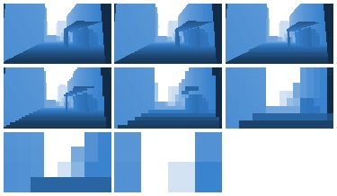
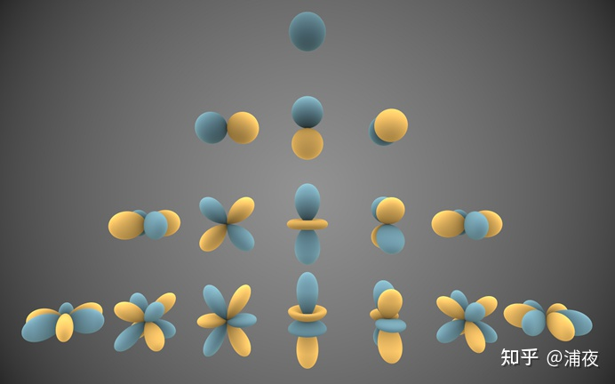
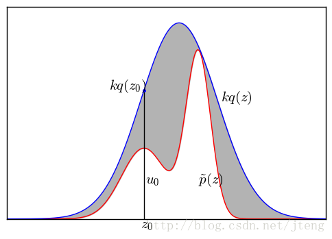

# 图形学进阶笔记

## 一：体积云

### 认识云

**云是**大气中的水蒸气遇冷液化成的**小水滴**或凝华成的**小冰晶**，所混合组成**的**漂浮在空中的**可见聚合物**

云的种类有很多，根据高度可以分为高空云和低空云

- 高空云：高、平、碎、体积感弱
- 低空云：低、体积感强、光感强

我们提到的体积云其实是一种低空云

游戏中有很多云，比如公告牌云、面片云、视差云、模型云、Ray Marching体积云，我们这里主要讲基于shadertoy的Ray Marching体积云

### 体积感

游戏中被玩家看到的物体，大多是模型通过光栅化绘制出来的，这些模型大多是刚体（我对动画和动作不是很了解），而云是流动的、半透的、可穿透的，所以很少使用模型（模型云是不可穿透的，一进入就露馅）

比较经典的做法是使用3d贴图做RayMarching，获得屏幕上某一点云的厚度（参考SDF建模），在shadertoy中，密度函数就是形状

### 光照

#### 大气散射

在大气中光可能发生三种事

- 被粒子吸收
- 外散射
- 内散射

*几乎不会有光那么幸运，不发生任何散射就穿透过去了吧*

##### 内散射与外散射

散射是指光在介质中传播时偏离的原来的方向（很好理解，光会与介质中的物体发生碰撞，于是改变方向）

- 外散射：光本来能传播到相机，但由于散射而无法到达相机的现象
- 内散射（InScattering）：光本来不能传播的相机，但由于散射而到达相机的现象

很显然，外散射会让光变暗，内散射会让光变亮

外散射的实现可以参考Beer定律、Henyey-Greenstein相位函数


内散射的直观现象是“糖粉效应”，即由于物体中间的折痕更容易发生内散射，于是会显得特别亮


可以通过修改Beer定律实现内散射


##### 单次散射与多次散射

我们从A点观察B点，会形成一条A到B的“光路”，这个“光路”会穿过介质，环境中的真实的光会与这条光路相交，进而在交点发生散射现象


- 单次散射：散射只发生一次（即只有光源直接发出的光会在AB处发生散射）
- 多次散射：光源在AB的散射光如果再次到达AB，会再次散射

*可以类比直接光和间接光*

实现单次散射的方式也很简单，步进然后累加散射值就可以（RayTrace in one week中做过）


##### 瑞利散射

瑞利（Rayleigh）散射：光在小分子介质（这里的小是用分子大小和光的波长比）中散射时，波长越长，散射越强

这个散射最直观的现象就是中午天空是蓝色的，黄昏天空时橙红色的。

1. 瑞丽散射，蓝色更容易散射，所以散射光大多为蓝光，天空是蓝色的
2. 已知太阳和地球的距离在一天之中几乎没有改变
3. 地球是一个球，太阳光视为平行光，那么在某一个时刻只有一个半球面会被太阳照射，这个半球面的中心太阳光垂直照射，而半球面的边界太阳光与地面竖直方向（或者说重力方向？）相切
4. 光照夹角在改变，光在大气中传播距离也会改变（黄昏时斜着照射，距离变大）
5. 距离过大，蓝色散射更强，强到一定程度，能量就耗尽了（于是蓝色就被吸收、消失了）
6. 于是呈现红色


只不过瑞利散射主要是低频信息，过度平滑，只有地平线处会变化大，所以可以把相关信息存储在一张非线形的LUT图中，使用时对这种LUT做RayMarching性能会更好（UE4是这样做的）

##### 米氏散射

米氏（Mie）散射：光在大粒子介质中散射时，会进入大粒子内部

米氏散射的结果是云雾是白色的，而且有朦胧感


### 运动

云是一种非常复杂的流体，我们使用噪声来模拟其运动

#### 分型布朗运动FBM

使用多张噪声图叠加位移，改变云的密度，从而影响RayMarching结果

### 小结

体积云是经典的TA技术，在游戏中非常常见（但在移动端很难跑实时的高品质云），制作方法有很多，但核心内容就两点：构建体积体和光照

如何高效构建体积？如何构建一个可交互的体积？如何构建一个种类丰富的体积？

如何模拟现实中大气的昼夜变化？如何模拟不同形状的云的颜色？如何模拟积雨云等特殊云的颜色？


## 二：遮挡剔除

### 剔除

剔除就是不处理不可见物

剔除的对象有很多，不仅仅是渲染层，物理、逻辑、动画都可以称为剔除的对象。本章提到的**遮挡剔除（occlusion culling）**特指渲染层的剔除

剔除的方案有很多，比如视锥剔除（view frustum culling）、背面剔除（backface culling）、距离剔除（distance culling），但这些剔除都有比较成熟而统一的方案，所以这里并不讨论，下面是一些常见的oc方案

### PVS

PVS（Potentially Visible Sets，潜在可见集），将场景分割成一个个Cell（一个小立方体），预计算出如果相机在这个Cell范围内时，相机可能看到的所有可见物体的集合，并将信息保存下来。运行时只需要查表就可以获得物体的可见信息

- 优点
  - 性能开销极小，速度极快（只需要查表）
- 缺点
  - 预烘焙数据非常大，会影响包体
  - 只能处理静态物体

#### 实现方案

1. 标记遮挡物体（occluders）和被遮挡物体（occludees）
   - 如果你感觉不好理解，你可以类比unity中投射阴影和接受阴影
2. 将所有相机能达到的地方分割为Cell
3. 朝四周做Raytracing
   - 计算相机在这个Cell中看被遮挡物时被遮挡物的可见性
   - 于是问题转化为相机所在的Cell的AABB和被遮挡物体的AABB间的可见性问题


### GPU Driven OC

CPU软光栅中有一个操作是信息回读，重投影生成Z-Buffer，这个完全可以GPU来做。通过`compute shader`和`indirect draw`等API，使用GPU中的**Hierarchical Z-Buffer**来做剔除

UE5中Nanite可以将模型分割为Cluster，使得剔除粒度达到Cluster级别

- 优点
  - 在VT、bindless等技术辅助下，可以实现1drawcall
- 缺点
  - 需要硬件支持
  - 将剔除滞后了，从CPU端推迟到GPU端

#### 移动端架构

移动端TBDR架构vs执行过程：


我们发现移动端vs执行完后会将数据存储到frameData中，而这个frameData时放在主存（System Memory）中，于是会带来额外的带宽（在IOS中这个能占一半的带宽），而移动端的带宽极其宝贵，所以移动端的顶点数需要严格限制，与UE5的Nanite设计理念想违背

此外移动端中GBuffer是放在`on-clip Buffer（memory)`中的，并不会带来带宽问题

##### 什么是on-chip memory

故名思义，是**片上存储**的意思，即这个部分是集成在GPU上的

GPU中有多种存储数据的结构，访问速度从快到慢排依次是

1. Register Memory（RMEM）
   - 访问极快，不需要消耗时钟周期（除非发生了冲突或者先写后读）
   - 只对负责对其进行读写的线程可见
2. Shared Memory（SMEM）
   - 对处于同一个block所有的线程都是可见的，所以常用与数据交换
3. Constant Memory（CMEM）
   - 用于存储常量数据
4. Texture Memory（TMEM）
   - 用于存储常量数据
5. Local Memory（LMEM）和Global Memory（GMEM）
   - LMEM只是对GMEM的一个抽象，两者存取速度上一样的
   - 只对负责对其进行读写的线程可见
   - 一般用来存储automatic变量
     - automatic变量是一种大尺寸的数据结构/数组
   - 有缓存机制（类比cache）

其中**RMEM与SMEM是集成在GPU芯片上的**，其他的则是存储在显存中的（你可以类比寄存器，cache和内存）

#### Hierarchical-Z

也称为Hiz，是一个常用的GPU Driven OC

- 生成depth buffer的mipmap链路（你可以类比bloom）

  

- 将被遮挡物的bounding box的八个顶点转化到裁剪空间中，记录离相机最近的点的深度**closest Z**，再利用这八个顶点生成一个对应的bounding quad（图中绿色线框）


- 根据这个quad查找depth的mip层级，使得这一层的depth正好包围这个quad
- 对depth采样（采样点是quad四角），获取四个depth中最远的
- 通过比较最远的depth和closest Z，来判断是否被遮蔽

### 其他OC

#### Portals and cells

同样是将场景划分为Cell，但保存的信息是相邻两个Cell间的连通性。运行时通过相机所在Cell+观察方向+Cell间的连通信息，可以快速计算物体是否处于可见范围


- 运行时开销比较大


*《巫师三》就是这个方案*

#### Occlusion queries

对物体做采样，判断其是否通过深度测试（使用的是之前某个Draw Call的信息），如果通过次数为0，则完全被遮挡

- 性能差，额外回读、Draw Call、pre-Z

*该方案基本已经被弃用*

#### CPU软光栅

手动标记用来遮挡的物体，运行时将遮挡物软光栅到Z-Buffer上，根据Z-Buffer汇总到深度信息+被剔除物体的包围盒计算遮挡信息

- 优点
  - 适用于静态和动态场景
- 缺点
  - 性能开销大

改进：CPU回读上一帧的depth buffer，通过**重投影**生成用于遮挡剔除的Z-Buffer

#### HSR/Early-Z

硬件侧的剔除

##### 各种测试

在片元着色器结束后会进行一系列的测试


- 裁剪测试（Scissor Test）
- 透明度测试（Alpha Test）
  - 丢弃透明部分
- 模版测试（Stencil Test）
  - 延迟渲染中可以用这个东西获得更多的ShadingMode
- 深度测试（Depth Test）
  - 通常用近处覆盖远处（当然你可以随便写）
  - Z-fighting（深度精度问题）：由于Z的精度不是线性的，近处比远处精度更高，当精度不够时（比如两个物体重叠），就会出现绘制错误（可以通过深度偏移解决）

- 透明度混合（Blending）

可以通过RenderQueue改变物体的渲染顺序

##### Early-Z

我们发现深度测试是在片元着色器之后，所以被抛弃的像素其实已经计算过了，存在性能浪费，如果我们在片元着色器之前做深度测试（Z-Prepass），就可以省去一部分的计算

##### HSR

Hidden Surface Removal，移动端TBDR架构下，对tile中每一个三角形做检测，提前（在片元着色器前）将被遮挡的三角形剔除出去，这样就可以避免被遮挡的像素被计算

## 三：光照与着色

### RGB光

首先，三个（不为负的）基本色不能混合出所有可见光（三个点进行插值，只能得到三角形内部的信息，而可见光区域是一个马蹄型）

然后，我们使用的三原色是现实中不存在的**CIE-XYZ**，这个标准R光永远是正的

最后，确实有多基色还原设备，但是无论是人眼还是显示器，还是RGB多一些

#### 颜色匹配实验

观察者（人眼）通过一个$2^{\circ}$FOV的的观察窗口观察一个纯色的屏幕，屏幕被分成两个区域，左测是待测光，右侧是由**RGB基本光**的混合光，如果左右无法分辨，那么记录右侧混合比例

- 此处RGB基本光指的是波长为625nm（R）、545nm（G）、535nm（B）

在这个实验中，绝大多数光都可以通过三色光合成，但有少数的光不能合成，但是如果将左边的光也加入一些基本光，就能一样（也就是说，如果RGB光的参数可以是负数，那么确实可以混合出所有的光）

### 传统反射模型

- `lighting/illumination`：用于描述到达表面的光的颜色与强度
- `shading`：用于描述曲面上每个点反射的光的颜色和强度

#### 漫反射

向周围随机scattered，强度与观察角度无关

如图，黄色的平行光照射到倾斜的表面上，光线的横断面积为A，光线与平面的夹角为$\theta $，光线照在平面的横截面积为$A/\cos \theta $，如果光强为$L$，那么到达平面表面的光强为$L\cos\theta$

夹角越大，光照射的面积越大，到达单位面积的入射光强度就会减小


$$
C_{diffuse}=K_{d}C_{ambient}+K_{d}\sum^{n}_{i=1} C_{i}\max_{} \left\{ \mathbf{N} \cdot \mathbf{L_{i}} ,0\right\}
$$

- $K_{d}$：漫反射衰减系数（The diffuse attenuation coefficient），表现为漫反射颜色
- $C_{ambinet}$：该点环境光的光照强度
- $C_{i}$：第i个光的光照强度
- $\mathbf{L_{i}}$：第i个光的光照方向（标准化后）

#### 镜面反射

向某个方向强烈反射，与观察角度有关
$$
C_{specular}=K_{s}\sum^{n}_{i=1} C_{i}\max_{} \left\{ \mathbf{V} \cdot \mathbf{R_{i}} ,0\right\}^{m}
$$

- $K_{s}$：高光系数，非金属典型值为0.04，金属为half3类型，表现为金属颜色
- $\mathbf{V}$：观察者向量
- $\mathbf{R_{i}}$：第i个光的反射向量

使用半向量H来计算高光，可以减少计算量
$$
C_{specular}=K_{s}\sum^{n}_{i=1} C_{i}\max_{} \left\{ \mathbf{N} \cdot \mathbf{H_{i}} ,0\right\}^{m}
$$

### PBR

PBR是一个很广的概念，包含

- 基于物理的材质（我们经常会把这个等同于PBR）
- 基于物理的光照
- 基于物理的相机

#### BRDF

BRDF，双向反射分布函数，是材质表面某一点出射**辐射率（Radiance）**和入射**辐照度（Irradiance）**的比值，用来描述入射光线沿反射方向会反射出多少的光能
$$
BRDF=\frac{dL\left( \omega_{o} \right)  }{dE\left( \omega_{i} \right)  }
$$

- 辐射率$L$：每单位面积每单位**投影固体角（projected solid angle）**上的能量
- 辐照度$E$：每单位面积上的能量

在理解BRDF前，先记住一件事，材料表面一点，会吸收来自半球面方向的光，并向半球面反射光，但对观察者来说，只有射向观察者的光才能被看到

#### 辐射度量学

##### 单位

辐射度量学单位和光学单位是可以一一对应的


光通量的本质就是辐射通量，两者的关系为
$$
\Phi_{lm} = \Phi_{W} * f(\lambda ) * 683
$$

- $\Phi_{lm}$：光通量，单位为lm
- $\Phi_{W}$：辐射通量，单位为W
- $\lambda$：波长，单位为nm
- $f$：函数如下，当波长为555nm时，取最大值1


光通量与距离无关，不会随着距离衰减，那为什么离灯光越近会越亮呢？是因为光强改变了吗？不是
$$
I=\frac{d\Phi}{d\omega }
$$

- $I$：Intensity，一般游戏中灯光的光强指的就是这个，单位为cd
- $\omega $：立体角

可以看出，光强和距离也没有关系。那是什么原因呢？其实是辐射度发生了改变
$$
E=\frac{d\Phi}{dA}
$$

- $E$：辐照度/照度，Irradiance/Illumination，单位是Lux

- $A$：球表面面积

离灯光越远，相同立体角对应的球面面积越大（想想球面面积公式吧），辐照度就越小

但是在实际应用中，入射的辐照度很好测量（测量方式如图），但出射的辐照度不好测量


于是我们又引入了辐射率
$$
E=\int^{}_{\Omega } L\cos \theta d\omega 
$$

- $L$：辐射率，Radiance，单位为nit（本文也会用$C$来表示辐射率）

出射辐射率非常好测量，测量方式如图


从这个积分可以看出，辐射率L可以是离散的，但辐照度E是连续的，我们就可以使用一些连续的基函数进行拟合，比如SH球谐函数

#### BRDF推导

如图一光源向面积为A的表面照射P瓦特的能量，光的截面积（红线）为$A\left( \mathbf{N} \cdot \mathbf{L} \right)  $

光源的光通强度$\Phi_{E}$为
$$
\Phi_{E} =\frac{P}{A\left( \mathbf{N} \cdot \mathbf{L} \right)  }
$$
照射到物体表面的光通强度$\Phi_{I}$为
$$
\Phi_{I} =\Phi_{E} \left( \mathbf{N} \cdot \mathbf{L} \right)
$$


光线照射物体表面的方向用立体角$\omega $表示


用极坐标表示球，可得球面面积A的微分（简单理解一下，如果球表面是一个矩形，那么其面积就是长x宽，而长是$\mathrm{d}\theta$对应的小圆的弧度，宽是$\mathrm{d}\varphi$对应的球的弧度）
$$
\mathrm{d} A= r\mathrm{d} \theta \cdot r\mathrm{d} \varphi =r^2\sin\varphi \ \mathrm{d} \theta\  \mathrm{d}\varphi
$$


面积A除以$r^2$可得立体角微分
$$
\mathrm{d}\omega =\frac{\mathrm{d} A}{r^{2}} =\sin\varphi \ \mathrm{d} \theta\  \mathrm{d}\varphi
$$
辐射率（Radiance）表示单位立体角辐射的光通强度，其关于投影固定角度积分等于辐射率，取表面上单位半球$\Omega $做积分（方位角$\theta$转一圈，极角$\varphi$转四分之一圆）
$$
\Phi_{I}=\int^{}_{\Omega } C_{I}\left( \mathbf{L} \right)  \mathrm{d} \omega 
=\int^{2\uppi }_{0} \int^{\uppi /2}_{0} C_{I}\left( \theta ,\varphi \right)\sin\varphi \ \mathrm{d} \theta\  \mathrm{d}\varphi
$$

- $C_{I}\left( \mathbf{L} \right)$：辐射率

由于$\Phi_{I} =\Phi_{E} \left( \mathbf{N} \cdot \mathbf{L} \right)$

所以
$$
C_{I}=C_{E}\left( \mathbf{N} \cdot \mathbf{L} \right) =C_{E}\ \cos\varphi
$$
带入得
$$
\Phi_{I}=\int^{2\uppi }_{0} \int^{\uppi /2}_{0} C_{E}\left( \theta ,\varphi \right)\sin\varphi \cos\varphi\ \mathrm{d} \theta\  \mathrm{d}\varphi
$$
微分出射辐射率$\mathrm{d}C_{R}$与微分入射辐照度$\mathrm{d}\Phi_{I}$的比值为
$$
\rho \left( \mathbf{V} \cdot \mathbf{L} \right)  =\frac{\mathrm{d} C_{R}}{\mathrm{d} \Phi_{I} } =\frac{\mathrm{d} C_{R}}{C_{E}\left( \mathbf{L} \right)  \left( \mathbf{N} \cdot \mathbf{L} \right)  \mathrm{d} \omega }
$$

- $\rho \left( \mathbf{V} \cdot \mathbf{L} \right) $：即BRDF
- $\mathrm{d} C_{R}$：出射辐射率（Radiance）

移项
$$
\mathrm{d} C_{R}=\rho \left( \mathbf{V} \cdot \mathbf{L} \right) \ C_{E}\left( \mathbf{L} \right)  \left( \mathbf{N} \cdot \mathbf{L} \right)  \mathrm{d} \omega
$$
积分
$$
C_{R}\left( \mathbf{V} \right)  =\sum^{n}_{i=1}\rho \left( \mathbf{V} \cdot \mathbf{L_{i}} \right) \ C_{i}  \left( \mathbf{N} \cdot \mathbf{L_{i}} \right)
$$
所以通过BRDF和所以照射改点的光，就可以求得观察方向上出射光的光强

#### BRDF性质

- 双向传播（因为光是可逆的）

$$
\rho \left( \mathbf{V} \cdot \mathbf{L} \right) =\rho \left( \mathbf{L} \cdot \mathbf{V} \right)
$$

- 颜色（只考虑漫反射和镜面反射，不能保证光线可逆，不能保证能量守恒）

$$
\rho \left( \mathbf{V} \cdot \mathbf{L} \right) =K_{d}+K_{s}\frac{\left( \mathbf{N} \cdot \mathbf{H} \right)^{m}  }{\mathbf{N} \cdot L}
$$

- 能量守恒（将BRDF拆成漫反射和非漫反射部分）
  $$
  \rho \left( \mathbf{V} \cdot \mathbf{L} \right) =kK_{d}+(1-k)\rho_{s} \left( \mathbf{V} \cdot \mathbf{L} \right)
  $$

  - k：漫反射消耗的能量
  - $\rho_{s} \left( \mathbf{V} \cdot \mathbf{L} \right)$：镜面反射函数

#### Cook-Torrance光照模型

CT模型将物体表面分解为多个随机分布的微小完美镜面，用于模拟镜面反射
$$
\rho_{s} \left( \mathbf{V} \cdot \mathbf{L} \right)=F\left( \mathbf{V} ,\mathbf{L} \right)  \frac{D\left( \mathbf{V} ,\mathbf{L} \right) G\left( \mathbf{V} ,\mathbf{L} \right) }{\uppi \left( \mathbf{N} ,\mathbf{V} \right)\left( \mathbf{N} ,\mathbf{L} \right)}
$$

- $\uppi$：规范化因子

$$
\Phi_{I}=\int^{2\uppi }_{0} \int^{\uppi /2}_{0} C_{E}\left( \theta ,\varphi \right)\sin\varphi \cos\varphi\ \mathrm{d} \theta\  \mathrm{d}\varphi=\uppi C_{E}
$$

##### 漫反射项

漫反射BRDF一定是一个常数，对一个半球积分，**如果能量完全不吸收**，全部反射出去
$$
\mathrm{d} C_{R}=\rho_{0} \ C_{E}\left( \mathbf{L} \right)  \left( \mathbf{N} \cdot \mathbf{L} \right)  \mathrm{d} \omega
$$

$$
C_{R}=\int^{}_{\Omega } \rho_{0} C_{E}\left( \mathbf{L} \right) \left( \mathbf{N} \cdot \mathbf{L} \right)  \mathrm{d} \omega
$$

$$
C_{R}=\rho_{0} C_{R} \int^{}_{H^2 } \cos \theta_{i} \ \mathrm{d} \omega
$$

$$
\rho_{0}=\frac{1}{\uppi }
$$

如果存在吸收，则
$$
\rho_{0}=\frac{K_{d}}{\uppi }
$$

##### 微平面分布函数

微观平面的法向量分布合=宏观平面的法向量

微平面分布函数D就是用来描述微平面上法向量与半向量相同的比例，就是用来描述法向量方向和H相同的微平面的面积
$$
\mathrm{d} A_{h}=D\left( \omega_{h} \right)  \mathrm{d} \omega_{h} \mathrm{d} A
$$
那么沿着半向量方向入射的辐射通量为
$$
\mathrm{d} \Phi_{i} 
=C_{i}\left( \omega_{i} \right)  \cos \theta_{h} \mathrm{d} \omega_{i} \mathrm{d} A_{h}
=C_{i}\left( \omega_{i} \right)  \mathrm{d} \omega_{i} \cos \theta_{h} D\left( \omega_{h} \right)  \mathrm{d} \omega_{h} \mathrm{A}
$$
如果不考虑F和G项的影响，此时入射辐射通量应该等于出射辐射通量
$$
\mathrm{d} \Phi_{i} =\mathrm{d} \Phi_{R}
$$
根据radiance的定义，等于出射辐射通量除以照射到的面积
$$
\mathrm{d} C_{R}\left( \omega_{R} \right)  
=\frac{\mathrm{d} \Phi_R }{\mathrm{d} \omega_{R} \cos \theta_{R} \mathrm{d} A}
=\frac{C_{i}\left( \omega_{i} \right)  \mathrm{d} \omega_{i} \cos \theta_{h} D\left( \omega_{h} \right)  \mathrm{d} \omega_{h} \mathrm{A}}{\mathrm{d} \omega_{R} \cos \theta_{R} \mathrm{d} A}
$$
根据BRDF定义式
$$
\rho_{s} =\frac{\mathrm{d} C_{R}}{C_{i}\cos \theta_{i} \mathrm{d} \omega_{i} } 
=	\frac{\cos \theta_{h} D\left( \omega_{h} \right)  \mathrm{d} \omega_{h} }{\cos \theta_{R} \cos \theta_{i} \mathrm{d} \omega_{R} }
$$
而现在出射方向和观察方向重合，所以半向量和法线的夹角正好是反射对称轴，所以角度翻倍


$$
\mathrm{d}\omega _{h}=\sin \theta _{h}\ \mathrm{d}\theta_{h}\ \mathrm{d}\phi
$$

$$
\mathrm{d}\omega _{R}=\sin \left( 2\theta _{h}\right) \ \mathrm{d}\left( 2\theta _{h}\right) \ \mathrm{d}\phi
$$

所以
$$
\frac{\mathrm{d} \omega _{h}}{\mathrm{d}\omega _{R}}=\frac{1}{4\cos \theta _{h}}
$$
所以
$$
\rho_{s}  
=	\frac{ D\left( \omega_{h} \right)   }{4\cos \theta_{R} \cos \theta_{i} }
$$
如果加入F和G的影响，则BRDF为
$$
\rho_{s}  
=	\frac{ F_{r}\left( \omega_{R} ,\omega_{h} \right)  D\left( \omega_{h} \right)   G\left( \omega_{R} ,\omega_{i} \right)  }{4\cos \theta_{R} \cos \theta_{i} }
$$
Beckmann分布函数：
$$
D_{m}\left( \mathbf{V} \cdot \mathbf{L} \right)  =\frac{1}{4m^{2}\left( \mathbf{N}\cdot \mathbf{H} \right)^{4}  }\exp \left( \frac{\left( \mathbf{N}\cdot \mathbf{H}\right)^{2}  -1}{m^{2}\left( \mathbf{N}\cdot \mathbf{H}\right) ^{2} } \right)
$$

- m：粗糙度，越大越粗糙，法向量分布越广

微平面分布函数分为两种

- 各项同性：绕法向量旋转时函数值不变
- 各项异性

改进后的Beckmann分布函数（各项异性）：
$$
D_{m}\left( \mathbf{V} \cdot \mathbf{L} \right)  =
\frac{1}{4m_{x}m_{y}\left( \mathbf{N}\cdot \mathbf{H} \right)^{4}  }
\exp \left[ \left( \frac{\left( \mathbf{T} \cdot \mathbf{P} \right)^{2}  }{m_{x}^{2}} +\frac{1-\left( \mathbf{T} \cdot \mathbf{P} \right)^{2}  }{m_{y}^{2}} \right)\left( \frac{\left( \mathbf{N}\cdot \mathbf{H}\right)^{2}  -1}{\left( \mathbf{N}\cdot \mathbf{H}\right) ^{2} } \right)  \right]
$$

- $\mathbf{T}$：切线
- $\mathbf{P}$：半向量到切平面度规范化投影，其中

$$
\mathbf{P}=\frac{ \mathbf{H} -\left( \mathbf{N} \cdot \mathbf{H} \right)  \mathbf{N}}{\| \mathbf{H} -\left( \mathbf{N} \cdot \mathbf{H} \right)  \mathbf{N} \| }
$$

##### Fresnel因子

电磁波碰到物体表面会产生反射波和透射波，我们将反射平面当作极化平面，与该平面平行的分量称为$p$偏振光，垂直的分量称为$s$偏振光

对于非偏振光，我们可以直接用$F_{p}$和$F_{s}$的平均值作为Fresnel因子$F_{\lambda }$
$$
F_{\lambda }=\frac{1}{2} \left( F_{p}+F_{s}\right)
=\frac{1}{2} \left[ \frac{\tan^{2} \left( \theta_{1} -\theta_{2} \right)  }{\tan^{2} \left( \theta_{1} +\theta_{2}\right)  }+\frac{\sin^{2} \left( \theta_{1} -\theta_{2} \right)  }{\sin^{2} \left( \theta_{1} +\theta_{2}\right)  } \right]
=\frac{\sin \theta_{1} \cos \theta_{2} -\cos \theta_{1} \sin \theta_{2}}{\sin \theta_{1} \cos \theta_{2} +\cos \theta_{1} \sin \theta_{2}}
$$

- $\theta_{1}$：入射角
- $\theta_{2}$：出射角

根据Snell定律
$$
\eta_{\lambda } =\frac{\eta_{2} }{\eta_{1} }=\frac{\sin \theta_{1} }{\sin \theta_{2} }
$$

- $\eta$：折射率

令$g=\eta_{\lambda } \cos \theta_{2} $
$$
F_{\lambda }=
\frac{1}{2} 
\frac{\left( g-\mathbf{L} \cdot \mathbf{H} \right)^{2}  }{\left( g+\mathbf{L} \cdot \mathbf{H} \right)^{2}  } 
\left( 1+\frac{\left[ \left( \mathbf{L} \cdot \mathbf{H} \right)  \left( g+\mathbf{L} \cdot \mathbf{H} \right)  -1\right] ^{2} }{\left[ \left( \mathbf{L} \cdot \mathbf{H} \right)  \left( g-\mathbf{L} \cdot \mathbf{H} \right)  +1\right]^{2}  } \right)
$$

- 当入射角为$ 90^{\circ }$时，$\mathbf{L} \cdot \mathbf{H}=0$，几乎所有光线被反射出去，表面不吸收光能
- 当入射角为$0^{\circ }$时，$\mathbf{L} \cdot \mathbf{H}=1$，函数简化为

$$
F_{0}=\left( \frac{\eta_{\lambda } -1}{\eta_{\lambda } +1} \right)^{2}
$$

移项
$$
\eta_{\lambda } =\frac{1+\sqrt{F_{0}} }{1-\sqrt{F_{0}} }
$$
这样计算过于复杂，所以做了近似（貌似是经验公式）
$$
F_{\theta}=F_{0}+\left( 1-F_{0} \right)\left(1-\cos\theta \right)^5
$$


##### 几何衰减系数

照到一个微平面的光线可能会被相邻的微平面遮挡，微平面的反射光线也可能会被相邻微平面遮挡

如果视所有微平面为V形平面，微平面的宽为1


$$
\omega =\frac{1}{\sin \alpha }
$$
在三角形ABC中使用正弦定理，可得AB：
$$
x=\frac{2\sin \gamma }{\sin \left( \beta +\uppi /2\right)  }
$$
观察向量$\mathbf{V} $只能看到AB部分反射的光，无法看到BO部分反射的光（因为被右侧的微平面遮挡了）

于是有三种情况


- 左侧反射的光被右侧遮挡，比例为$\mathbf{G}_{1}$

$$
\mathbf{G}_{1} 
=\frac{x}{\omega } 
=\frac{2\sin \gamma \sin \alpha }{\sin \left( \beta +\uppi /2\right)  }
=\frac{2\left( \mathbf{N} \cdot \mathbf{H} \right)  \left( \mathbf{N} \cdot \mathbf{V} \right)  }{\mathbf{V} \cdot \mathbf{H} }
$$

- 射向左侧的光被右侧遮挡，比例为$\mathbf{G}_{2}$

$$
\mathbf{G}_{2} 
=\frac{x}{\omega } 
=\frac{2\left( \mathbf{N} \cdot \mathbf{H} \right)  \left( \mathbf{N} \cdot \mathbf{L} \right)  }{\mathbf{L} \cdot \mathbf{H} }
$$

- 完全没有被阻断，比例为1

取三种情况下最小值为几何衰减因子
$$
G\left( \mathbf{V} ,\mathbf{L} \right)  =\min_{} \left\{ 1,G_{1},G_{2}\right\}  =\min_{} \left\{ 1,\frac{2\left( \mathbf{N} \cdot \mathbf{H} \right)  \left( \mathbf{N} \cdot \mathbf{V} \right)  }{\mathbf{V} \cdot \mathbf{H} },\frac{2\left( \mathbf{N} \cdot \mathbf{H} \right)  \left( \mathbf{N} \cdot \mathbf{L} \right)  }{\mathbf{L} \cdot \mathbf{H} }\right\}
$$

- $\mathbf{V} \cdot \mathbf{H}=\mathbf{L} \cdot \mathbf{H}$

### IBL

[浦夜的文章](https://zhuanlan.zhihu.com/p/351289217)

[2012年Light Probe GDC](https://gdcvault.com/play/1015312/Light-Probe-Interpolation-Using-Tetrahedral)

IBL（image base lighting）是一种全局光照算法（global illumination），常用来描述到达材质表面的光强与颜色，常用于计算间接光漫反射

如果场景中只有直接光，那么暗处就只能用其他光补足亮度，如果灯一多，就会降低空间中的明暗对比，就会让场景显得很平

#### 球谐函数

球谐函数（Spherical Harmonics，SH）的本质就是一组基函数

##### 基函数

基函数是一个很常见的东西，比如N维空间的任意向量都可以由N个不平行的非零**向量**表示，比如任意一个连续的函数都可以由一组**三角函数**组成（傅立叶变换），使用多个**多项式函数**可以用来模拟函数在某点的值（泰勒公式）

在这里面的向量、三角函数、多项式函数就是基函数

于是我们可以把复杂的函数变成基函数的合，进而变成一组参数，我们一般不需要特别高的精度，所以可以舍掉一些尾巴，只选取前几个参数（所以这本质是有损压缩，参数越多，效果越好）


在直角坐标系中，用基向量表示任意向量时，我们常用一组两两正交的向量（**内积为0**）作为基向量，这些向量各自独立，而且无法由其他基加权得来（单一职责）

##### 内积

规定两函数$f(x)$和$g(x)$与区间$[a,b]$，若两函数在该区间上可积且平方可积，则其内积为
$$
<f(x),g(x)>\ =\ \int^{b}_{a} f(x)g(x)dx
$$
若两函数在$[a,b]$上内积为0，则称$f(x)$和$g(x)$在区间$[a,b]$上**正交**

##### 极坐标的基函数

直角坐标系可以有的，极坐标自然也可以有

极坐标上三角函数长啥样？

- 二阶

  - 右：$r = sin\theta$

  - 左：$r = cos\theta$


- 三阶
  - 左：$r = sin2\theta$
  - 右：$r = cos2\theta$


##### 球谐函数

拓展到球坐标，最常用的基函数就是**球谐函数**

其中蓝色为正数，黄色为负数，具备正交性和旋转不变性

*旋转不变形，就是性质（积分）与朝向无关，让人想起了角动量守恒和宇称不守恒*




这个图上的瓣，其实是点的轨迹（你想想圆和球的定义）

#### Irradiance Map

球谐在IBL中到底有啥用呢？我们在谈辐射度量学中，提到过Irradiance Map，当时说这个是连续的，可以用球谐函数来拟合

##### radiance map

*这张图是清晰的*


我们经常看到一些以`.hdr`结尾的资源，这些资源里六面立方体的形式（Cubemap）保存，可以用来制作天空盒和Reflection Cube，这些资源就是radiance map

使用时用法线去采（可以理解为法线方向发射一条射线，打到无穷远的Cube上）

##### Irradiance map

*这张图是模糊的*


当我们计算某一点的diffuse时，就不能直接用法线去采radiance map，因为该点其实接受着很多方向的光，而上面这种采样方法其实只采了垂直入射的光

但是我们实时运算时，肯定不能让这个点去采整个Cube（如果没有遮挡），这太费了

所以我们可以预计算，把radiance map预积分成Irradiance map（方法有很多，比如黎曼和，蒙特卡洛），然后再用法线去采

##### 球谐函数

上面我们得到的Irradiance map效果非常好，但有一个缺点是非常大

Irradiance map的本质是一个映射（函数），是一个法线和Irradiance的映射（函数），且还是一个连续的函数，那么我们能不能用基函数来拟合这个函数呢？很显然是可以的，我们用三阶（L2）球谐来拟合

```c#
//某点 采某个球谐 得到的球谐参数，xyz是法线
public static SH9 GetBasis(float x, float y, float z)
{
    SH9 res = new SH9();
    res[0] = sh0;
    res[1] = sh1 * y;
    res[2] = sh1 * z;
    res[3] = sh1 * x;
    res[4] = sh2_2 * x * y;
    res[5] = sh2_1 * y * z;
    res[6] = sh20 * (-x * x - y * y + 2 * z * z);
    res[7] = sh21 * z * x;
    res[8] = sh22 * (x * x - y * y);
    return res;
}
```

##### Light Probe

我们在实际使用时，并不只采一个球谐，而是采周围多个

具体要用哪几个球呢？如果是Light Probe，可以生成空间四面体（顶点是probe），用四个顶点，如果是Volume Light Probe，可以用相邻的四个Probe

## 四：光线追踪

[PBRT](https://pbr-book.org/)，[球面均匀采样](http://corysimon.github.io/articles/uniformdistn-on-sphere/)

### 常见光追

#### 正向光线追踪

非常好理解，光从光源出发，经过与物体表面发生反射折射散射等，最后传递到人眼中

- 绝大多数从光源出发的光不会到达人眼，所以非常浪费

#### 逆光线追踪

光是可逆的，从相机出发发射逆光线，经过反射折射散射等，最后丢失或者到达光源，从而递归计算相机处光的累积值

- 优点
  - 跟上面的正向比，减少了大量不传入人眼的光线计算
- 缺点
  - 视角变化需要重新计算，不适合实时渲染
  - 从屏幕像素出发，像素间的追踪无关，所以采样结果趋向于平均采样，会对某些光源过度采样，性能浪费，而且光源较小的时候容易走样

#### 蒙特卡洛光线追踪

Monte-Carlo算法最经典的例子是撒点求圆周率，通过PDF（概率密度函数），增加对重要物体的采样，以加速收敛（重要性采样）


蒙特卡洛光追分两步

- 辐射度算法
- 逆光线追踪

##### 辐射度算法

理想的辐射度算法应该是正向光追

- 先将场景划分为一个个小的patch，计算两个patch间的形式因子，形式因子表示的是从一个patch出发的光，会有多少到达另一个patch（所以这个形式因子的数量是$C^{2}_{n}$）
- 通过迭代，找到一个光能传递的平衡状态
- 对平衡状态的亮度进行逆光追

缺点

- 非常慢
- 难以计算镜面反射

#### photonmaping算法

前预计算光子图，再用光子图逆光追着色，而计算光子图的方式是划分场景，光追采样

*感觉和 PVS很像*

- 该算法只记录漫反射和折射
- 镜面反射仍要使用逆光追实时计算（毕竟镜面反射与观察角有关，我们不可能预计算所有的角度）

### 加速结构

加速结构是光追的核心，用来减少相交测试的数量，主要思路有

- 空间细分（如Kd-Tree）
  - 通过将空间分割为区域，并记录图元属于哪一个区域，相交测试时先与区域进行计算
- 对象细分（如BVH）
  - 将对象分解为更小的对象集，比如要测试光线是否与凳子腿相交，先判断时候和房子相交，再判断是否和凳子相交，然后再和凳子腿求交

#### BVH

图元根据邻近度聚合


BVH的碰撞检测非常简单，先检测当前节点，如果成功则检测其左右子节点

BVH的构建：

1. 计算每一个图元的边界信息（上图虚线），并存储到数组中
2. 将图元分割，构建一颗二叉树
3. 将树转化为无指针表示

其中不同BVH构建方法的差异，主要来自于图元分割的算法，常用的有

- SAH（表面积启发式）
- LBVHs（线性包围体层次结构）

#### Kd-Tree

Kd-Tree是一种特殊的**BSP树**（二进制空间划分树），其对空间的分割只能延轴向


构建方法：

1. 从包含整个场景的边界开始
2. 若盒子内图元数量大于某个阈值，则空间一分为二，并存储图元信息
3. 循环分割

碰撞检测：如果命中父图元，则测试两个子图元

##### 与BVH比较

- BVH构建比Kd-Tree快，但相交测试效率略慢
- BVH中一个图元只会在一个节点中，而Kd-Tree中图元即属于自己所在的区域，在属于其父区域（我附庸的附庸，还是我的附庸）

### 采样与重建

**采样**：将连续信号变成离散信号

**重建**：将离散信号恢复成连续信号，在重建时需要使用**滤波**

**走样**：经过采样和重建后，原函数和新函数存在一定差异

- pre-aliasing：采样阶段导致的走样
- post-aliasing：重建阶段导致的走样

**反走样**：试图消除走样的计数，也称为**抗锯齿**

#### 反走样

##### 前置滤波

在采样前使用滤波器对原函数进行处理（如模糊化），尽管损失了一些信息，但比锯齿效果好

##### 自适应采样

找到信号频率较高的区域，增加在该区域的采样量

*需要知道采样函数的大致形状，在实践中并不好做*

#### 采样器实现

##### 分层采样

把积分区间均匀划分为m个不相交的子区间，称为阶层（Stratum），对每一个阶层做采样

##### N-Rooks

在分层采样中，d维函数至少需要$N^d$个采样点，太多了，如果使用N-Rooks采样，就可以只用$N$个采样点

采样时，任意一行任意一列只会出现一个样本，有点像“八皇后”（但这里的皇后只能横竖攻击），这个方阵被称为**拉丁方阵**，拓展到高纬，变成**拉丁超立方体**，所以该算法也叫**拉丁超立方体算法**


##### Halton 采样

**差异（Discrepancy）**是用来点集在空间中的分布情况，分布约均匀，空间中子空间中点的数量占比就越趋近于子空间的面积，点的差异就越趋近于0

样本的**丛聚现象**会导致方差的增大，均匀分布的PRNG也会有丛聚现象。但如果使用低差序列生成随机数，效果可能会好很多

**倒根**

一个正整数可以用不同进制表示出来，比如
$$
28\ =\ 2\times 10^1+8\times10^0\ =\ 1\times2^4+1\times2^3+1\times2^2+0\times2^1+0\times2^0
$$
以b进制表达某个正整数，会得到正整数的**倒根**，比如$28\mid_{10} $的倒根$0.82$，$11100\mid_{2} $的倒根$0.00111$

**生成随机数**

**Van der Corput 序列**就是用倒根法生成的一维低差序列

- 由十进制 1-9 得到 Van der Corput 序列： $\{0.1, 0.2, 0.3, 0.4, 0.5, 0.6, 0.7, 0.8, 0.9\}$
- 由二进制 1,10,11 得到的 Van der Corput 序列： $\{0.1, 0.01, 0.011\}$

**Halton 序列**是把 Van der Corput 序列拓展到 n 维的情况

而使用这个序列进行采样，就是Halton 采样

### 随机采样

光追计算中有很多积分没有解析解（如给定半球面上的入射辐射率和BRDF，求出射辐射率），使用普通的积分方法求解高维、不连续的积分**收敛速度**比较慢，于是我们引入了蒙特卡洛方法，使用随机性来估计，收敛速度与函数维度无关

- PDF：概率密度函数
- CDF：分布函数，是PDF在$[-\infty,x]$上的积分，其中$x$为当前值

#### 逆变换法

由CDF的反函数求PDF

#### 拒绝采样法

*这东西实际不能使用，但其思想指导了MCMC*

有的函数无法直接计算出其PDF，也无法通过CDF的反函数求PDF

我们先设置一个辅助**建议分布函数**$q(z)$，和一个常数K，使得$kq(z)\geqslant p(z)$

*kq(z)*即蓝线



1. 从建议分布函数中采样，获得样本z
2. 从$[0,1]$中均匀采样获得样本u
3. 如果满足公式。。则接受采样结果，否则拒绝采样结果

$$
\frac{p\left( z\right)  }{kq\left( z\right)  } \geqslant u
$$

可以看出，这个算法不在复杂的公式上采样，而是选择了在建议分布函数和均匀分布上采样

*u就是竖着采一列，找这一列中有多少在$p$下面*

#### MCMC

**马尔可夫链蒙特卡洛（Markov Chain Monte Carlo Method，MCMC）**

##### 马尔可夫链

马尔可夫链是时间和状态都离散，且具有无后效性的随机过程，即将来的状态和过去的状态无关

我们列出马尔可夫链所有可能的状态，$x_1,x_2,x_3...$，称为**状态空间**，记为$I$

列出所有参数，$t_1,t_2,t_3...$，称为**参数集**，记为$T$

所有时刻所有可能的状态的集合构成了马尔可夫链
$$
\left\{ X\left( t\right)  =x,t\in T,x\in I\right\}  
$$
在具体的某一时刻，马尔可夫链是一个离散的随机变量，称为该时刻的**状态概率分布**

讲 从一个状态转移到另一个状态的过程的概率 写成一个方阵，称为**状态转移矩阵**，其中每行之和为1


如果$P_{ij}(i,i+1)=0$，则无法通过$i$状态转移到$j$状态

##### 对马尔可夫链采样


#### 曲面上均匀采样

GAMES101的蒙特卡洛光追中，对三角形光源均匀采样的代码是这样

```c++
void Sample(Intersection &pos, float &pdf){
	float x = std::sqrt(get_radom_float());
  float y = get_radom_float();
  pos coords = v0 * (1 - x) + v1 * (x * (1 - y)) + v2 * (x * y);
	...
}
```

$$
\mathbf{p} = \left( 1-\sqrt{x} \right)  \mathbf{v}_{0} +\left( \sqrt{x} \left( 1-y\right)  \right)  \mathbf{v}_{1} +\left( y\sqrt{x} \right)  \mathbf{v}_{2}
$$

##### 流形（Manifold）

流形(manifold)就是局部具有欧式空间(Euclidean Space)性质的空间或者对象。

地球是球型，但对人来说，地面像是平的，地球就是“平”的地面扭曲成的球，地面的局部是一个二维的欧式空间，地球是一个二维流行

极小弧度所对应的圆弧，看上去像是直线，圆就是“直”的线扭曲成的圆，圆弧的局部是一个一维的欧式空间，圆是一个一维流形

基于这个概念，我们可以把N纬空间中的曲线/曲面/曲空间称为N维空间的流形

##### 流形上的均匀采样

我们想在N纬流形上均匀采样，首先要定义为什么是均匀。我们最初要干什么？是要通过蒙特卡洛方法对曲面上的光进行积分得到光通量，而均匀采样就是相同**测度**中采样点点数量应该是一样的
$$
f_{PDF}=\frac{1}{测度}
$$
**测度(measure)**：准确来说是**勒贝格测度(Lebesgue measure)**，曲线的测度是长度，曲面的测度是面积，曲空间的测度是体积

所以核心就变成了怎么把流形上的均匀分布和随机数的均匀分布联系起来，这就涉及到概率分布的变换


而体积比是什么呢？**格拉姆行列式(Gram Determinant)的平方根**，它的第$i,j$个元素$\langle v_{i},v_{j}\rangle $是$v_{i}和v_{j}$的内积


### 概率密度函数

#### 重要性来自什么

我们先从感性的角度来思考，什么样的光线更重要（假设每条光线都是由一个虚拟的点光发出的），也就是一个、一组光源对某点着色的贡献

- 辐射通量大的更重要
- 越近越重要（越近，立体角越大）
- 朝向（光源可能不在每个方向都发均匀的光）
- 可见性（被遮挡的光没有贡献）
- 材质（光线射到材质表面反射方向呈瓣型，对于某个特定的观察方向，不同方向的入射光贡献也不一样）

#### 可见性

可见性来自什么？传统路径跟踪是通过在材质点处，发射一道**阴影光线**，如果miss，可见性为1，命中，可见性为0


## 五：LTC面光源

https://blog.csdn.net/qjh5606/article/details/119682254

https://zhuanlan.zhihu.com/p/345364404

《Real-Time Polygonal-Light Shading with Linearly Transformed Cosines》

LTC，Linearly Transformed Cosines，线性变换余弦

### 面光源的特殊性

在提这个之前，先说一下Unity的面光源只有bake模式，为什么没有runtime呢？因为实时计算面光源比较费

我们在计算**点光、桶光、方向光**的shading时：
$$
C_{R}\left( \mathbf{V} \right)  =C_{ambinet} +\sum^{n}_{i=1}\rho \left( \mathbf{V} \cdot \mathbf{L_{i}} \right) \ C_{i}  \left( \mathbf{N} \cdot \mathbf{L_{i}} \right)
$$
即使场景中有多个光源，我们可以将其视为完全独立的几个光源，分别计算

然而如果要处理面光源，就没法靠这个方程了，我们可以通过用点光源+Bloom来模拟面光源，在某些距离下效果只能说还凑合

而当我们计算面光源时，先回到光照公式，对下面这个式子积分
$$
\mathrm{d} C_{R}=\rho \left( \mathbf{V} \cdot \mathbf{L} \right) \ C_{E}\left( \mathbf{L} \right)  \left( \mathbf{N} \cdot \mathbf{L} \right)  \mathrm{d} \omega
$$

$$
C_R=\int^{}_{P} \rho\  C_{E}\cos \theta d\omega
$$

- P为多边形

由于球面积分比较难算，BRDF也非常复杂，所以这个公式运行时很难计算，无法得到解析解（所以Unity就没给运行时的选项）

只不过对漫反射（兰伯特那种各项同性）是可以得到解析解的

### 线性变化球形分布

对于任意一个球面分布函数$D(\omega_0)$，一定可以通过**一个3X3的线性变换矩阵**将其变化到另外一个球面分布函数$D(\omega)$

- 其中$\omega$是球面上一个单位向量

找到一个线性变化矩阵，使得难以计算$\rho cos\theta$的分布，变成一个容易计算的分布（就是对 $\omega $ 做变换）

*推导过程略，主要我也没怎么看懂*
$$
\omega =\frac {M\omega_0}{\|M\omega_0\|}
$$

$$
D(\omega)=D(\omega_0)\frac{\partial\omega_0}{\partial\omega}
$$

$$
\int^{}_{P} D(\omega)d\omega=\int^{}_{P_0}D(\omega_0)d\omega_0
$$

- 其中$P_0=M^{-1}P$


- b：统一缩放来模拟粗糙度
- c：非一致缩放来模拟各向异性
- d：副对角线错切变换来模拟偏斜度（skewness）


### 原始分布

将难以求解的复杂积分转化为比较容易求解的原始积分，可以选择**截断余弦分布（clamped cosine distribution）**
$$
D_0(\omega_0=(x,y,z))=\frac 1 \pi max(0, z)
$$


这东西说白了就是下半部分取0，上半部分取$cos\theta$

### 总结

我们要计算面光源在某点的光照，实际就是在这个面的区域内做光照积分（积分项前面推到BRDF时提到好多次），然而这个积分运行时几乎不可能得到解析解
$$
\mathrm{d} C_{R}=\rho \left( \mathbf{V} \cdot \mathbf{L} \right) \ C_{E}\left( \mathbf{L} \right)  \left( \mathbf{N} \cdot \mathbf{L} \right)  \mathrm{d} \omega
$$

一般来说，面光源的辐射率是固定的，与空间无关，所以积分时$C_E$可以提出来
$$
D(\omega)=\rho \left( \mathbf{V} \cdot \mathbf{L} \right)  \left( \mathbf{N} \cdot \mathbf{L} \right)=\rho\  cos\theta
$$

- 如果是漫反射，那么$\rho$可以提出来，非常容易积分
- 如果面光源的辐射量不固定（比如用了贴图的灯），就要拆分为漫反射和高光反射进行计算，其中漫反射的计算仍是上面这个式子

但上面这个式子仍然不好算

以o点为球心画一个球，面光源在球面会有一个投影面积（半球投影），这个面积在水平面上也可以投影（水平面的垂直投影），于是转化为求平面上不规则图形（多边形）的面积，最后用这个面积乘以$D_0$就能得到着色


## 六：湿表面

https://seblagarde.wordpress.com/2012/12/10/observe-rainy-world/

提出问题比解决问题更重要，很多复杂的模块不知如何下手，做好分量的拆分，是成果的第一步，这个湿表面就是一个很好的例子

### 观察湿表面

- 水不多（湿润）

  - 漫反射
    - 比干表面暗（光滑物体如金属玻璃受影响较小）

  - 高光
    - 比干表面亮
    - 高光形状会被拉伸，拉伸成一个长条（各向异性）
  - 反射
    - 反射部分被模糊
  - 形状
    - 干燥部分是不规则的
  - 其他
    - 饱和度更高了

- 水很多（薄表面）
  - 高光
    - 形状完美
  - 反射
    - 像镜子一样
  - 形状
    - 会出现涟漪

### 原理分析

#### 漫反射变暗了

粗糙湿表面会发生水饱和现象，表面会有一层水薄膜

材质表面反射光线时，要从水表面穿到空气中，而光线从密度较大的介质移动到密度较小的介质中时，当入射角度大于临界角，就会发生**全内反射**（Total internal reflection）


$$
\theta _{c} = arcsin \left(\frac{n_{air}}{n_{water}}\right)$
$$

- $\theta_{c} $：临界角
- $n $：介质的折射率

发生全内反射后，光线会被再次吸收，于是漫反射亮点就会降低

#### 高光变亮了

光线进入材质内部会发生大量折射（散射），于是很多光在散射的过程中被吸收了

水填充粗糙表面后，由于水的折射率和粗糙材料折射率接近（跟空气比），于是进入材质内部的光会发生更少的散射，于是更多的能量不再被吸收，而是反射出去，于是高光能量多了，还更具有方向性，自然更亮

#### 饱和度提高

同样因为全内反射，光线在材质中进行了多次吸收，如果材质的反射偏向于某个波长的光，就会导致这个波长的光更多了（对提纯的光再次提纯，于是光更纯了）

#### 高光被拉伸

如图，粗糙表面中，有更多角度的光可以照射到人眼，于是高光就被拉伸了


#### 积水面反射的锐度更大

有的时候，水中的倒影会比物体本身具有更高的清晰度、锐度、色温，出现这个情况的原因是反射是偏振的

## 七：Render Graph

### Render Pipeline和Render Pass

不同图形API可能不一样，以Vulkan为例

- Pipeline是管线，将输入的3D场景渲染到屏幕上
- Pass是用来描述一段渲染过程中，RT的状态


以延迟渲染为例，延迟渲染要有两Pass（GBufferPass和LightingPass），在Vulkan中视为一个Pass+一个SubPass

### Render Graph

这东西的起源是2017年EA在[GDC](https://www.gdcvault.com/play/1024612/FrameGraph-Extensible-Rendering-Architecture-in)分享的Frame Graph，也叫做Rendering Dependency Graph（RDG）

工业中渲染管线越来越复杂，传统的图形API对并行渲染支持的很差（DX11就是单线程提交渲染），所以急需一个高效的并行渲染框架，用来自动调度计算、管理资源

时至今日，Render Graph已经成为现代图形API必备的功能，如[UE4](https://docs.unrealengine.com/4.26/en-US/ProgrammingAndScripting/Rendering/RenderDependencyGraph/)、[Unity SRP](https://docs.unity3d.com/Packages/com.unity.render-pipelines.core@10.2/manual/render-graph-system.html)、[Google Filament](https://github.com/google/filament)、[NVIDIA Falcor](https://github.com/NVIDIAGameWorks/Falcor)

核心思想是数据驱动，而非控制驱动，我们需要做的是描述数据间的关系，而非控制的顺序

#### 什么是Graph

Render Graph是一个Graph（图），在这里特指**有向无环图**

如下图，下图是一个延迟渲染，黄色的是Pass，代表着渲染操作，蓝色的是Buffer，代表着Resource，红色箭头是write，绿色箭头是read


在RDG中，我们抽象出两个集合

- Pass	

- Resource

一个集合中的节点只能与另一个集合中的节点连接（由于集合只有两种，也就是Pass只能指向Resource，Resource只能指向Pass）

#### 有什么用

- 抽象渲染流程，自动维护Pass、RT间依赖

我们知道我们一帧中要渲染什么东西，我们于是不直接调用Pass，而是先把Pass全列出来（显示声明Render Pass，说明其依赖的资源），画出类似上图一样的图，将所有的Pass收集完毕后，剔除无用Pass，再进行编译和执行

我们会定义一个横跨整帧的对象，这个对象负责管理/计算资源在这一帧的生命周期（尽管这个时候资源还没有被创建），我们知道对象的生命周期后，就可以异步计算（约定好一个时间，到时间我来取资源）

在编译的过程，是通过访问这个有向无环图，选择切换RT、RenderPath最少的路线，选择RenderCommand尽量少的路线

- Resource Loader
- Add Pass
  - 声明虚拟RT（handle），设置write和read
- Compile
  - 通过引用计数法剔除无用Pass和Resource
  - 将Attachment（Vulkan的附件，可以理解为RT？）相同的Pass合并成一个SubPass
- Execution
  - 根据虚拟资源生成真实的RT
  - RT load、store
- 可视化

