# 性能优化笔记

工具手册

| 工具           | 优点                           | 评价                                   |
| -------------- | ------------------------------ | -------------------------------------- |
| Unity profiler | 用起来最简单，可以网络远程测试 | 功能不是很全                           |
| Xcode          | 功能全，而且使用简单           | 只能iOS，而且iOS打包很折磨             |
| RenderDoc      |                                | 安卓利器                               |
| snapdragon     |                                | 只能用于高通骁龙soc，使用时注意有无adb |
| Nsight         |                                | 贼难用（可能是Unity图形API的锅）       |
| PIX            |                                | 调试DX12也就这个好使                   |

### Xcode

#### 配置Xcode项目

Xcode想要截帧需要依赖Xcode源项目

- 签名配置（略，这玩意贼恶心，尤其是别人的项目）

- 配置截帧
  - Edit Scheme
  
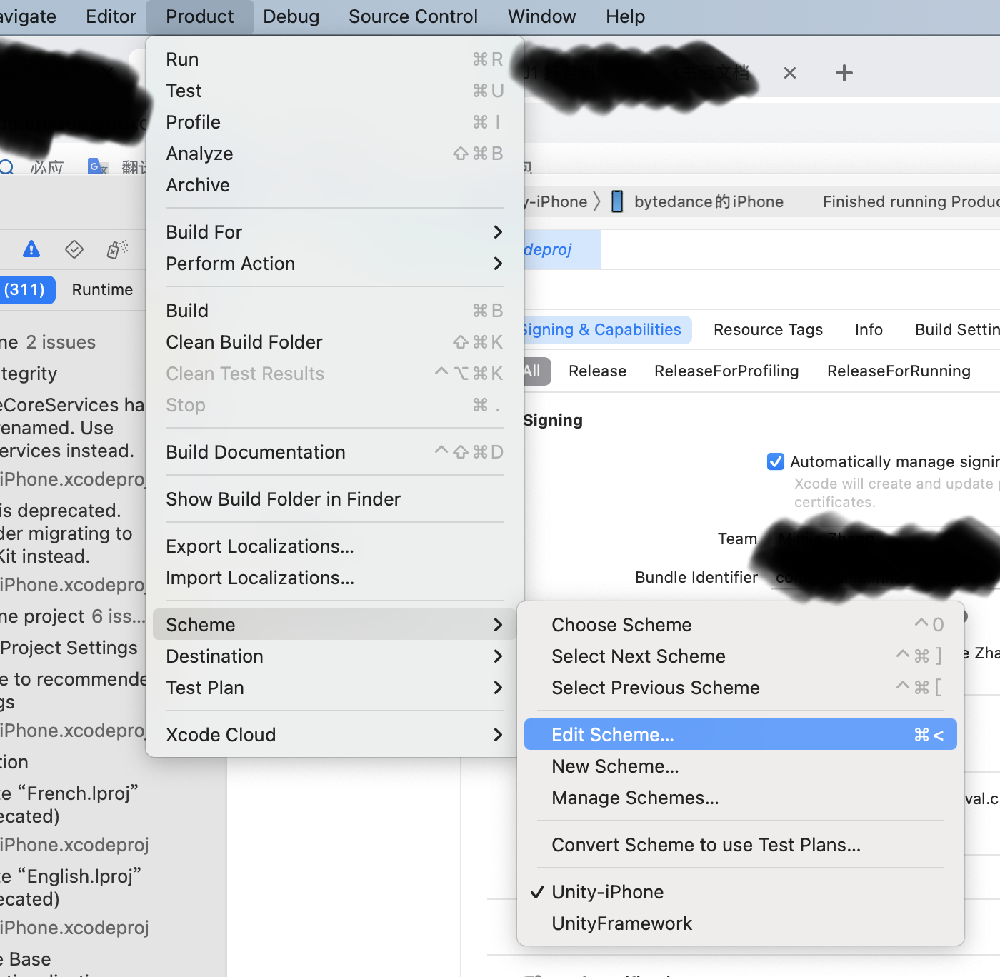
  
  - CaptureMetal
  
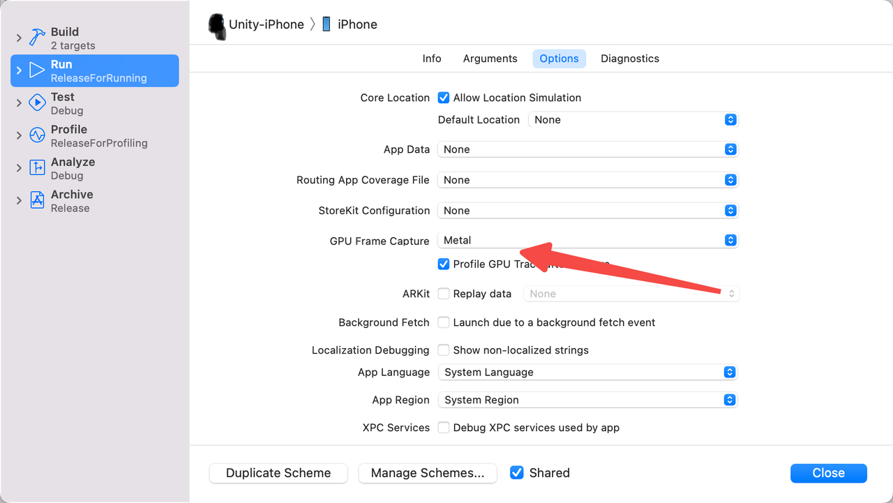
  
  - API Validation
  
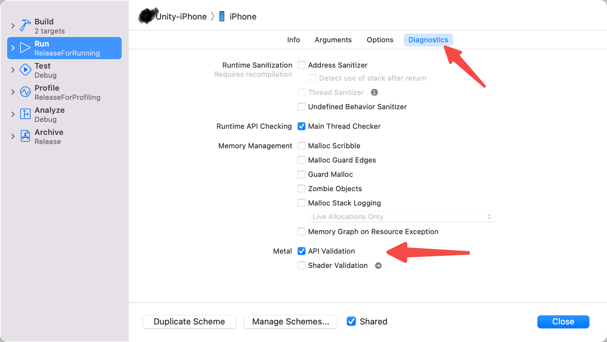

#### 截帧

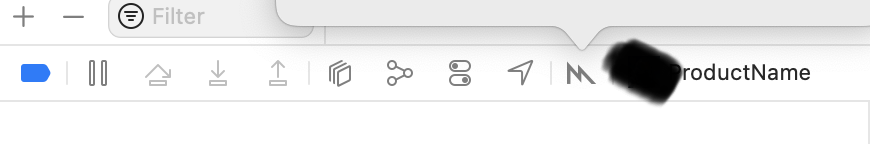

#### 截帧信息分析

- GPU时间（首页就有）
- 带宽

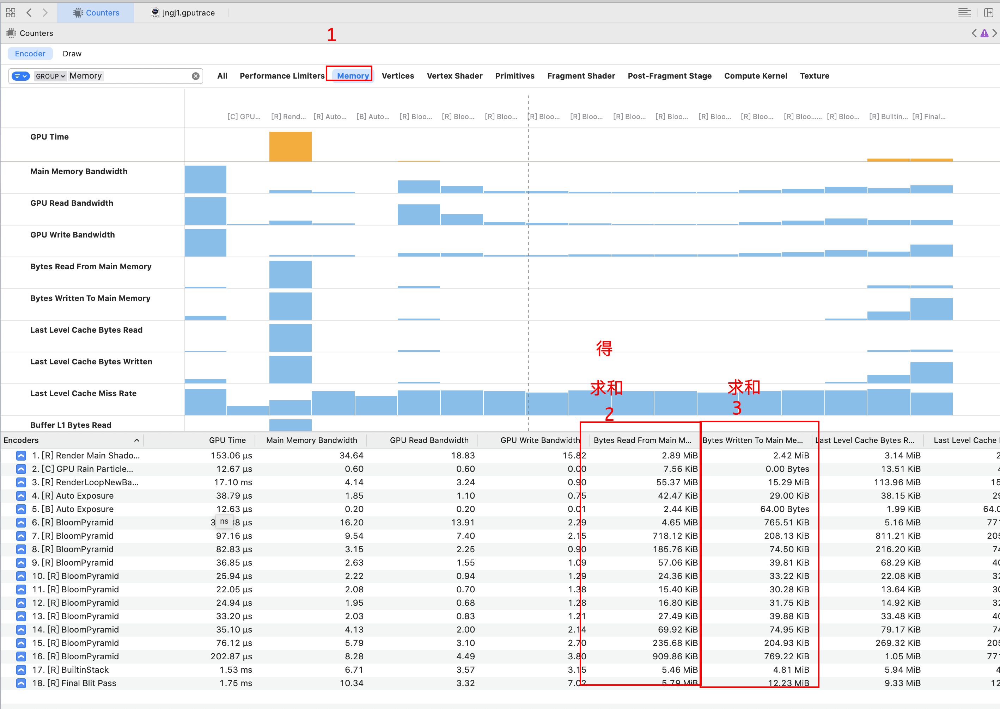

#### 截帧分享

找到这个文件，分享给其他人

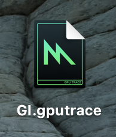

### Nsight

#### 连接Unity Editor

- 以管理员身份打开

- 配置

  - Application Executable：Unity.exe所在的绝对路径

  - Command Line Arguements：-projectPath ”项目根路径“
    - 项目根路径：文件夹内有Asset、Package的那个文件夹

- 启动

  - 点击Launch Frame Debugger
  - 注意，请将Unity和Unity Hub都关掉

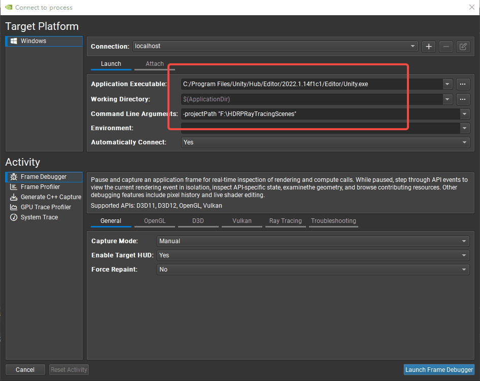

#### 注意

Unity HDRP使用了`D3D11On12`，在使用NSight时会报Warm，暂时先别管

### Snapdragon

#### 连接安卓APP

- Connect to a device
  - 如果找不到设备，检查有无adb命令，或者直接用adb连接
- Realtime看带宽
  - 从左下角Process中挑
- Trace Capture看GPU时间

### RenderDoc

#### 连接安卓APP

- 手机连接电脑，电脑打开RenderDoc
- Connect
- 打开Launch Application窗口
  - Program——Executable Path——选择要截帧的APP

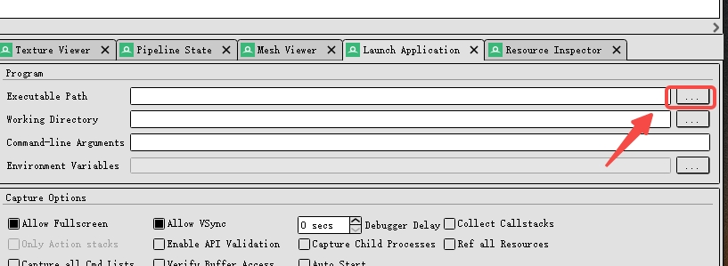

#### 连接Unity Editor

- 右键Scene，Load RenderDoc
- 按小相机截帧

### PIX

#### 权限配置

- 开启Window开发者模式

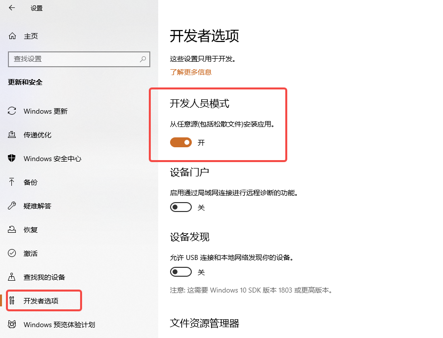

- 开启英伟达开发者模式（以管理员身法打开英伟达控制面板）
  - 注意，更换模式时，请注意关闭、保存Unity（和显卡相关的软件会崩掉）

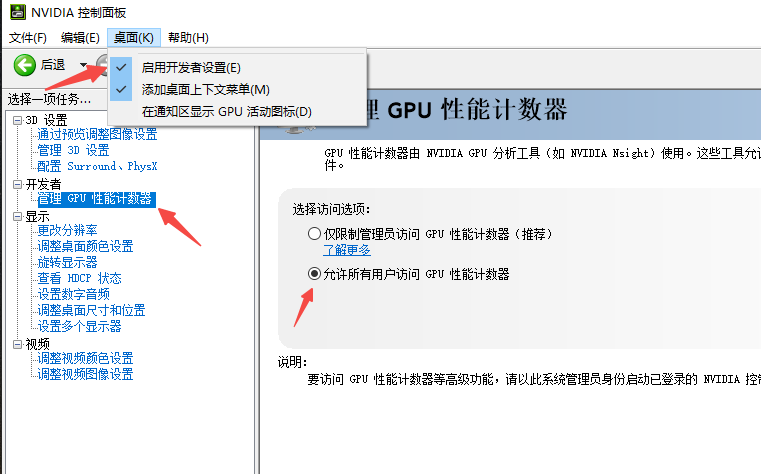

#### 连接Unity Editor

- 以管理员身份打开PIX

- Attach Unity Editor（配置方式同NSight）

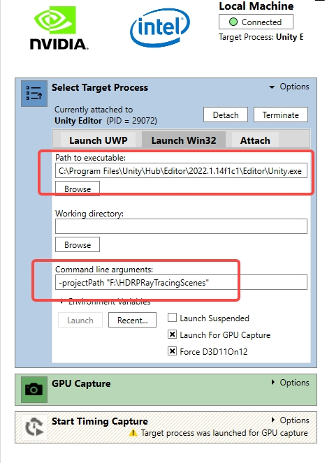

- 按GPU Capture截帧
