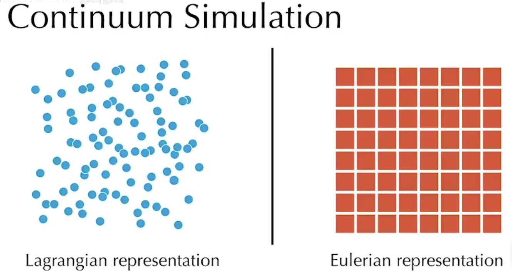

# 物理动画

- 序列帧动画：记录动作的每一帧
  - 非矢量动画：每一帧是固定不可复用的，新的一帧本质上是完全重画一次物体，没有发生形态上的改变
- 关键帧动画：记录动作的始末和轨迹曲线，运行时根据曲线进行插值（很显然，这是一种矢量动画）
  - 每个关键帧被称为姿势

## 顶点动画

骨骼动画的本质是顶点动画

- 刚体动画：在渲染中网格不发生改变，刚体的变化矩阵发生改变
- 顶点动画：在渲染中网格顶点发生了直接的变化（位移旋转缩放）
  - 骨骼动画：一种对顶点动画的压缩算法
  - 流体动画
  - 粒子动画
  - 变形动画：常用于制作表情，捏脸

根据顶点动画的实现方式，分为CPU和GPU

|                  | CPU动画                        | GPU动画                |
| ---------------- | ------------------------------ | ---------------------- |
| 顶点位置改变时机 | CPU应用阶段                    | GPU几何阶段            |
| 数据流           | CPU传递给GPU的顶点数组发生改变 | 顶点着色器输出发生改变 |

### 骨骼动画

骨骼动画的模型整体不是刚体，同时为了避免旋转、移动时发生断裂，也不能将物体拆分为多个小刚体，因此只能选择顶点动画。

然而顶点动画带来的顶点移动，如果全部交由vertex着色器处理，过于昂贵，实时渲染不可接受

而且骨骼动画的顶点受更高层次的骨骼节点控制

- 同一根骨骼的顶点要保持相对位置不变
- 骨骼间顶点要进行平滑
- 顶点的大体形状受骨骼形状制约，顶点变化时要保持和骨骼的联系

#### 实现

矩阵调色板蒙皮技术（Matrix Palette Skinning）：

- 骨骼为近似刚体，其变化矩阵按顺序存储在数组中（我们称这个数组为骨骼）
- 顶点缓冲中会存储其骨骼ID和权重信息（一个顶点通常会受1～4个骨骼影响，可以用两个Vector存储）
- 进行变化时，顶点可以根据骨骼ID和权重查询变化矩阵，并通过插值的方式实现顶点动画（我们称查询矩阵为蒙皮）
- CPU通过姿势间插值，以获得每一帧骨骼的位置及矩阵，GPU根据顶点信息查询矩阵进而实现运动

## 坐标系


### 骨骼树

三维骨骼本质上是一系列Bone组成的树状结构

在骨骼动画中，我们更关心骨骼的相对位置，于是我们选择本地坐标系（A物体的本地坐标就是以A物体中心为原点，相对于中心的偏移），并让坐标系层次嵌套

> 比如大臂移动时也会带动小臂移动，我们就把小臂的本地坐标系定义在大臂的本地坐标系之下，我们称大臂是小臂的父物体，小臂是大臂的子物体。而小臂在大臂的本地坐标系的坐标被称为局部坐标系（可以参考Unity的GO组织）

顺着嵌套关系向根部搜索，就可以获得物体的世界坐标系

下图为树节点的数据结构


- 本地坐标系就是object space transform

在播放动画时，会从空间树的根节点（一般为盆骨节点或者root节点）开始向下递归变化，以保证父物体的local transform总是先于子物体刷新

```C#
 //对关键帧进行插值 
public OnAnimated(CoordinateTreeNode Key0, CoordinateTreeNode Key1, float t)
{ 
    Position = Vector3.Lerp(Key0.Position, Key1.Position, t); 
    Rotation = Quaternion.Lerp(Key0.Rotation, Key2.Rotation, t); 
    Scale = Vector3.Lerp(Key0.Scale, Key1.Scale, t); 
    
    localTransform = new TransformMatrix(Position, Rotation, Scale); 
    combinedTransform = parent.localTransform * this.localTransform; 
} 
```

### 骨骼

- 盆骨：选盆骨作为根节点（或者是空根节点的第一也是唯一的子节点），是因为盆骨在运动时相对匀速，且位置居中，可以避免骨骼树过深
- 脊椎骨：模拟躯干运动，一般有2～3块
- 捻度骨骼：Twist Bone，生物学中像小臂这类骨骼不是一块骨骼，而是两条并排的骨骼，以此实现肘关节不动而手掌可以旋转


### 坐标变化

- 位移矩阵
- 缩放矩阵
- 旋转矩阵
- 齐次坐标
- 仿射变换：缩放--旋转--平移
- 列矩阵左乘
- 手性变换：只需要对所有的矩阵任选一维进行取反即可（哪个维度不重要，只要统一即可）

## 旋转

骨骼动画是矢量动画，是关键帧动画，因此会用到大量的插值，这决定了旋转的表达**必须便于插值**

三维空间中的点可以由三个正交向量插值表示，根据嵌套关系，一个物体发生旋转，其实就是其基向量相对于父节点基向量发生改变

### 双向量法

既然旋转可以由基向量的朝向表示，那么我们就直接基向量表示旋转吧！

正好三个基向量正交，而且对长度不敏感，那么我们还可以将三个向量压缩为两个向量

更进一步，这些向量都在球面上，那么用球坐标系替代直角坐标系

问题：

- 需要时刻保证两个向量垂直
- 不好插值

### 欧拉角

在航空业应用广泛，本质是一种过程量，描述了从初始位置沿着xyz轴旋转指定角度的过程，使用时需要明确旋转顺序（即顺规）

|          | 直角坐标系 | 欧拉角       |
| -------- | ---------- | ------------ |
| 前进方向 | Z          | Roll 桶滚角  |
| 上方向   | Y          | Yaw 偏航角   |
| 右方向   | X          | Pitch 俯仰角 |

问题：

- 没有统一标准，而欧拉角强依赖于顺规
- 某些情况下会有两个轴平行，以至于失去一个自由度，导致万向节死锁
- 不能线性插值

### 轴角与四元数

轴角（x, y, z, w）指沿着轴（x, y, z）旋转w度，也可以压缩为三维向量（wx', wy', wz'），轴角可以通过对轴向量和旋转角度分别插值对方法进行插值

四元数是一种超复数，可以用来表示旋转

[四元数的可视化_哔哩哔哩_bilibili](https://www.bilibili.com/video/BV1SW411y7W1)

## 蒙皮解算

Mesh中的顶点缓存中会存储骨架、骨骼索引，骨骼权重，将用于蒙皮解算


## GAMES201

物理模拟中有两个常用视角：

- 拉格朗日视角：视角随着介质移动而移动（粒子模拟）
- 欧拉视角：视角是固定的，检测穿过视角的介质流速（网格模拟）




### 弹簧质点模型

#### 显式积分器

显式积分器：从过去的状态得到现在的状态，表示简单，容易实现。
$$
\mathbf{v}_{t+1}=\mathbf{v}_t+\Delta t \frac{\mathbf{f}_t}{m}
$$

$$
\mathbf{x}_{t+1}=\mathbf{x}_t+\Delta t \mathbf{v}_{t+1}
$$

但是容易爆炸，$\Delta t$不能太大，或者弹簧不能太硬
$$
\Delta t \le c\sqrt{\frac{m}{k}} \ \ (c \sim 1)
$$

#### 隐式积分器

隐式积分器：现在状态依赖过去和**未来**，难以实现，但鲁棒性更好
$$
\mathbf{v}_{t+1}=\mathbf{v}_t+\Delta t \mathbf{M}^{-1}\mathbf{f}(\mathbf{x}_{t+1})
$$

$$
\mathbf{x}_{t+1}=\mathbf{x}_t+\Delta t \mathbf{v}_{t+1}
$$

- $\mathbf{M}$：质量矩阵

带入展开
$$
\mathbf{v}_{t+1}=\mathbf{v}_t+\Delta t \mathbf{M}^{-1}[\mathbf{f}(\mathbf{x}_t)+\frac{\part \mathbf{f}}{\part \mathbf{x}}(\mathbf{x}_t)\Delta t \mathbf{v}_{t+1}]
$$
化简，得到一个线性系统
$$
[\mathbf{I}-\Delta t^2 \mathbf{M}^{-1}\frac{\part \mathbf{f}}{\part \mathbf{x}}(\mathbf{x}_t)]\mathbf{v}_{t+1}=\mathbf{v}_t+\Delta t \mathbf{M}^{-1}\mathbf{f}(\mathbf{x}_t)
$$
